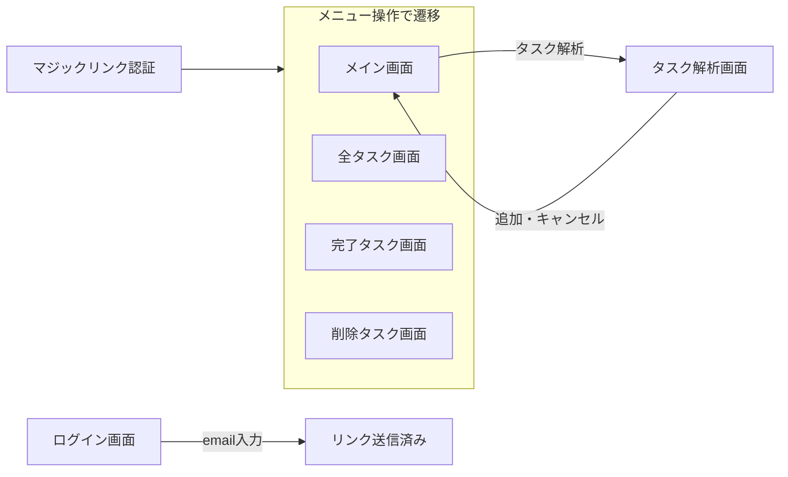

# 要求仕様書 - VanishToDo

## 1. 概要

### 1.1 製品の位置づけ
VanishToDoは、タスク管理の継続利用を実現するWebアプリケーションである。「入力の簡素化」と「表示の最適化」により、従来のToDoアプリが抱える「使い続けられない」という問題を解決する。

### 1.2 主要機能概要

1. **LLMによるスマートタスク入力**
   - タスクの自動補完
   - タスクの自動分割
   - 自動重みづけ

2. **制限付き表示システム**
   - 各カテゴリn個(3~5程度)までの表示制限
   - n日経過後(14日程度)の自動非表示
   - 重さ別フィルタリング

3. **タスク管理**
   - タスクの作成・編集・削除
   - 重さの設定（重・中・軽）
   - 締切の設定

### 1.3 利用者
- プライマリーユーザー：大河るり（開発者本人）
- ~~シングルユーザー専用（マルチユーザー非対応）~~
- マルチユーザー対応、emailアドレスのみでマジックリンクを用いたパスワードレス認証

### 1.4 利用環境
- デバイス：PC、スマートフォン、タブレット
- ブラウザ：Google Chrome（最新版）
- ネットワーク：インターネット接続必須

### 1.5 用語定義

| 用語 | 定義 |
|------|------|
| タスク | ユーザーが実行すべき作業項目 |
| 完了タスク | ユーザーが実行した作業項目 |
| 削除タスク | ユーザーが削除した作業項目 |
| タスクリスト | 一連のタスクをリストにしたもの |
| 重さ | タスクの推定所要時間による分類（重・中・軽） |
| 重タスク | 1時間以上かかると推定されるタスク |
| 中タスク | 15分～1時間で完了すると推定されるタスク |
| 軽タスク | 15分以内で完了すると推定されるタスク |
| 締切タスク | 期限が設定されたタスク（重さなし） |
| 表示制限 | 各カテゴリで表示するタスク数の上限 |
| セッティング | アカウントIDに紐づく、表示制限などの設定 |
| Vanish（消失） | 古いタスクを自動的に非表示にする機能 |
| LLM | Large Language Model（大規模言語モデル） |

## 2. ユーザーインターフェース

#### UI-1 画面構成

| 画面名 | 説明 | 主要要素 |
|--------|------|----------|
| ログイン画面 | メール認証 | メール入力、OTP入力 |
| メイン画面 | タスク一覧と入力 | タスクリスト(編集可)、入力欄、フィルタ |
| タスク解析画面 | 解析したタスクの編集と追加 | タスクリスト(編集可)、一括削除、一括登録 |
| 全タスク画面 | 全タスク管理 | タスクリスト(編集可)、検索、ソート、一括削除 |
| 完了タスク画面 | 完了タスク管理 | タスクリスト(**編集不可**)、検索、ソート、一括削除、一括復帰 |
| 削除タスク画面 | 削除タスク管理 | タスクリスト(**編集不可**)、検索、ソート、一括復帰 |

#### UI-2 画面遷移

## 3. 機能要求

### 3.1 タスク入力機能

#### FR-1.1 基本タスク入力

| 項目 | 内容 |
|------|------|
| 説明 | ユーザーがタスクを素早く入力できる |
| 詳細 | 1. タスク（テキスト、最大500文字）と重さ・締切を登録し表示する 2. 登録したタスクはリストとして表示される 3. 入力したタスクはどの端末からでも見ることができる 4. 入力後は入力欄がクリアされ次の入力ができる 5. アプリ起動直後はこの項目の入力欄にフォーカスがあたるsa |
| 操作 | エンターキー or 登録ボタン |
| 対応画面 | メイン画面 |
| 優先度 | 必須 |
| 対応US | US-1.1 クイックタスク入力 (US-4.1 データの永続化) (US-4.3 レスポンシブデザイン) |

#### FR-1.2 タスク自動補完

| 項目 | 内容 |
|------|------|
| 説明 | 曖昧な入力をLLMが解釈し、適切なタスクに変換 |
| 詳細 | 1. タスク入力欄に入力したあいまいなテキスト(最大500文字)を自然なタスクとして認識する 2. 認識したタスクを1~複数のタスクに分割する 3. タスクごとに適切な重さを設定する |
| 判定基準 | - 重：1時間以上 - 中：15分～1時間 - 軽：15分以内 |
| 前提条件 | Cloudflare Workers AI APIの利用を想定 |
| API制限 | 無料枠内（1日あたり10,000ニューロン） |
| 対応画面 | メイン画面 |
| 優先度 | 中 |
| 対応US | US-1.2 自然言語でのタスク入力  US-1.3 メモからタスク分割  US-1.4 タスクの重さ自動判定 |

#### FR-1.3 自動補完タスク表示

| 項目 | 内容 |
|------|------|
| 説明 | 自動補完されたタスク群を表示し、実際に追加するタスクを選ぶ |
| 詳細 | 1. タスクをリストで表示 2. 名前と重さ・締切を編集できるようにする 3. チェックボックスにチェックを入れたタスクを全部追加する 4. 追加をキャンセルしてメイン画面に戻る  |
| 対応画面 | タスク解析画面 |
| 優先度 | 中 |
| 対応US | US-1.2 自然言語でのタスク入力 US-1.3 メモからタスク分割 US-1.4 タスクの重さ自動判定 |

### 3.2 タスク表示機能

#### FR-2.1 表示数制限

| 項目 | 内容 |
|------|------|
| 説明 | 各重さカテゴリで最新3個のタスクのみ表示 |
| 表示ルール | - 各カテゴリ（重/中/軽）：最新n個(設定可能) - 締切タスク：全て表示 - 2週間以上前のタスク：非表示 |
| ソート順 | 作成日時の降順（新しい順） |
| 対応画面 | メイン画面 |
| 優先度 | 中 |
| 対応US | US-2.1 制限付きタスク表示 |

#### FR-2.2 重さ別フィルタリング

| 項目 | 内容 |
|------|------|
| 説明 | タスクを重さでフィルタリング表示 |
| フィルタオプション | - すべて - 重 - 中 - 軽 - 締切 |
| UI | 画面下部のタブ形式ボタン |
| 対応画面 | メイン画面・全タスク表示画面・完了タスク表示画面 |
| 優先度 | 中 |
| 対応US | US-2.2 重さ別フィルタリング |

#### FR-2.3 自動非表示

| 項目 | 内容 |
|------|------|
| 説明 | 作成から一定期間経過したタスクを自動的に非表示 |
| 非表示条件 | - 作成日時からn日(設定可能)経過 - 締切なし - 未完了 |
| 例外 | 締切ありタスクは対象外 |
| 対応画面 | メイン画面 |
| 優先度 | 中 |
| 対応US | US-2.1 制限付きタスク表示 |

#### FR-2.4 全タスク表示

| 項目 | 内容 |
|------|------|
| 説明 | 制限なしで全タスクを表示・管理 |
| アクセス方法 | メニュー操作 |
| 対応画面 | 全タスク表示画面 |
| 優先度 | 低 |
| 対応US | US-3.4 全タスク表示 |

#### FR-2.5 完了タスク表示

| 項目 | 内容 |
|------|------|
| 説明 | 全完了タスクを表示・管理 |
| アクセス方法 | メニュー操作 |
| 対応画面 | 完了タスク表示画面 |
| 優先度 | 低 |
| 対応US | US-3.5 完了タスク表示 |

#### FR-2.6 削除タスク表示

| 項目 | 内容 |
|------|------|
| 説明 | 全削除タスクを表示・管理 |
| アクセス方法 | メニュー操作 |
| 対応画面 | 削除タスク表示画面 |
| 優先度 | 低 |
| 対応US | なし |

### 3.3 タスク管理機能

#### FR-3.1 タスク編集

| 項目 | 内容 |
|------|------|
| 説明 | 既存タスクの内容を変更 |
| 編集可能項目 | - タスク名 - 重さ - 締切日 |
| UI | インライン編集（モーダルなし） |
| 保存 | 自動保存（フォーカスアウト時・アプリ終了時） |
| 対応画面 | メイン画面・全タスク表示画面・完了タスク表示画面・タスク解析画面 |
| 優先度 | 必須 |
| 対応US | US-3.1 タスク編集 |

#### FR-3.2 タスク削除

| 項目 | 内容 |
|------|------|
| 説明 | 不要なタスクを削除 |
| 削除方法 | - スワイプ（モバイル） - 削除ボタン（PC） |
| Undo | 5秒間の取り消し可能 |
| 対応画面 | メイン画面・全タスク表示画面・完了タスク表示画面・タスク解析画面 |
| 優先度 | 必須 |
| 対応US | US-3.2 タスク削除 |

#### FR-3.3 タスク完了

| 項目 | 内容 |
|------|------|
| 説明 | タスクを完了状態にする |
| 操作 | チェックボックスのクリック/タップ |
| フィードバック | - 完了アニメーション - 1秒後にフェードアウト |
| Undo | 5秒間の取り消し可能 |
| 対応画面 | メイン画面・全タスク表示画面 |
| 優先度 | 必須 |
| 対応US | US-2.4 タスク完了フィードバック |

#### FR-3.4 締切設定

| 項目 | 内容 |
|------|------|
| 説明 | タスクに期限を設定 |
| UI | - カレンダー選択 - クイック選択（今日/明日/来週） |
| 表示 | - 締切までの日数表示 - 期限切れは赤字強調 |
| 対応画面 | 各画面のタスク編集画面 |
| 優先度 | 中 |
| 対応US | US-3.3 締切設定 |

#### FR-3.5 タスク一括削除

| 項目 | 内容 |
|------|------|
| 説明 | 不要なタスクを一括削除 |
| 削除方法 | - チェックボックスで削除対象選択 - 削除実行ボタン押下 |
| 確認 | 削除確認ダイアログ |
| Undo | 5秒間の取り消し可能 |
| UI | 全件選択/選択解除ボタンも設ける |
| 対応画面 | 全タスク表示画面・完了タスク表示画面 |
| 優先度 | 低 |
| 対応US | US-3.4 全タスク表示  US-3.5 完了タスク表示 |

#### FR-3.6 タスク一括未完了化

| 項目 | 内容 |
|------|------|
| 説明 | 完了タスクを一括未完了状態に遷移させる |
| 削除方法 | - チェックボックスで対象選択 - 未完了実行ボタン押下 |
| UI | 全件選択/選択解除ボタンも設ける |
| 対応画面 | 完了タスク表示画面 |
| 優先度 | 低 |
| 対応US | US-3.5 完了タスク表示 |

#### FR-3.7 タスク一括復帰

| 項目 | 内容 |
|------|------|
| 説明 | 削除タスクを一括未削除状態に遷移させる |
| 削除方法 | - チェックボックスで対象選択 - 復帰実行ボタン押下 |
| UI | 全件選択/選択解除ボタンも設ける |
| 対応画面 | 削除タスク表示画面 |
| 優先度 | 低 |
| 対応US | なし |

#### FR-3.8: タスクの自動クリーンアップ

| 項目 | 内容 |
|------|------|
| 説明 | 完了タスクと削除タスクを一定期間後に自動的に物理削除する |
| 削除対象 | - **完了タスク**: 完了から30日経過後 - **削除タスク**: 論理削除から7日経過後 |
| 実行タイミング | 日次バッチ処理(サイレント削除) |
| 優先度 | 低 |
| 対応US | なし |

### 3.4 特殊機能

#### FR-4.1 日次達成モード

| 項目 | 内容 |
|------|------|
| 説明 | 1日の目標タスク数を設定し、達成後は追加表示しない |
| デフォルト目標 | - 重：1個 - 中：2個 - 軽：3個 |
| 達成時動作 | - 「今日はお疲れ様」メッセージ - 新規タスク非表示 |
| リセット | 日付変更時に自動リセット |
| 優先度 | 中 |
| 対応US | US-2.3 日次達成モード |

### 3.5 永続化機能

#### FR-5.1 ローカル保存機能

| 項目 | 内容 |
|------|------|
| 説明 | 入力されたタスクをLocalStorageに保存する |
| 詳細 | データは同期的に保存される |
| 優先度 | 必須 |
| 対応US | US-4.1 データの永続化 |

#### FR-5.2 リモート保存機能

| 項目 | 内容 |
|------|------|
| 説明 | 入力されたタスクをクラウド上のDBに保管・参照する |
| 詳細 | データは非同期的に保存される REST API越しに同期する リクエストはqueueで直列化され、read backを待つことにより順番を保つ |
| 優先度 | 高 |
| 対応US | US-4.1 データの永続化 |

## 4. 非機能要求

### 4.1 性能要求

#### NFR-1 レスポンス時間

**対応US**: US-4.4 パフォーマンス

| 項目 | 要求値 | 測定条件 |
|------|--------|----------|
| 初回ページロード | 2秒以内 | 3G回線相当 |
| タスク追加 | 0.5秒以内 | ローカル処理 |
| LLM処理 | 5秒以内 | Workers AI応答含む |
| タスク表示切替 | 0.3秒以内 | フィルタリング |

#### NFR-2 容量・スケール

**対応US**: US-4.4 パフォーマンス

| 項目 | 要求値 |
|------|--------|
| 最大タスク数 | 1,000件/ユーザー |
| 最大文字数（タスク名） | 500文字 |
| 最大文字数（メモ分割） | 500文字 |
| 同時処理 | シングルユーザーのため考慮不要 |

### 4.2 信頼性要求

#### NFR-3 障害対策

| 項目 | 対策 |
|------|------|
| ネットワーク断 | ローカルストレージで常に一時保存、復旧後同期 同期中にネットワーク断しても、ネットワーク復帰後再同期できる |
| LLM API障害 | 基本機能（手動入力）は継続動作 |
| 認証失敗 | 再認証画面へリダイレクト |
| ログ | DBへのアクセスと成否を記録しあとから障害などの確認ができる |

### 4.3 セキュリティ要求

#### NFR-4 認証・認可

**対応US**: US-4.2 認証とセキュリティ

| 項目 | 要求 |
|------|------|
| 認証方式 | マジックリンク・パスワードレス |
| セッション | 14日維持 |
| アクセス制御 | ~~シングルユーザーのみ~~マルチユーザー対応 |

#### NFR-4 データ保護

**対応US**: US-4.2 認証とセキュリティ

| 項目 | 要求 |
|------|------|
| 通信暗号化 | HTTPS（TLS 1.3） |
| データ暗号化 | D1のデフォルト暗号化 |
| 個人情報 | メールアドレスのみ保持 |

### 4.4 移植性・互換性要求

#### NFR-5 ブラウザ対応

**対応US**: US-4.3 レスポンシブデザイン

| 項目 | 要求 |
|------|------|
| 対応ブラウザ | Google Chrome最新版 |
| 特徴 | PC/スマホ用に別レイアウト キー操作・タッチスワイプ操作対応 |

---

## 付録A: Cloudflare Workers AI使用モデル候補

無料枠で使用可能な主要モデル：

### テキスト生成（タスク補完・分割用）
- **@cf/meta/llama-3.2-1b-instruct** - 推奨（バランスが良い）
- @cf/tinyllama/tinyllama-1.1b-chat-v1.0（軽量）
- @cf/qwen/qwen1.5-0.5b-chat（超軽量）

### 使用ニューロン目安
- タスク補完: 約10ニューロン/リクエスト
- タスク分割: 約30ニューロン/リクエスト
- 重さ判定: 約5ニューロン/リクエスト

1日の想定使用量：
- タスク入力: 20回 × 10 = 200ニューロン
- タスク分割: 2回 × 30 = 60ニューロン
- 重さ判定: 20回 × 5 = 100ニューロン
- **合計: 約360ニューロン/日（無料枠10,000の範囲内）**

---

*本文書は、VanishToDoプロジェクトの要求仕様を定義し、実装の基準となるものである。*
