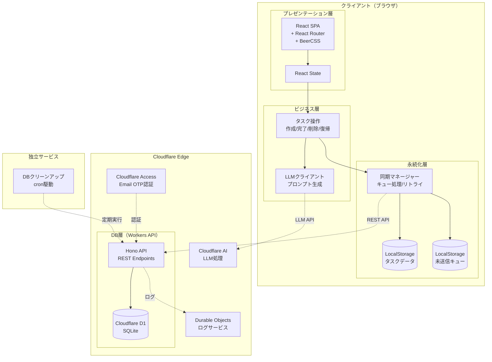
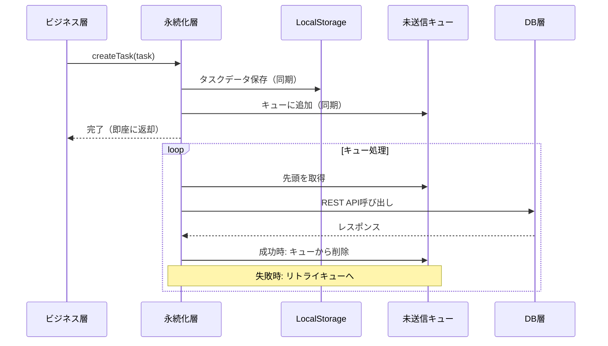
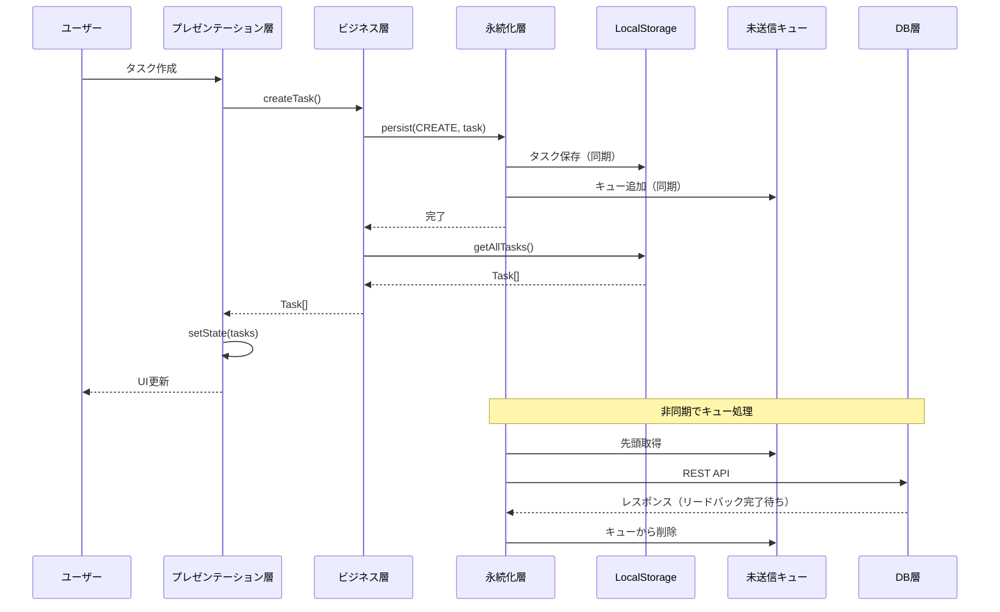
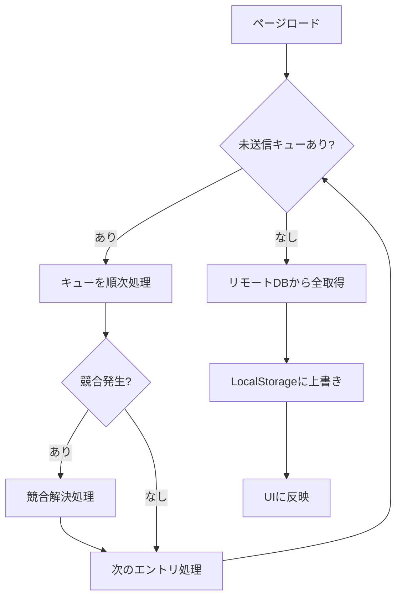

# アーキテクチャ設計書 - VanishToDo

## 1. 文書情報

| 項目 | 内容 |
|------|------|
| バージョン | 2.0 |
| 作成日 | 2025-11-15 |
| 最終更新日 | 2025-11-27 |
| 作成者 | 大河るり |

### 変更履歴

| バージョン | 日付 | 変更内容 |
|------------|------|----------|
| 1.0 | 2025-11-15 | 初版作成 |
| 2.0 | 2025-11-27 | 4層レイヤードアーキテクチャ+2サービスに再設計 |

---

## 2. システム概要

### 2.1 全体構成図



### 2.2 アーキテクチャパターン

**4層レイヤードアーキテクチャ + 2独立サービス**

| 層 | 配置 | 責務 |
|----|------|------|
| プレゼンテーション層 | ブラウザ | UI表示、ユーザー操作、状態管理（React State） |
| ビジネス層 | ブラウザ | タスク操作ロジック、LLMプロンプト生成 |
| 永続化層 | ブラウザ | LocalStorage管理、DB同期、キュー処理 |
| DB層 | Cloudflare Workers | REST API、CRUD操作 |

| サービス | 配置 | 責務 |
|----------|------|------|
| DBクリーンアップサービス | cron（外部プロセス） | ソフト削除データの物理削除 |
| ログサービス | Durable Objects | DB層リクエストのログ記録 |

### 2.3 レイヤード採用理由

1. **段階的実装との整合性**: MVPからフェーズごとに必要な層だけ実装可能
2. **責務の明確化**: 各層の役割が明確で保守しやすい
3. **耐障害性**: 永続化層でネットワーク断からの復旧を独立して管理

---

## 3. 各層の詳細設計

### 3.1 プレゼンテーション層

#### 責務

- タスクリストのフィルタリングと表示
- ユーザー操作への応答とビジネス層への伝達
- ユーザー設定の表示・編集
- LLMエラー時のフォールバック処理（入力テキスト復帰）

#### 技術スタック

| 技術 | 用途 |
|------|------|
| React x.y | UI構築 |
| React Router x.y | クライアントサイドルーティング |
| BeerCSS x.y | マテリアルデザインUI |
| TypeScript x.y | 型安全な開発 |


#### 画面構成

| 画面 | パス | 説明 |
|------|------|------|
| ログイン画面 | `/login` | Email OTP認証 |
| メイン画面 | `/` | タスク一覧と入力 |
| タスク解析画面 | `/analyze` | LLM解析結果の編集・追加 |
| 全タスク画面 | `/all` | 全タスク管理 |
| 完了タスク画面 | `/completed` | 完了タスク管理 |

### 3.2 ビジネス層

#### 責務

- タスクの作成・完了・復帰・削除操作
- 「もっとやる」モードの制御
- ユーザー設定の編集
- LLMへのプロンプト生成とAPI呼び出し
- **ステートレス**: 状態を持たず、LocalStorageから毎回取得


### 3.3 永続化層

#### 責務

- ビジネス層からのCRUD要求をLocalStorageに同期的に保存
- 未送信キューの管理（LocalStorageに保存）
- DB層との非同期同期
- ネットワーク断からの復旧処理

#### データフロー



#### LocalStorage構造(例)

```typescript
// LocalStorageのキー構造
interface LocalStorageSchema {
  'vanish_tasks': Task[];           // タスクデータ
  'vanish_settings': UserSettings;  // ユーザー設定
  'vanish_queue': QueueEntry[];     // 未送信キュー
}

interface QueueEntry {
  id: string;              // エントリID（UUID）
  operation: 'CREATE' | 'UPDATE' | 'DELETE' | 'COMPLETE' | 'UNCOMPLETE';
  payload: unknown;        // 操作に必要なデータ
  createdAt: string;       // 追加日時
  retryCount: number;      // リトライ回数
}
```


### 3.4 DB層

#### 責務

- タスクとユーザー設定のCRUD操作のみ
- REST APIの提供
- ログサービスへのリクエスト記録

#### 技術スタック

| 技術 | 用途 |
|------|------|
| Hono x.y | APIフレームワーク |
| Cloudflare Workers | 実行環境 |
| Cloudflare D1 | SQLiteデータベース |
| Drizzle ORM | 型安全なDBアクセス |

---

## 4. 独立サービス

### 4.1 DBクリーンアップサービス

#### 概要

- **実行方式**: cron駆動の外部プロセス
- **実行頻度**: 毎日深夜（例: 03:00 JST）
- **デプロイ**: Cloudflare Workers（Cron Triggers）

#### 削除対象

| 対象 | 条件 |
|------|------|
| 完了タスク | 完了から30日経過 |
| 削除タスク | ソフト削除から7日経過 |


### 4.2 ログサービス

#### 概要

- **実行方式**: Cloudflare Durable Objects
- **目的**: DB層リクエストの記録、障害対応・性能調査
- **参照方法**: Cloudflareダッシュボード

#### ログ内容

```typescript
interface LogEntry {
  timestamp: string;
  requestId: string;
  operation: string;
  endpoint: string;
  status: 'success' | 'error';
  statusCode?: number;
  duration: number;  // ms
  errorMessage?: string;
}
```

#### ログ保持期間

- **保持期間**: 1〜数日（設定可能）
- **削除方式**: 古いログを自動削除

---

## 5. 非同期設計

### 5.1 処理フロー概要



### 5.2 順序保証の仕組み

1. **キューによる直列化**: すべてのDB操作は1本のキューで順番を保持
2. **リードバック待ち**: レスポンスの完全な受信を待ってから次の操作を送信
3. **追い越し禁止**: キュー内の操作を途中で削除・変更しない

```
例: 削除 → UNDO（削除キャンセル）の場合

キュー状態: [DELETE task-1] → [UNCOMPLETE task-1]

処理順序:
1. DELETE task-1 を DB に送信
2. レスポンス待ち
3. 成功後、UNCOMPLETE task-1 を DB に送信
4. レスポンス待ち
5. 完了

※ キュー内で DELETE を取り消さない（ロジックの単純化のため）
```

### 5.3 ページロード時の同期



---

## 6. エラーハンドリング

### 6.1 エラーハンドリングポリシー

| エラー種別 | HTTPステータス | 対応方針 |
|------------|----------------|----------|
| ネットワークエラー | - | リトライキューに残し、復旧後に再送 |
| 認証エラー | 401 | 再認証画面へリダイレクト |
| サーバーエラー | 5xx | リトライ（最大3回、exponential backoff） |
| クライアントエラー | 4xx（409以外） | ログ記録、キューから削除（不正データとして破棄） |
| 競合エラー | 409 | 競合解決処理（6.2参照） |
| LLM APIエラー | - | null返却、プレゼンテーション層で手動入力へフォールバック |

### 6.2 競合解決ポリシー

> **TODO**: 競合状況の詳細な列挙と解決方針は、実装フェーズで検討する。
> 
> 想定される競合状況：
> - 複数デバイスからの同時編集
> - ネットワーク断中の編集とリモートの変更
> - 削除済みタスクへの操作

---

## 7. セキュリティ設計

### 7.1 認証・認可

| 項目 | 実装 |
|------|------|
| 認証方式 | Cloudflare Access Email OTP |
| セッション維持 | 30日 |
| アクセス制御 | シングルユーザーのみ許可 |

### 7.2 データ保護

| 項目 | 実装 |
|------|------|
| 通信暗号化 | HTTPS（TLS 1.3） |
| データ暗号化 | D1のデフォルト暗号化 |
| 個人情報 | メールアドレスのみ保持 |
| LocalStorage | ブラウザのセキュリティに依存 |

---

## 8. 技術スタック一覧

### フロントエンド

| カテゴリ | 技術 | バージョン | 用途 |
|---------|------|-----------|------|
| コアフレームワーク | React | 18.x | UI構築 |
| 言語 | TypeScript | 5.x | 型安全な開発 |
| ルーティング | React Router | 7.x | 画面遷移 |
| UIフレームワーク | BeerCSS | 3.x | マテリアルデザイン |
| ビルドツール | Vite | 5.x | 開発環境 |

### バックエンド

| カテゴリ | 技術 | バージョン | 用途 |
|---------|------|-----------|------|
| フレームワーク | Hono | 4.x | API構築 |
| 言語 | TypeScript | 5.x | 型安全な開発 |
| ランタイム | Cloudflare Workers | - | サーバーレス実行 |
| ORM | Drizzle ORM | 0.x | D1アクセス |

### インフラ

| カテゴリ | 技術 | 用途 |
|---------|------|------|
| ホスティング | Cloudflare Pages | フロントエンド配信 |
| コンピューティング | Cloudflare Workers | API実行 |
| データベース | Cloudflare D1 | データ永続化 |
| AI | Cloudflare AI | LLM処理 |
| 認証 | Cloudflare Access | Email OTP |
| ログ | Durable Objects | リクエストログ |

### 開発ツール

| カテゴリ | 技術 | 用途 |
|---------|------|------|
| パッケージマネージャー | pnpm | 依存関係管理 |
| リンター・フォーマッター | Biome | コード品質 |
| バージョン管理 | Git | ソースコード管理 |
| ローカル開発 | Wrangler | Workers/D1ローカル実行 |

---

## 9. アーキテクチャ決定記録（ADR）

### ADR-001: 4層レイヤードアーキテクチャの採用

**状態:** 承認済み  
**決定日:** 2025-11-27

**コンテキスト:**
MVPから段階的に機能を実装していく計画であり、各フェーズで必要な部分だけを実装できる構造が求められた。また、ローカルストレージとリモートDBの同期ロジックが複雑になることが予想された。

**決定内容:**
プレゼンテーション層、ビジネス層、永続化層、DB層の4層構造を採用する。

**理由:**
1. 段階的実装との整合性（フェーズごとに必要な層だけ実装可能）
2. 永続化ロジックの独立（同期の複雑さをビジネスロジックから分離）
3. 責務の明確化（各層の役割が明確）
4. テスタビリティ（層ごとの単体テストが容易）

**影響:**
- ✅ 設計がわかりやすい
- ✅ 保守性の向上
- ⚠️ 層間のインターフェース定義が必要

---

### ADR-002: ビジネス層のステートレス化

**状態:** 承認済み  
**決定日:** 2025-11-27

**コンテキスト:**
ビジネス層が内部状態を持つ案（案A）と、LocalStorageから毎回取得する案（案B）を検討した。

**決定内容:**
ビジネス層はステートレスとし、タスクデータはLocalStorageから毎回取得する（案B）。

**理由:**
1. 「LocalStorageが常に正」という単一の信頼源
2. React StateとビジネスLayer間の二重管理を回避
3. テストが容易（状態を持たないため）
4. LocalStorageは同期的で十分高速（1000件程度）

**影響:**
- ✅ 状態管理がシンプル
- ✅ バグが発生しにくい
- ⚠️ 毎回LocalStorageアクセスが発生（性能影響は軽微）

---

### ADR-003: 未送信キューのLocalStorage保存

**状態:** 承認済み  
**決定日:** 2025-11-27

**コンテキスト:**
ネットワーク断時やブラウザ終了時に未送信の操作を保持する必要があった。

**決定内容:**
未送信キュー自体をLocalStorageに保存し、メモリ上のキューとの二重管理をしない。

**理由:**
1. ブラウザ突然終了時も未送信操作が残る
2. `beforeunload`イベントの不確実性を回避
3. キューの状態が常に永続化されている安心感
4. 実装がシンプル

**影響:**
- ✅ 耐障害性の向上
- ✅ 実装のシンプル化
- ⚠️ LocalStorageへの書き込み頻度が増加（性能影響は軽微）

---

### ADR-004: キュー操作の追い越し禁止

**状態:** 承認済み  
**決定日:** 2025-11-27

**コンテキスト:**
削除→UNDO（削除キャンセル）のような操作で、キュー内の削除コマンドを取り消すべきか検討した。

**決定内容:**
キュー内の操作を途中で削除・変更せず、すべてDB層に送信する。

**理由:**
1. ロジックの単純化（キュー操作の複雑な判定が不要）
2. UNDOの発生頻度は低いと想定
3. DB上で一貫した状態管理
4. デバッグが容易

**影響:**
- ✅ 実装がシンプル
- ✅ バグが発生しにくい
- ⚠️ 冗長なAPIリクエストが発生する可能性（頻度は低い）

---

### ADR-005: Cloudflareエコシステムの全面採用

**状態:** 承認済み  
**決定日:** 2025-11-15

**コンテキスト:**
インフラ選定において、複数のクラウドサービスを組み合わせるか、単一プロバイダーに統一するかの判断が必要だった。

**決定内容:**
Cloudflareのサービス群（Pages, Workers, D1, AI, Access, Durable Objects）を全面的に採用する。

**理由:**
1. コスト効率（無料枠で開発・運用が可能）
2. 統合性（同一プロバイダー内でのサービス連携が容易）
3. 学習コスト（単一エコシステムの習得で済む）
4. 開発者体験（Wrangler CLIによる統一的な開発フロー）

**影響:**
- ✅ インフラ管理の単純化
- ✅ コストの最小化
- ⚠️ ベンダーロックインのリスク

---

## 付録A: Cloudflare Workers AI使用モデル

### 推奨モデル

- **@cf/meta/llama-3.2-1b-instruct** - タスク補完・分割用（バランスが良い）

### 使用ニューロン目安

| 操作 | ニューロン/リクエスト |
|------|----------------------|
| タスク補完 | 約10 |
| タスク分割 | 約30 |
| 重さ判定 | 約5 |

**1日の想定使用量**: 約360ニューロン（無料枠10,000の範囲内）

---

*本アーキテクチャ設計書は、VanishToDoプロジェクトの技術的な基盤を定義し、すべての実装の指針となるものである。*