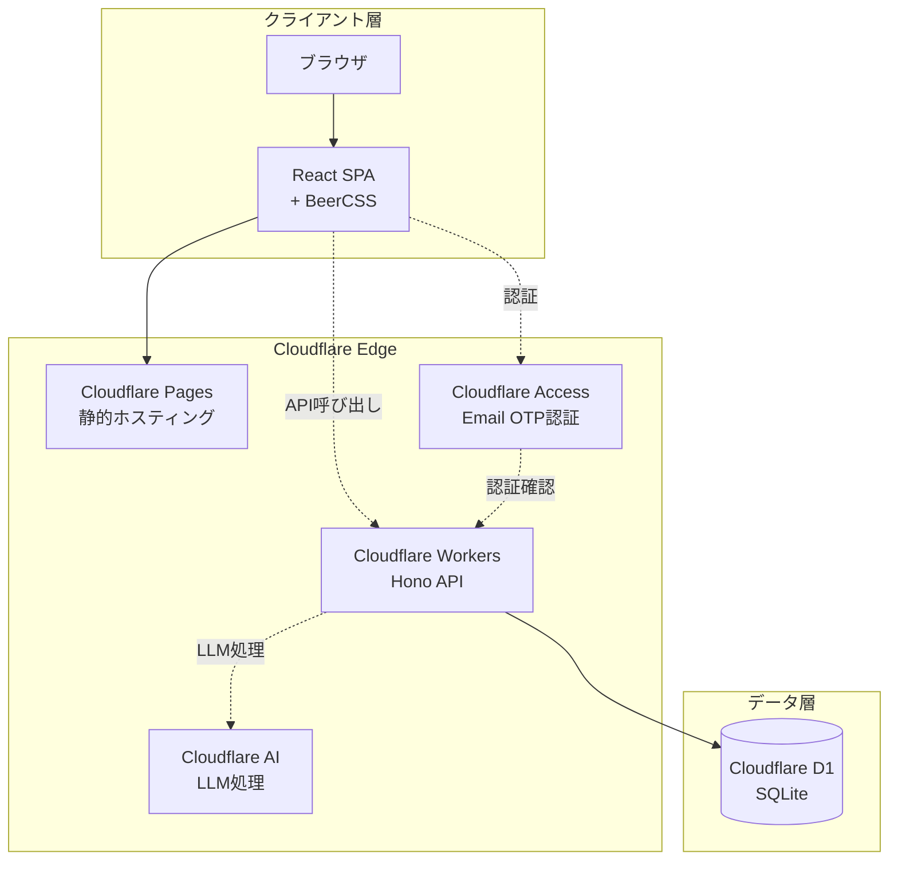
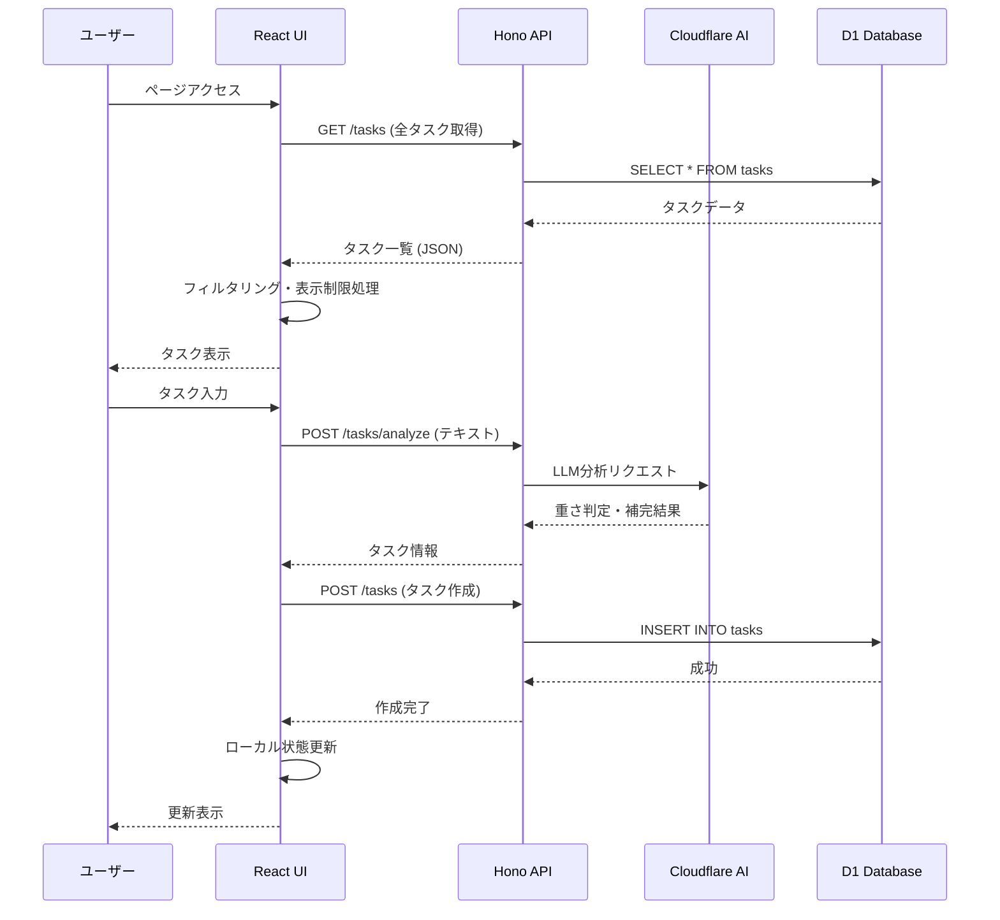
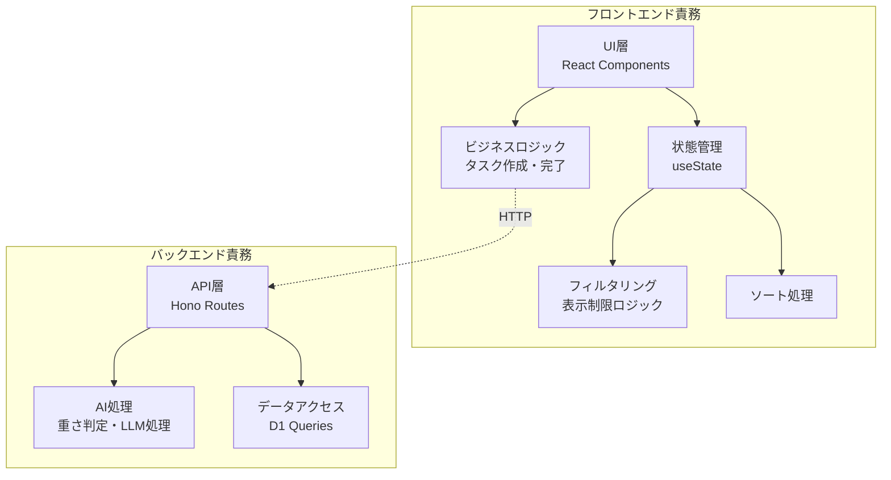
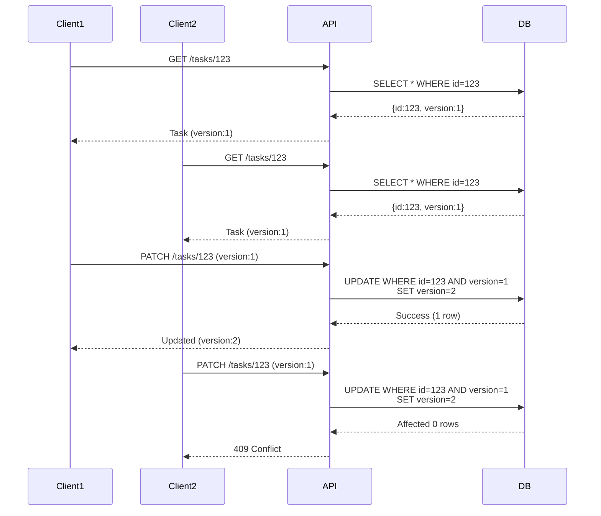
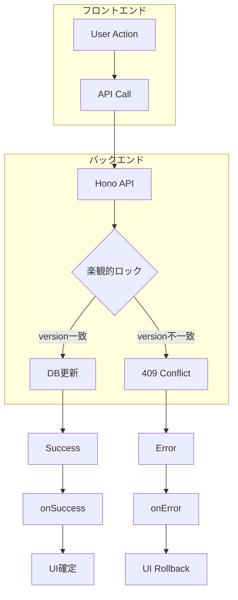

# アーキテクチャ設計書 - VanishToDo

## 5.1.1 システム概要図

### 全体構成図



### コンポーネント間データフロー



---

## 5.1.2 アーキテクチャパターン

### 採用アーキテクチャ

**ハイブリッドアーキテクチャ（フロントエンド中心 + バックエンドロジック分離）**

### 構造の概要

本システムは、**UIロジックとビジネスロジックをフロントエンド**に、**データ整合性とAI処理をバックエンド**に配置するハイブリッドアーキテクチャを採用する。



### 責務分離の原則

#### フロントエンド（React）の責務
- **UI表示とユーザー操作**
  - タスクリストの描画
  - フォーム入力の処理
  - ユーザーインタラクション
  
- **クライアント側ロジック**
  - タスク作成・完了・削除・復帰
  - タスクのフィルタリング（重さ別、締切別）
  - 表示制限処理（直近N件のみ表示）
  - 古いタスクの自動非表示判定
  - ソート処理
  - 完了タスクの即時UI反映

#### バックエンド（Hono）の責務
- **データ永続化**
  - CRUD操作の実行
  - データ整合性の保証
  
- **AI処理**
  - LLMによるタスクの重さ自動判定
  - LLMによる長文からのタスク分割
  
- **認証・認可**
  - Cloudflare Accessとの連携
  - ユーザーセッション管理

### 選定理由

1. **パフォーマンスの最適化**
   - フィルタリングやソートなどの頻繁な操作をフロントエンドで処理することで、API呼び出しを削減
   - ユーザー操作に対する即座のフィードバック

2. **開発の単純化**
   - シングルユーザーのため、複雑な同期機構は不要
   - 全データをフロントエンドで保持しても問題ない規模（1000タスク程度）

3. **Cloudflare Workersの制約対応**
   - Workers の CPU時間制限を考慮し、重い処理（LLM呼び出し）のみをバックエンドに配置
   - 軽量な処理はフロントエンドで完結

4. **保守性とテスタビリティ**
   - AI処理（重さ判定、LLM処理）とDBのCRUDをバックエンドに集約
   - AI処理以外はCRUDだけに集中することにより、DB周りの検証を最小化
     - 検証用DBを用意するのが大変なため

---

## 5.1.3 アーキテクチャ決定記録（ADR）

### ADR-001: Cloudflareエコシステムの全面採用

**状態:** 承認済み  
**決定日:** 2025-11-15

**コンテキスト:**
インフラ選定において、複数のクラウドサービスを組み合わせるか、単一プロバイダーに統一するかの判断が必要だった。

**決定内容:**
Cloudflareのサービス群（Pages, Workers, D1, AI, Access）を全面的に採用する。

**理由:**
1. **コスト効率:** 無料枠で開発・運用が可能
2. **統合性:** 同一プロバイダー内でのサービス連携が容易
3. **エッジコンピューティング:** グローバル展開が容易（将来的な拡張性）
4. **学習コスト:** 単一エコシステムの習得で済む
5. **開発者体験:** Wrangler CLIによる統一的な開発フロー

**影響:**
- ✅ インフラ管理の単純化
- ✅ コストの最小化
- ✅ デプロイの簡素化
- ⚠️ ベンダーロックインのリスク
- ⚠️ Cloudflareのサービス制約に依存

**代替案:**
- Vercel + Supabase: より成熟したBaaS、リアルタイム機能が充実
- AWS Amplify: より多機能だが複雑でコストが高い
- Firebase: 学習コストは低いがCloudflareとの親和性が低い

**関連する決定:** ADR-002, ADR-003

---

### ADR-002: Honoフレームワークの採用

**状態:** 承認済み  
**決定日:** 2025-11-15

**コンテキスト:**
Cloudflare Workers上で動作するAPIフレームワークの選定が必要だった。

**決定内容:**
Honoフレームワークを採用してバックエンドAPIを構築する。

**理由:**
1. **Cloudflare Workers最適化:** Workers環境向けに設計されている
2. **軽量性:** バンドルサイズが小さく、起動が高速
3. **TypeScript完全サポート:** 型安全な開発が可能
4. **シンプルなAPI:** Expressライクな書き心地で学習コストが低い
5. **ミドルウェアエコシステム:** CORS、認証などの一般的な機能が揃っている

**影響:**
- ✅ 高速なAPI応答
- ✅ TypeScriptによる型安全性
- ✅ Workers環境での最適なパフォーマンス
- ⚠️ エコシステムは比較的小さい（Express比）

**代替案:**
- Workers直接実装: フレームワークなしでの実装、柔軟性は高いが開発効率が低い
- itty-router: より軽量だが機能が限定的
- Express on Workers: 可能だがパフォーマンスが劣る

**関連する決定:** ADR-001

---

### ADR-003: データ取得パターン（全データ取得方式）

**状態:** 承認済み  
**決定日:** 2025-11-15

**コンテキスト:**
タスクデータの取得方法について、全データ取得か必要データのみ取得かの選択が必要だった。

**決定内容:**
ページ読み込み時に全タスクデータを取得し、フィルタリング・表示制限はフロントエンドで実施する。

**理由:**
1. **データ規模:** 1000タスク程度であればブラウザで処理可能
2. **API呼び出し削減:** フィルタ切り替え時にAPI呼び出し不要
3. **レスポンシブ性:** 即座のフィルタリング・ソートが可能
4. **実装の単純化:** バックエンドのクエリロジックが単純
5. **Workers CPU時間節約:** フィルタリング処理をクライアントに委譲

**影響:**
- ✅ フィルタ切り替えが即座に反映
- ✅ バックエンドの処理負荷軽減
- ✅ API設計がシンプル
- ⚠️ 初回ロード時のデータ転送量がやや大きい
- ⚠️ タスク数が大幅に増えた場合の対応が必要

**代替案:**
- 必要データのみ取得: データ転送量は少ないが、フィルタ変更のたびにAPI呼び出しが必要
- 差分更新方式: 最も効率的だが実装が複雑

**関連する決定:** ADR-004

---

### ADR-004: クライアントサイドキャッシュを使用しない

**状態:** 承認済み  
**決定日:** 2025-11-15

**コンテキスト:**
タスクデータをブラウザ側（LocalStorage/IndexedDB）にキャッシュするかの判断が必要だった。

**決定内容:**
クライアントサイドキャッシュは使用せず、ページ読み込み時に毎回D1から全データを取得する。

**理由:**
1. **実装の単純化:** キャッシュ同期ロジックが不要
2. **データ整合性:** 常に最新のデータを表示できる
3. **デバッグの容易性:** 状態管理が単純
4. **セキュリティ:** ブラウザにタスクデータが残らない
5. **パフォーマンス許容範囲:** D1からの取得は十分高速

**影響:**
- ✅ 実装とデバッグが容易
- ✅ データ整合性の問題が発生しない
- ✅ セキュリティ向上
- ⚠️ ページ読み込み時に必ずAPI呼び出しが発生
- ⚠️ オフライン対応が不可能

**代替案:**
- LocalStorage使用: シンプルだがストレージ制限と同期問題あり
- IndexedDB使用: 大容量データに対応できるが実装が複雑
- Service Worker キャッシュ: オフライン対応可能だが複雑

**関連する決定:** ADR-003

---

### ADR-005: 認証方式（Cloudflare Access Email OTP）

**状態:** 承認済み  
**決定日:** 2025-11-15

**コンテキスト:**
シングルユーザーアプリケーションに適した認証方式の選定が必要だった。

**決定内容:**
Cloudflare Access のEmail OTP（ワンタイムパスワード）を認証方式として採用する。

**理由:**
1. **パスワードレス:** パスワード管理の負担がない
2. **Cloudflare統合:** 他のCloudflareサービスとシームレスに連携
3. **セキュリティ:** 毎回新しいトークンを使用
4. **実装の単純化:** Cloudflare Accessが認証を処理
5. **シングルユーザー向け:** 複雑なユーザー管理機能が不要

**影響:**
- ✅ セキュアな認証
- ✅ 実装コストの削減
- ✅ パスワード管理不要
- ⚠️ メールアクセスが必須
- ⚠️ Cloudflareへの依存度が高い

**代替案:**
- 自前のメール認証: 実装コストが高い
- OAuth (Google/GitHub): 外部プロバイダーへの依存
- パスワード認証: パスワード管理の負担

**関連する決定:** ADR-001

---

### ADR-006: フロントエンド状態管理（React useState）

**状態:** 承認済み  
**決定日:** 2025-11-15

**コンテキスト:**
フロントエンドの状態管理方法を決定する必要があった。

**決定内容:**
React標準のuseStateフックを使用し、外部状態管理ライブラリは導入しない。

**理由:**
1. **シンプルさ:** 状態管理が単純（タスクリストとフィルタ状態のみ）
2. **学習コスト:** React標準機能のみで完結
3. **バンドルサイズ:** 追加ライブラリ不要
4. **十分な機能:** 現在の要件には過不足ない
5. **パフォーマンス:** 状態更新の頻度が高くない

**影響:**
- ✅ 実装がシンプル
- ✅ バンドルサイズの削減
- ✅ メンテナンスコストの低減
- ⚠️ 複雑な状態管理が必要になった場合の移行コスト
- ⚠️ グローバル状態の管理に工夫が必要

**代替案:**
- Redux: 強力だが本プロジェクトには過剰
- Zustand: 軽量でシンプルだが、現時点では不要
- Jotai/Recoil: Atomicな状態管理、現時点では複雑すぎる

**関連する決定:** なし

---

### ADR-007: SPAルーティング（React Router）

**状態:** 承認済み  
**決定日:** 2025-11-15

**コンテキスト:**
基本画面、全タスク表示画面、完了タスク表示画面など、複数の画面遷移をどう実装するか決定が必要だった。

**決定内容:**
React Routerを使用してクライアントサイドルーティングを実装する。

**理由:**
1. **標準的な選択:** Reactエコシステムで最も一般的
2. **柔軟性:** 将来的な画面追加に対応可能
3. **URL管理:** ブラウザバック/フォワード、ブックマーク対応
4. **コード分割:** 画面ごとの遅延ロードが可能
5. **開発者体験:** ドキュメントとコミュニティが充実

**影響:**
- ✅ 標準的な画面遷移の実装
- ✅ ブラウザヒストリーとの統合
- ✅ 将来の拡張性
- ⚠️ バンドルサイズの増加（軽微）

**代替案:**
- 条件分岐レンダリング: シンプルだがURLが変わらない、履歴管理が困難
- Tanstack Router: 型安全性は高いが学習コストあり

**関連する決定:** ADR-006

---

### ADR-008: API Queue方式による順序保証

**状態:** 承認済み  
**決定日:** 2025-11-15

**コンテキスト:**
フロントエンドから複数のAPI呼び出しが短時間に連続して発生する場合、操作の順序が入れ替わる可能性がある。特に、タスクの作成→削除が高速に行われた場合、削除が先に実行されてタスクが残ってしまう問題が発生しうる。

**決定内容:**
フロントエンドにAPI Queue機構を実装し、すべてのAPI呼び出しをQueue経由で順次実行する。

**理由:**
1. **順序保証:** Queue方式により操作順序が確実に保たれる
2. **UIブロッキング回避:** Queue投入は即座に完了し、処理は非同期で実行
3. **エラーハンドリング一元化:** Queue processorでエラー処理を集約
4. **実装のシンプルさ:** 複雑な排他制御が不要
5. **Optimistic Updateとの相性:** UIは即座に更新、バックエンドは順次処理

**実装方針:**
```typescript
// API呼び出しの流れ
User Action 
  → Optimistic UI Update（即座）
  → Queue.enqueue()（即座）
  → Queue Processor（非同期・順次実行）
  → Success/Error Handler
```

**影響:**
- ✅ 操作順序の入れ替わり問題を根本的に解決
- ✅ UIのレスポンス性を維持
- ✅ エラーハンドリングの一貫性
- ⚠️ ページリロード時にQueue内容は喪失（許容）
- ⚠️ Queue実装の追加コスト（軽微）

**代替案:**
- フロントエンド排他制御: 複雑で実装コストが高い
- バックエンドのみで順序保証: フロントエンドの順序が保証されない
- 楽観的ロックのみ: 順序入れ替わりは解決しない

**関連する決定:** ADR-009

---

### ADR-009: バックエンド楽観的ロックの採用

**状態:** 承認済み  
**決定日:** 2025-11-15

**コンテキスト:**
シングルユーザーアプリケーションであっても、複数タブや複数デバイスからの同時アクセスの可能性がある。データ整合性を保つための並行制御機構が必要。

**決定内容:**
D1データベースにversionカラムを追加し、楽観的ロック（Optimistic Locking）を実装する。

**理由:**
1. **軽量性:** ロック取得のオーバーヘッドがない
2. **パフォーマンス:** 読み取り操作がブロックされない
3. **Cloudflare Workers適性:** ステートレスな環境に適している
4. **シンプルな実装:** versionカラムの追加のみで実現可能
5. **競合検出:** 更新時に競合を確実に検出できる

**実装方針:**
```sql
-- テーブル定義
CREATE TABLE tasks (
  id TEXT PRIMARY KEY,
  version INTEGER DEFAULT 1,
  -- その他のカラム
);

-- 更新クエリ
UPDATE tasks 
SET column = value, version = version + 1
WHERE id = ? AND version = ?;
```

**影響:**
- ✅ データ整合性の保証
- ✅ デッドロックの回避
- ✅ 実装がシンプル
- ⚠️ 競合発生時のリトライ処理が必要
- ⚠️ すべてのテーブルにversionカラムが必要

**代替案:**
- 悲観的ロック: D1ではサポートが限定的、パフォーマンス低下
- タイムスタンプベース: バージョン番号より精度が低い
- ロックなし: データ不整合のリスク

**関連する決定:** ADR-008

---

### ADR-010: CRUDに徹したDBアクセスAPI設計

**状態:** 承認済み  
**決定日:** 2025-11-15

#### コンテキスト

バックエンドAPIをビジネスロジック込みで実装するか、純粋なCRUD操作のみに限定するかの判断が必要だった。テストの容易性、責務の明確化、保守性を考慮する必要がある。

#### 決定内容

バックエンドAPIは**純粋なCRUD操作**に徹し、ビジネスロジックはフロントエンドで実装する。ただし、データ整合性を保つための**完全なバリデーション**はバックエンドで実施する。

**責務分担:**

- **フロントエンド:** ビジネスロジック、`completed_at`/`deleted_at`/`created_at`/`updated_at`の設定（UTC）
- **バックエンド:** CRUD操作、`id`/`version`の自動設定、完全なバリデーション

**削除方式:** 論理削除（`deleted`フラグ）を採用

#### 理由

1. **テストの容易性:** バックエンドはCRUD操作のみテストすれば良い
2. **責務の明確化:** フロントエンド=ビジネスロジック、バックエンド=データ永続化
3. **保守性の向上:** ビジネスロジック変更時、フロントエンドのみ修正
4. **パフォーマンス:** フィルタリング、ソートをクライアント側で実行
5. **整合性の保証:** 完全なバリデーションにより不正データを拒否

#### 影響

- ✅ テストが簡単（特にバックエンド）
- ✅ 責務が明確で保守しやすい
- ✅ フロントエンドの柔軟性が高い
- ✅ バリデーションによるデータ品質保証
- ⚠️ フロントエンドのコード量が増える
- ⚠️ フロントエンドとバックエンドで重複するバリデーションロジック（型定義）

#### 代替案

- ビジネスロジックをバックエンドに配置: テストが複雑になり、柔軟性が低下
- バリデーションなし: データ品質の問題が発生しうる
- 物理削除: データの復元やトレーサビリティが失われる

#### 関連する決定

ADR-008, ADR-009

---

## 5.1.4 設計指針

### 基本原則

本プロジェクトでは、以下の設計原則を重視する：

#### 1. シンプルさ優先（YAGNI - You Aren't Gonna Need It）
- 現時点で必要な機能のみを実装
- 将来の拡張性よりも現在の要件達成を優先
- 過度な抽象化を避ける

**例:**
- ✅ シンプルなCRUD API
- ❌ 複雑なレイヤードアーキテクチャ

#### 2. 関心の分離（Separation of Concerns）
- UIロジックとビジネスロジックの明確な分離
- フロントエンドとバックエンドの責務を明確に定義
- 各コンポーネントは単一の責務を持つ

**例:**
- フィルタリング → フロントエンド
- LLM処理 → バックエンド

#### 3. DRY原則（Don't Repeat Yourself）の適度な適用
- 共通ロジックは関数化・モジュール化
- ただし、過度な共通化は避ける（3回ルール）
- コピペが明らかに問題になってから抽象化

#### 4. 型安全性の確保
- TypeScriptを全面的に活用
- anyの使用を最小限に
- APIレスポンスの型定義を明確に

#### 5. エラーハンドリングの一貫性
- すべてのAPI呼び出しでエラーハンドリング
- ユーザーフレンドリーなエラーメッセージ
- エラー発生時のフォールバック動作を定義

### コーディング規約

#### TypeScript/JavaScript
- **リンター・フォーマッター:** Biome使用
- **命名規則:**
  - コンポーネント: PascalCase（例: `TaskList.tsx`）
  - 関数: camelCase（例: `fetchTasks()`）
  - 定数: UPPER_SNAKE_CASE（例: `MAX_DISPLAY_TASKS`）
  - 型・インターフェース: PascalCase（例: `Task`, `TaskFilter`）
  
#### ファイル構成
- **コンポーネント:** `src/components/` 以下に配置
- **型定義:** `src/types/` 以下に配置
- **API呼び出し:** `src/api/` 以下に配置
- **ユーティリティ:** `src/utils/` 以下に配置

#### コメント規約
- **JSDoc形式:** 関数やクラスには説明を付与
- **インラインコメント:** 複雑なロジックには説明を追加
- **TODO/FIXME:** 将来の改善点を明記

```typescript
/**
 * タスクの重さを判定する
 * @param taskText - タスクの内容
 * @returns 重さ（heavy/medium/light）
 */
function determineTaskWeight(taskText: string): TaskWeight {
  // TODO: LLMによる判定を実装
  return 'medium';
}
```

### パフォーマンスガイドライン

#### フロントエンド
- **レンダリング最適化:**
  - React.memoの適切な使用
  - useCallbackでの関数メモ化
  - 大きなリストのバーチャルスクロール（必要時）

- **バンドルサイズ:**
  - ツリーシェイキングの活用
  - 不要な依存関係の削除

#### バックエンド
- **データベースクエリ:**
  - インデックスの適切な設定
  - N+1問題の回避

### セキュリティガイドライン

1. **入力検証:**
   - すべてのユーザー入力をバリデーション
   - SQLインジェクション対策（ORMの活用）
   - XSS対策（Reactのエスケープ機能活用）

2. **認証・認可:**
   - Cloudflare Accessによる保護

3. **データ保護:**
   - HTTPS通信の強制
   - 機密情報のログ出力禁止

---

## 5.1.5 技術スタック

### フロントエンド

| カテゴリ | 技術 | バージョン | 用途 |
|---------|------|-----------|------|
| **コアフレームワーク** | React | 18.x | UI構築 |
| **言語** | TypeScript | 5.x | 型安全な開発 |
| **ルーティング** | React Router | 7.x | クライアントサイドルーティング |
| **UIフレームワーク** | BeerCSS | 3.x | マテリアルデザインUI |
| **HTTPクライアント** | Fetch API | - | API通信 |
| **ビルドツール** | Vite | 5.x | 高速な開発環境 |

**選定理由:**
- **React:** 豊富なエコシステムと学習リソース
- **TypeScript:** 型安全性による品質向上とIDE支援
- **React Router:** 標準的なルーティングソリューション
- **BeerCSS:** 軽量なマテリアルデザイン実装
- **Vite:** 高速なHMRと最適化されたビルド

### バックエンド

| カテゴリ | 技術 | バージョン | 用途 |
|---------|------|-----------|------|
| **フレームワーク** | Hono | 4.x | API構築 |
| **言語** | TypeScript | 5.x | 型安全な開発 |
| **ランタイム** | Cloudflare Workers | - | サーバーレス実行環境 |
| **ORM/クエリビルダー** | Drizzle ORM | 0.x | D1アクセス |

**選定理由:**
- **Hono:** Cloudflare Workers最適化、軽量で高速
- **TypeScript:** フロントエンドとの型共有
- **Drizzle ORM:** 型安全なクエリ、D1対応

### インフラストラクチャ

| カテゴリ | 技術 | 用途 |
|---------|------|------|
| **ホスティング** | Cloudflare Pages | フロントエンドの静的配信 |
| **コンピューティング** | Cloudflare Workers | バックエンドAPI実行 |
| **データベース** | Cloudflare D1 | SQLiteベースのデータ永続化 |
| **AI処理** | Cloudflare AI | LLMによるタスク分析 |
| **認証** | Cloudflare Access | Email OTP認証 |
| **CDN** | Cloudflare CDN | グローバル配信 |

**選定理由:**
- すべてCloudflareエコシステム内で統一
- 無料枠での運用が可能
- グローバルエッジネットワークによる低レイテンシ

### 開発ツール

| カテゴリ | 技術 | 用途 |
|---------|------|------|
| **パッケージマネージャー** | npm/pnpm | 依存関係管理 |
| **リンター・フォーマッター** | Biome | コード品質チェック・フォーマット |
| **バージョン管理** | Git | ソースコード管理 |
| **CI/CD** | Cloudflare Pages CI | 自動デプロイ |
| **ローカル開発** | Wrangler | Workers/D1ローカル実行 |

**Biome採用理由:**
- ESLint + Prettier の代替として1つのツールで完結
- 高速な実行速度
- TypeScript完全サポート

---

## 5.1.6 非同期・並行処理設計

### 非同期処理の方針

本システムでは、以下の処理を非同期で実行する：

#### 1. LLM処理（タスク分析・補完）

**処理フロー:**
```typescript
// フロントエンド: ユーザーがタスクを入力
User Input → API Request → Workers → Cloudflare AI → Response → UI Update
```

**実装方針:**
- **非ブロッキング:** LLM処理中もUIは操作可能
- **タイムアウト:** 10秒でタイムアウト、フォールバック処理
- **エラーハンドリング:** LLM失敗時はユーザー入力をそのまま使用
- **ローディング表示:** 処理中のインジケーター表示

**コード例:**
```typescript
// フロントエンド
const [isAnalyzing, setIsAnalyzing] = useState(false);

async function analyzeTask(text: string) {
  setIsAnalyzing(true);
  try {
    const response = await fetch('/api/tasks/analyze', {
      method: 'POST',
      body: JSON.stringify({ text }),
      signal: AbortSignal.timeout(10000), // 10秒タイムアウト
    });
    const result = await response.json();
    return result;
  } catch (error) {
    // フォールバック: ユーザー入力をそのまま使用
    return { text, weight: 'medium', deadline: null };
  } finally {
    setIsAnalyzing(false);
  }
}
```

#### 2. データベース操作

**処理フロー:**
```typescript
// CRUD操作は同期的に見えるが、内部的には非同期
API Request → D1 Query (async) → Response
```

**実装方針:**
- **トランザクション:** 1つのトランザクションで1APIの操作を実行
- **エラーハンドリング:** DB操作失敗時はエラーを返すだけでテーブルには何もしない
- **リトライ:** 一時的なエラーは3回までリトライ

**コード例:**
```typescript
// バックエンド
async function createTask(task: NewTask) {
  try {
    const result = await db.insert(tasks).values(task).returning();
    return result[0];
  } catch (error) {
    logger.error('Failed to create task', error);
    throw new Error('タスクの作成に失敗しました');
  }
}
```

### 並行処理の方針

#### フロントエンド: DBの楽観的ロックに依存

- 後述するDBの楽観的ロックにより、read after writeのハザードは生じないため、フロントエンド独自での追加のロック等は行わない

#### バックエンド: 楽観的ロック

**実装:**

```sql
-- テーブル定義
CREATE TABLE tasks (
  id TEXT PRIMARY KEY,
  user_id TEXT NOT NULL,
  title TEXT NOT NULL,
  weight TEXT CHECK(weight IN ('heavy', 'medium', 'light')) NOT NULL,
  deadline DATETIME,
  completed BOOLEAN DEFAULT FALSE,
  completed_at DATETIME,
  version INTEGER DEFAULT 1,
  created_at DATETIME DEFAULT CURRENT_TIMESTAMP,
  updated_at DATETIME DEFAULT CURRENT_TIMESTAMP
);

CREATE INDEX idx_tasks_user_completed ON tasks(user_id, completed);
CREATE INDEX idx_tasks_deadline ON tasks(deadline) WHERE deadline IS NOT NULL;
```

```typescript
// Drizzle ORMでの実装例
import { eq, and } from 'drizzle-orm';

/**
 * 楽観的ロックを使ったタスク更新
 */
async function updateTask(
  id: string, 
  updates: Partial<Task>, 
  currentVersion: number
): Promise<Task> {
  const result = await db
    .update(tasks)
    .set({ 
      ...updates, 
      version: currentVersion + 1,
      updated_at: new Date()
    })
    .where(and(
      eq(tasks.id, id),
      eq(tasks.version, currentVersion)
    ))
    .returning();
    
  if (result.length === 0) {
    throw new ConflictError(
      'Task was modified by another request',
      409
    );
  }
  
  return result[0];
}

/**
 * 楽観的ロックを使ったタスク削除
 */
async function deleteTask(id: string, currentVersion: number): Promise<void> {
  const result = await db
    .delete(tasks)
    .where(and(
      eq(tasks.id, id),
      eq(tasks.version, currentVersion)
    ))
    .returning();
    
  if (result.length === 0) {
    // 既に削除済み、または他で更新された
    // 削除時は404として扱う
    throw new NotFoundError('Task not found', 404);
  }
}

/**
 * カスタムエラークラス
 */
class ConflictError extends Error {
  constructor(message: string, public status: number) {
    super(message);
    this.name = 'ConflictError';
  }
}

class NotFoundError extends Error {
  constructor(message: string, public status: number) {
    super(message);
    this.name = 'NotFoundError';
  }
}
```

**Honoでのエラーハンドリング:**

```typescript
// API実装例
app.patch('/tasks/:id', async (c) => {
  const id = c.req.param('id');
  const body = await c.req.json();
  const { version, ...updates } = body;
  
  try {
    const updated = await updateTask(id, updates, version);
    return c.json(updated);
  } catch (error) {
    if (error instanceof ConflictError) {
      return c.json({ error: 'Conflict' }, 409);
    }
    throw error;
  }
});

app.delete('/tasks/:id', async (c) => {
  const id = c.req.param('id');
  const version = Number(c.req.query('version'));
  
  try {
    await deleteTask(id, version);
    return c.json({ success: true });
  } catch (error) {
    if (error instanceof NotFoundError) {
      return c.json({ error: 'Not found' }, 404);
    }
    throw error;
  }
});
```

**楽観的ロックのフロー:**



### 並行制御のまとめ



**二重の安全機構:**

1. **フロントエンド:**
   - 楽観的ロックのversionを用いると、read after writeハザードは生じない

2. **バックエンド（楽観的ロック）:**
   - データ整合性を保証
   - 複数クライアント間での競合を検出

### イベント駆動アーキテクチャ

本システムでは現時点でイベント駆動アーキテクチャは採用しない。

**理由:**
- シンプルなCRUD操作が中心
- シングルユーザーのため、複雑なイベント伝播は不要
- 将来的に必要になった場合に追加を検討

### 整合性の方針

#### データ整合性

**強整合性を保証する範囲:**
- タスクのCRUD操作（楽観的ロックにより保証）
- ユーザー認証情報

**最終的整合性で許容する範囲:**
- 現時点ではなし（すべて強整合性）

**実装方法:**
- D1のトランザクション機能を活用
- ACID特性を利用した整合性保証
- 楽観的ロックによる並行制御

#### UI整合性

**Optimistic UI Update:**
- タスク完了、削除などの操作は即座にUIに反映
- バックエンドの楽観的ロックにより順序が保証される
- バックエンドの処理完了を待たずに次の操作が可能
- 失敗時はロールバックして再表示

**データ再取得:**
- ページリロード時は常に最新データを取得
- 操作成功後はローカル状態を更新（再取得不要）
- 409 Conflict発生時はページリロードか強制上書きのどちらを選ぶかを促す

---

## 補足: 将来的な拡張性の考慮

本設計では、以下の将来的な拡張を考慮している：

### スケーラビリティ
- **現在:** シングルユーザー
- **将来:** マルチユーザー対応時は認証・認可の強化が必要
- **対応方法:** Cloudflare Access の設定変更、D1のテーブルにuser_id追加

### 機能拡張
- **現在:** 基本的なタスク管理
- **将来:** タグ、プロジェクト、リマインダー機能
- **対応方法:** 現在のアーキテクチャで対応可能（テーブル追加）

### パフォーマンス
- **現在:** 1000タスクまで
- **将来:** 10000タスク以上
- **対応方法:** ページネーション、インデックス最適化、キャッシュ導入を検討

---

*本アーキテクチャ設計書は、VanishToDoプロジェクトの技術的な基盤を定義し、すべての実装の指針となるものである。*