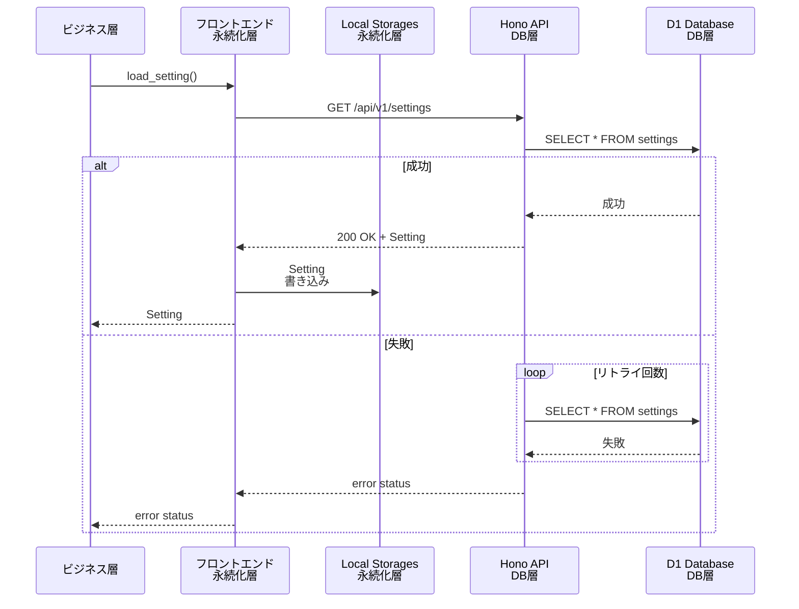
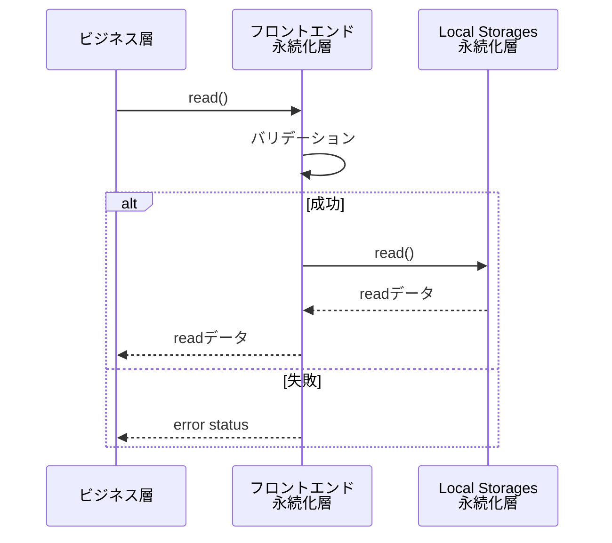
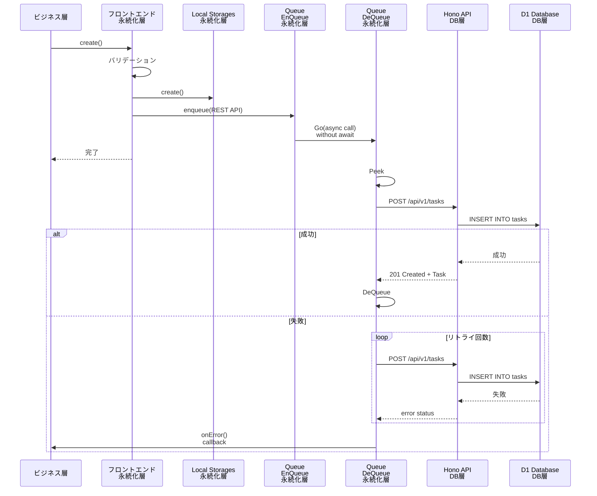

# 5.4 永続化層機能仕様

## 5.4.1 機能概要

- ビジネス層からのCRUD要求を、LocalStorageを対象として同期的に実行
- DB層とLocalStorageの同期(非同期)
- 未同期キューの管理（未同期キューはLocalStorage上に実装）
- ネットワーク断からの復旧処理

永続化層は、タスクリストやセッティングを保持し、ビジネス層からのリクエストに応えてこれらの値を読み書きします。
タスクリストやセッティングの初期値はDB層に保存されているため、アプリの起動直後にDB層からこれらのデータを取得しLocalStorageに保存します。
ビジネス層からの読み書きリクエストはまずLocalStorageに対して行われます。書き込みアクセスはLocalStorageに加えDB層へのアクセスも行い、DB層のDBとLocalStorageのコヒーレントを保ちます。

DB層への書き込みアクセスは1本のQueueにより直列化され、最初のリクエスト順を守ってDBへの書き込みを行います。
DB層への書き込みAPIのリードバックを待ってから次の書き込みを行うことで、順番の追い越しを防ぎます。
また、このQueueは非同期で動作し、フロントエンドの動作を極力邪魔しません。

VanishToDoには、複数の端末からの書き込みアクセスの競合を検知するために、各タスクにversionフィールドを用意してあります。書き込みごとにversionフィールドをインクリメントし、DB上の値+1と一致するか比較することで、書き込みアクセスが競合していないことを確認できます。versionフィールドのインクリメントはビジネス層の責務です。また、競合を検出するのはDB層の責務です。そのため、永続化層はDB層からのアクセス競合エラーを検知してビジネス層に返す責務のみを持ちます。versionフィールドに関しては永続化層は触りません。また、Settingにはversionフィールドはなく、競合は検知できません。

DB層へのアクセスでエラーが返ってきた場合、一部のネットワークエラーではリトライを何回か行います。それでもエラーの場合はDeQueueはリトライを一時停止します。Queueに次のEnQueueアクセスがあった際、またはユーザーから明示的なリロード指定があった際に、あらためてQueueの先頭からDB層へのリトライアクセスをはじめます。

ネットワークエラー以外の、リトライしても改善しないエラーに関しては、基本的に致命的です。ビジネス層にエラーを伝え、エラー原因になったアクセスをQueueから取り除き、次のアクセスをQueueから取り出して続きの処理を行います。

QueueはLocalStorage上に構成されます。ブラウザの再起動やリロードを超えてDBとの同期を確保するためです。ネットワークエラーの場合はQueueに値が残り続けます。ページロード/リロード時の永続化層初期化の時に、Queueに値が残っている場合は、永続化層の初期読み込みの前にQueueに残ったDB層への書き込みアクセスを処理します。

アプリ起動ごとに、DB層からの読み込みを行い、LocalStorageを上書きします。これは、他のクライアントからのアクセスを同期する目的です。DB層からの読み込みは、Queueの値の処理の後に行われます。

エラーがあり、DB層へのアクセスができない場合は、LocalStorageに残った値のみを使ってビジネス層からのアクセスに答えます。

## 5.4.2 機能リスト

| 機能ID   | 機能名 |
|----------|--------------------|
| F-PE-001 | LocalStorage初期化 |
| F-PE-002 | 未同期Queue処理 |
| F-PE-003 | 読み出し |
| F-PE-004 | 書き込み |
| F-PE-005 | DB同期 |
| F-PE-006 | リトライ |

## 5.4.3 シーケンス図

### 初期化・リロード動作

### Read動作(タスク読み込み等)

### Write動作(タスク作成等)

## 5.4.4 状態遷移図

なし。

## 5.4.5 機能詳細仕様

### F-PE-001 LocalStorage初期化

**概要:**

LocalStorageにDBの値を格納します。以降、LocalStorageが最も正しい状態を表します。

初期化に先立ち、未同期Queueにアイテムが存在する場合、それは前回アプリ終了時にネットワーク断などでDB同期（書き込み）が終わっていないことを示します。そのため、まずは未同期QueueのアイテムをDBに書き込み同期します（F-PE-002）。

未同期Queueが空の状態で、本機能はDB層への読み出しアクセスを行い、Settingと全Task[]をLocalStorageに格納します。
Settingが存在しない場合、致命的エラーで終了します。

**起動トリガ:** ビジネス層からの初期化リクエスト

**機能:**

- DB層への読みだしアクセスを行い、タスクリストとセッティングを取得します。
- 取得したデータをLocalStorageに保存します。
- P-FE-002呼び出し: LocalStorage上の未同期Queueに未処理アクセスが残っている場合は、DB層への読み出しアクセスに先立って未同期Queueの未処理アクセスを順に処理します。

**エラー:**

DB層からの応答により以下のエラーを返す。

- 致命的エラー: 
  1. ネットワークエラーのために初期化に失敗し、かつ、LocalStorageにSettingが存在しない
  2. DB層が500を返し（DB層内部ロジックにバグがある）、かつ、LocalStorageにSettingが存在しない
  - Settingは一度は読み込むことが最低限必要になる。存在しない場合はアプリはそれ以上動作できない。
- ネットワークエラー: ネットワークエラーのために初期化に失敗したが、LocalStorageにSettingが存在する
  - LocalStorageに格納されている値を利用してアプリの動作を継続可能。
- サーバー内部エラー: DB層の内部ロジックにバグがあるが、LocalStorageにSettingが存在する
  - LocalStorageに格納されている値を利用してアプリの動作を継続可能。
- 競合エラー: 1個以上のアイテムに関して、バージョンの競合が発生した
  - 競合はDB側を正として解消済み。そのため、そのままアプリの動作を継続可能。

---
### F-PE-002 未同期Queue処理

**概要:**

F-PE-001 LocalStorage初期化の際に、未同期キューの内容が存在する場合、それは前回のアプリ終了時点でDB同期（書き込み）が済んでいないデータがあることを示しています。まず、DBの状態を最新に保つために、F-PE-001 LocalStorage初期化に先立って、未同期Queueの内容をDBに書き込みます。この際、楽観的ロック競合が生じることがあります。原因は、ネットワークエラーなどによりある端末の未同期Queueに値が格納されたままアプリを終了し、その後、他の端末で同じタスクに対し編集などの操作を行った場合に生じます。本来ならば、どちらが正かをユーザーに問い合わせるところですが、VanishToDoでは簡略化のため、初期化時はDBの状態を正として取り扱います。具体的には、未同期QueueのTOPにある当該アクセスを破棄し、後続アクセスの処理を続けます。前述の状況が想定されるため、DBの状態がより最新に近いだろうという判断のもとです。F-PE-002に引き続き行われるF-PE-001 LocalStorage初期化において、DBの状態を全読み込みしてLocalStorageに上書きされるため、当該アクセスの破棄だけでLocalStorage上にDBの状態を完全に反映することができます。

**起動トリガ:** F-PE-001 LocalStorage初期化からの呼び出し

**機能:**

**エラー:**
- ネットワークエラー: ネットワークエラーのために初期化に失敗した
  - 未同期Queueは空にならない状態でリターン
- サーバー内部エラー: DB層の内部ロジックにバグがある
  - 未同期Queueは空にならない状態でリターン
- 競合エラー: 1個以上のアイテムに関して、バージョンの競合が発生した
  - 競合はDB側を正として解消済み。未同期Queueは空になっている。

---
### F-PE-003 読み出し

**概要:**

Task[]もしくはSettingをLocalStorageから読み出します。

**起動トリガ:** ビジネス層からの読み出しリクエスト

**詳細:**

**エラー:**
- なし

---
### F-PE-004 書き込み

**概要:**

TaskもしくはSettingをLocalStorageに同期的に書き込みます。引き続き、F7-PE-004 DB層同期が非同期的に行われます。

Taskの書き込み先の指定は、Task IDによって指定されます。Settingはユーザーひとりにつき1個のため、書き込み先の指定はユーザIDになります。
そのため、LocalStorageはライトスルーキャッシュのように動作します。

LocalStorage書き込みは必ず成功します。
DB書き込みが成功した場合はレスポンスはありません。DB書き込みが失敗した場合は、onError()ハンドラが起動されます。
onError()ハンドラでは、プレゼンテーション層でユーザーにエラーメッセージを表示させるトリガとして扱うことを想定しています。

**起動トリガ:** ビジネス層からの書き込みリクエスト

**詳細:**

**エラー:**
書き込みリクエスト自体はエラーを返さない。引数で渡されるonError()ハンドラに、F-PE-005 DB層同期で発生する下記エラーが報告されることがある。ただし、どれも動作は継続可能。詳細はF-PE-005のエラーを参照。

- ネットワークエラー: ネットワークエラーのために書き込みに失敗した
- サーバー内部エラー: DB層の内部ロジックにバグがある
- 競合エラー: バージョンの競合が発生した

---
### F-PE-005 DB同期

**概要:**

未同期キューの内容をDBと同期します。LocalStorageはライトスルーキャッシュのように動作します。
アプリ起動時にDB全体をLocalStorageに読み込むため、そのあとはビジネス層からの書き込みアクセスのたびに
未同期QueueへのEnQueueが行われます。EnQueueは同期的に行われ、そのあとで、DeQueueは非同期的に行われます。
具体的には、EnQueue直後に、async関数のDeQueue+DB層書き込みアクセスのための用関数（async関数）を、awaitなしで呼び出します(シーケンス図 Write動作のGOの個所)。GOした際に、DeQueueがすでに動いているかDeQueue側のフラグで確認し、DeQueueがすでに動作している場合は何もせずreturnします。DeQueueが動いていない場合は、Queueの中身が空になるまで、DeQueueとDB層への書き込みアクセスを行います。

**起動トリガ:** F-PE-004 書き込みからの呼び出し

**機能:**

**エラー:**
- ネットワークエラー: ネットワークエラーのために書き込みに失敗した
  - 未同期Queueは空にならない状態でリターン。LocalStorageには書き込みは完了しているため、アプリは継続して動作可能。
- サーバー内部エラー: DB層の内部ロジックにバグがある
  - 未同期Queueは空にならない状態でリターン。LocalStorageには書き込みは完了しているため、アプリは継続して動作可能。
- 競合エラー: バージョンの競合が発生した
  - 競合はLocalStorage側を正として解消済み(強制上書き)。未同期Queueは空になっている。アプリは継続して動作可能。

---
### F-PE-006 リトライ

**概要:**

未同期Queueの先頭アイテムを参照して行われる、DB層への書き込みアクセスがネットワークエラーなどのリトライ可能要因で失敗した場合、
一定秒数を待って書き込みのリトライを行います。
一定回数リトライし、その間にアクセスが成功した場合は当該アイテムをDeQueueをして次のアイテムの処理に戻ります。
すべてのリトライが失敗した場合、ネットワークエラーとしてonError()ハンドラを呼び出すことで、F-PE-002もしくはF-PE-005の非同期処理を終了します。次にこの非同期Queueの処理が始まるのは、ユーザーから明示的にリロードの指示があったとき、および、画面ロード/リロード時です。

**起動トリガ:** F-PE-002 未同期Queue処理、およびF-PE-005 DB層同期からの呼び出し

**詳細:**

**エラー:**
- ネットワークエラー: n回のリトライにおいて、全てネットワークエラーのために書き込みに失敗した
  - 未同期Queueは空にならない状態でリターン

---

### F-PE-007 リロード

**概要:**

DBとLocalStorage、未同期Queue全ての同期をとります。ほぼ、処理はF-PE-001と同一です。唯一、競合エラーが発生した場合は、未同期Queueの値でDBを上書きします。

**起動トリガ:** ビジネス層からのリロード要求

**詳細:**

**エラー:**
F-PE-001と同じエラーを返します。

- 致命的エラー
- ネットワークエラー
- サーバー内部エラー
- 競合エラー

---

## 5.4.6 データ型

詳細はtypes.tsを参照。

- タスクリスト: `Task[]`型
- Setting: `UserSettings`型
