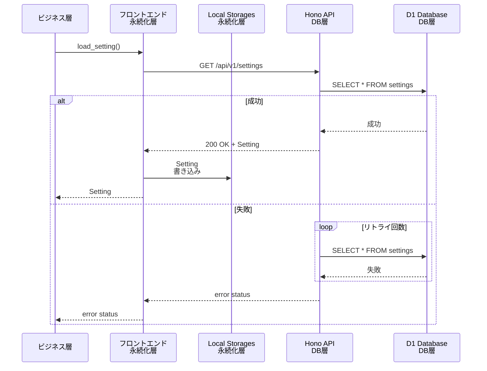
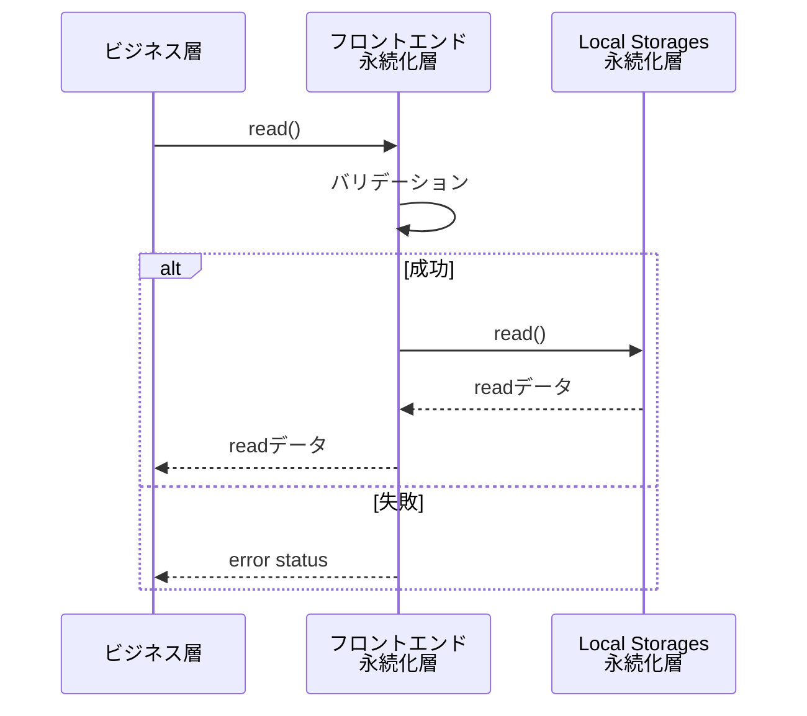
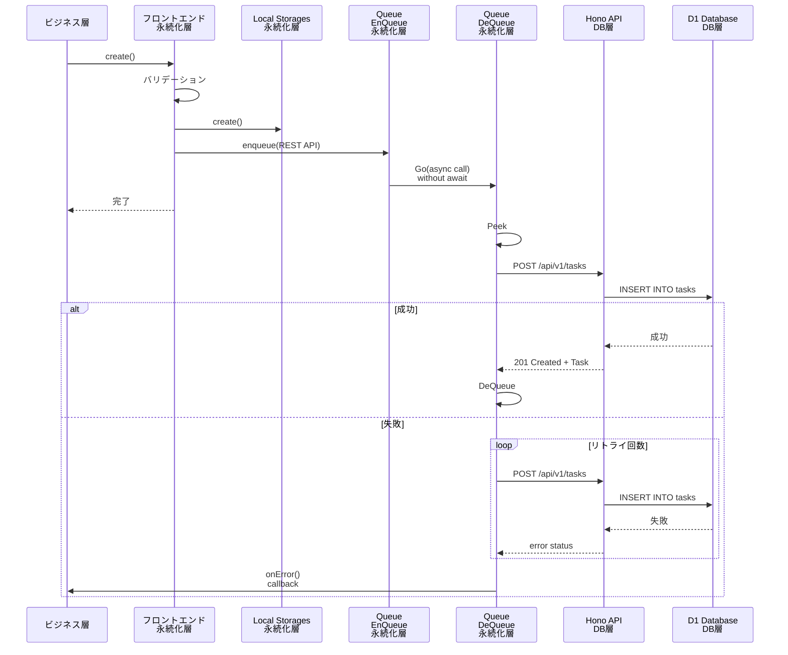

# 5.4 永続化層機能仕様

## 概要

永続化層は、タスクリストやセッティングを保持し、ビジネス層からのリクエストに応えてこれらの値を読み書きします。
タスクリストやセッティングの初期値はDB層に保存されているため、アプリの起動直後にDB層からこれらのデータを取得しLocalStorageに保存します。
ビジネス層からの読み書きリクエストはまずLocalStorageに対して行われます。書き込みアクセスはLocalStorageに加えDB層へのアクセスも行い、DB層のDBとLocalStorageのコヒーレントを保ちます。
DB層への書き込みアクセスは1本のQueueにより直列化され、最初のリクエスト順を守ってDBへの書き込みを行います。
DB層への書き込みAPIのリードバックを待ってから次の書き込みを行うことで、順番の追い越しを防ぎます。
また、このQueueは非同期で動作し、フロントエンドの動作を極力邪魔しません。

VanishToDoには、複数の端末からの書き込みアクセスの競合を検知するために、各タスクやセッティングにversionフィールドを用意してあります。書き込みごとにversionフィールドをインクリメントし、DB上の値+1と一致するか比較することで、書き込みアクセスが競合していないことを確認できます。しかし、versionフィールドのインクリメントはビジネス層の責務です。また、競合を検出するのはDB層の責務です。そのため、永続化層はDB層からのアクセス競合エラーを検知してビジネス層に返す責務の実を持ちます。versionフィールドに関しては永続化層は触りません。

DB層へのアクセスでエラーが返ってきた場合、一部のネットワークエラーではリトライを何回か行います。それでもエラーの場合はDeQueueは一時停止します。Queueに次のEnQueueアクセスがあった際に、あらためてQueueの先頭からDB層へのアクセスをはじめます。

ネットワークエラー以外の、リトライしても改善しないエラーに関しては、基本的に致命的です。ビジネス層にエラーを伝え、エラー原因になったアクセスをQueueから取り除き、次のアクセスをQueueから取り出して続きの処理を行います。

QueueはLocalStorage上に構成されます。ネットワークエラーの場合はQueueに値が残り続けます。ページロード/リロード時の永続化層初期化の時に、Queueに値が残っている場合は、永続化層の初期読み込みの前にQueueに残ったDB層への書き込みアクセスを処理します。

アプリ起動ごとに、DB層からの読み込みを行い、LocalStorageを上書きします。これは、他のクライアントからのアクセスを同期する目的です。DB層からの読み込みは、Queueの値の処理の後に行われます。

エラーがあり、DB層へのアクセスができない場合は、LocalStorageに残った値のみを使ってビジネス層からのアクセスに答えます。

## 5.4.1 機能一覧

- ビジネス層からのCRUD要求をLocalStorageに同期的に保存
- 未送信キューの管理（LocalStorageに保存）
- DB層とLocalStorageの同期(非同期)
- ネットワーク断からの復旧処理

## 5.4.2 シーケンス図

### 初期化・リロード動作

### Read動作(タスク読み込み等)

### Write動作(タスク作成等)

## 5.4.3 状態遷移図

## 5.4.4 機能詳細仕様

### F-PE-001 LocalStorage初期化機能

**概要:**

- DB層への読みだしアクセスを行い、タスクリストとセッティングを取得します。
- 取得したデータをLocalStorageに保存します。
- LocalStorage上のQueueに未処理アクセスが残っている場合は、DB層への読み出しアクセスに先立ってQueueの未処理アクセスを順に処理します。

**起動トリガ:** ビジネス層からの初期化リクエスト

### F-PE-002 読み書き機能

### F-PE-003 DB層同期機能

### F-PE-002 リトライ機能

- **記載内容:** 各機能の詳細な説明
- 各機能について以下を記述:
  - **機能ID:** 識別子（例: F-001）
  - **機能名:** 機能の名称
  - **対応する要件ID:** トレーサビリティの確保
  - **対応するユーザーストーリーID:** ユーザー価値との紐付け
  - **概要:** 機能の簡潔な説明
  - **詳細説明:**
    - **入力:** 何を受け取るのか（入力パラメータの型と説明）
    - **処理:** どのような処理をするのか（ステップバイステップ）
    - **出力:** 何を出力するのか（出力の型と説明）
    - **副作用:** DB更新、ファイル生成、外部API呼び出し、ログ出力など
  - **前提条件:** 機能実行前に満たされているべき条件
  - **事後条件:** 機能実行後のシステム状態
  - **不変条件:** 処理の前後を通じて常に満たされるべき条件（重要なビジネスルールや整合性制約）
  - **ビジネスルール:** 適用される業務ルールや制約
  - **エラーハンドリング:**
    - 発生しうるエラー
    - 各エラーの検出方法
    - エラー時の処理（リトライ、ロールバック、エラー通知等）
    - ユーザーへのエラー表示
  - **パフォーマンス要件:** この機能固有の性能要件（あれば）
  - **セキュリティ考慮事項:** この機能固有のセキュリティ対策（あれば）
  - **参照:** 関連するシーケンス図、状態遷移図、API仕様へのリンク

## 5.5.5 ビジネスロジック
- **記載内容:** 複雑なビジネスロジックの詳細
- 計算式、アルゴリズム
- 判定条件の詳細（デシジョンテーブル等）
- ビジネスルールの実装方法

## 5.4.6 データフロー図（DFD）
- **記載内容:** データの流れを図示（複雑なシステムの場合）
- データの源泉、処理、格納先、データの流れを表現
- レベル0（コンテキスト図）からレベル1, 2へと詳細化

---
