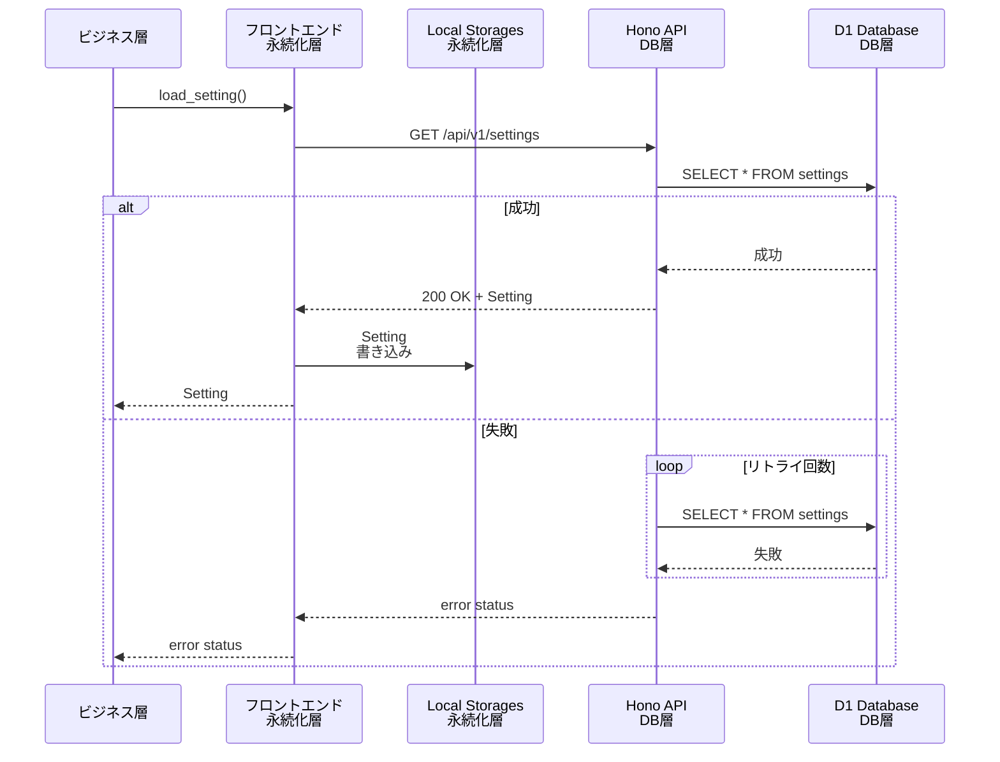
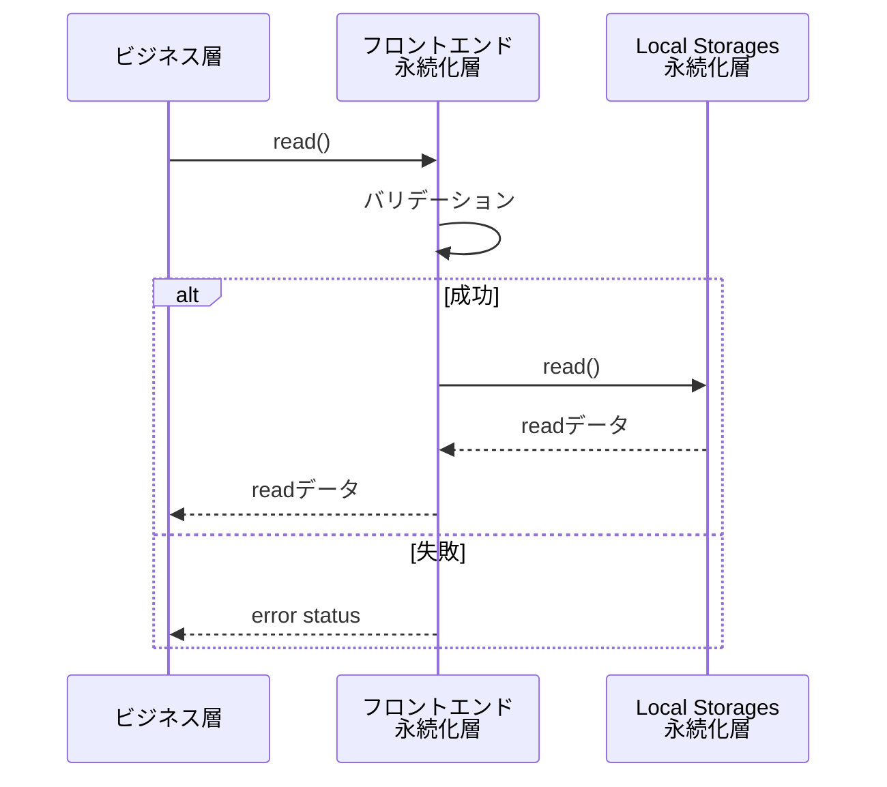
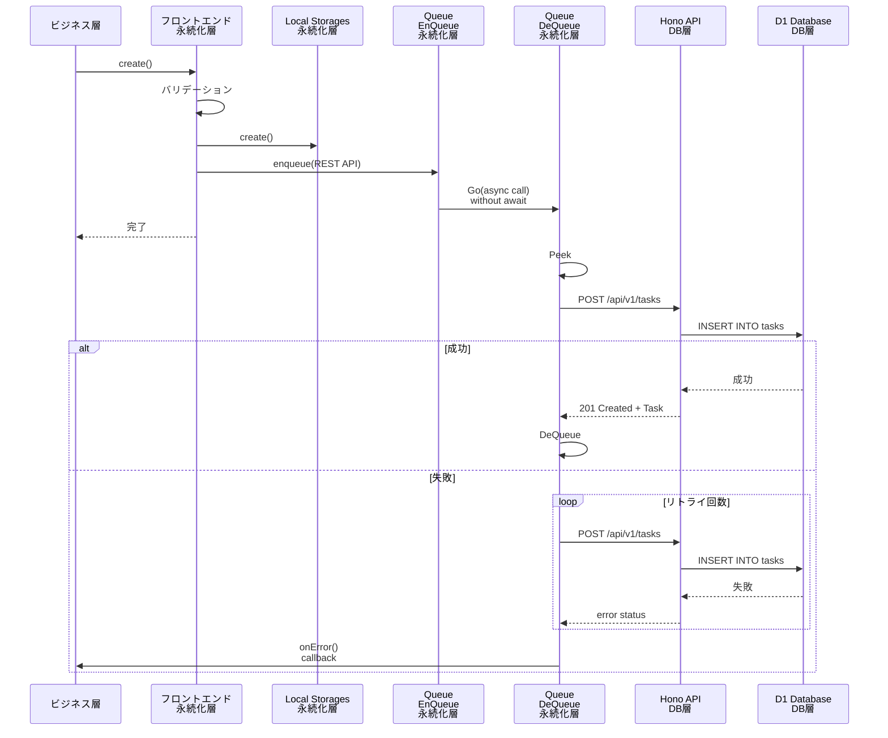

# 5.4 永続化層仕様

## 概要
各機能の詳細な振る舞いを定義するドキュメントです。シーケンス図や状態遷移図を用いて、動的な側面を記述します。

## 5.5.1 機能一覧
- **記載内容:** 実装する機能のリスト
- 各機能に簡潔な説明とIDを付与

## 5.5.2 状態遷移図
- **記載内容:** システムや画面の状態遷移を図示
- 状態をノードとする図
- 遷移条件を矢印に記載
- 各状態での振る舞い
- ※画面遷移図はインターフェース仕様書に記載

## 5.5.3 シーケンス図

### 初期化・リロード動作

### Read動作(タスク読み込み等)

### Write動作(タスク作成等)

## 5.5.4 機能詳細仕様
- **記載内容:** 各機能の詳細な説明
- 各機能について以下を記述:
  - **機能ID:** 識別子（例: F-001）
  - **機能名:** 機能の名称
  - **対応する要件ID:** トレーサビリティの確保
  - **対応するユーザーストーリーID:** ユーザー価値との紐付け
  - **概要:** 機能の簡潔な説明
  - **詳細説明:**
    - **入力:** 何を受け取るのか（入力パラメータの型と説明）
    - **処理:** どのような処理をするのか（ステップバイステップ）
    - **出力:** 何を出力するのか（出力の型と説明）
    - **副作用:** DB更新、ファイル生成、外部API呼び出し、ログ出力など
  - **前提条件:** 機能実行前に満たされているべき条件
  - **事後条件:** 機能実行後のシステム状態
  - **不変条件:** 処理の前後を通じて常に満たされるべき条件（重要なビジネスルールや整合性制約）
  - **ビジネスルール:** 適用される業務ルールや制約
  - **エラーハンドリング:**
    - 発生しうるエラー
    - 各エラーの検出方法
    - エラー時の処理（リトライ、ロールバック、エラー通知等）
    - ユーザーへのエラー表示
  - **パフォーマンス要件:** この機能固有の性能要件（あれば）
  - **セキュリティ考慮事項:** この機能固有のセキュリティ対策（あれば）
  - **参照:** 関連するシーケンス図、状態遷移図、API仕様へのリンク

## 5.5.5 ビジネスロジック
- **記載内容:** 複雑なビジネスロジックの詳細
- 計算式、アルゴリズム
- 判定条件の詳細（デシジョンテーブル等）
- ビジネスルールの実装方法

## 5.4.6 データフロー図（DFD）
- **記載内容:** データの流れを図示（複雑なシステムの場合）
- データの源泉、処理、格納先、データの流れを表現
- レベル0（コンテキスト図）からレベル1, 2へと詳細化

---
