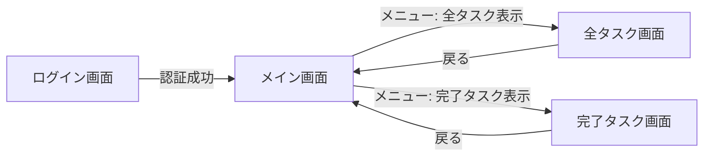

## 5.4 プレゼンテーション層仕様

### 5.4.1 UI全体方針

#### デザインシステム
- **UIフレームワーク**: BeerCSS (Material Design 3準拠)
- **カラーテーマ**: マテリアルデザインの標準カラーパレット
  - プライマリカラー: インディゴ（#3F51B5）
  - アクセントカラー: ピンク（#E91E63）
  - 背景色: ホワイト（#FFFFFF）/ ライトグレー（#F5F5F5）
- **タイポグラフィ**: Roboto フォント（Material Design標準）
- **アイコン**: Material Icons

#### レスポンシブ対応方針
- **ブレークポイント**:
  - スマートフォン: 320px - 767px
  - タブレット: 768px - 1023px
  - デスクトップ: 1024px以上
- **対応デバイス**: スマートフォン、タブレット、PC
- **優先度**: モバイルファースト設計

#### アクセシビリティ方針
- **WCAG準拠レベル**: WCAG 2.1 Level AA準拠を目指す
- **対応する支援技術**: スクリーンリーダー（基本的なサポート）
- **キーボード操作**: 主要機能はキーボードのみで操作可能
- **タップターゲット**: 最小44x44px（モバイル）

#### ブラウザ対応
- **対応ブラウザ**: Google Chrome 最新版
- **JavaScriptバージョン**: ES2022準拠
- **CSSバージョン**: CSS3、CSS Grid、Flexbox使用

---

### 5.4.2 画面遷移図



**遷移条件:**

| 遷移元 | 遷移先 | 条件/トリガー | 
|-------|-------|-------------|
| ログイン画面 | メイン画面 | Cloudflare Access認証成功 | 
| メイン画面 | 全タスク画面 | メニューボタンから「全タスク表示」選択 | 
| メイン画面 | 完了タスク画面 | メニューボタンから「完了タスク表示」選択 | 
| 全タスク画面 | メイン画面 | 戻るボタンクリック | 
| 完了タスク画面 | メイン画面 | 戻るボタンクリック | 

---

### 5.4.3 画面仕様

#### SCR-001: ログイン画面

| 項目 | 内容 |
|------|------|
| **画面ID** | SCR-001 |
| **画面名** | ログイン画面 |
| **URL/パス** | `/login` |
| **対応する要件ID** | NFR-7 |
| **画面の目的** | ユーザー認証を行う |
| **アクセス権限** | すべてのユーザー（未認証） |

**画面レイアウト:**

**※ Cloudflare Accessの標準UIを使用するため、本アプリケーションでは実装不要**

ここでは、認証後の挙動のみを記載する。

**表示項目:**
- Cloudflare Accessが提供する認証UI

**処理フロー:**
1. ユーザーがアプリケーションURLにアクセス
2. Cloudflare Accessが自動的にログイン画面を表示
3. ユーザーがメールアドレスを入力
4. Cloudflare AccessがOTPをメール送信
5. ユーザーがOTPを入力
6. 認証成功 → メイン画面へリダイレクト

---

#### SCR-002: メイン画面

| 項目 | 内容 |
|------|------|
| **画面ID** | SCR-002 |
| **画面名** | メイン画面（タスク一覧・入力） |
| **URL/パス** | `/` |
| **対応する要件ID** | FR-1.1, FR-2.1, FR-2.2, FR-3.1, FR-3.2, FR-3.3 |
| **画面の目的** | タスクの表示・入力・管理を一元的に行う |
| **アクセス権限** | 認証済みユーザーのみ |

**画面レイアウト:**

```
┌─────────────────────────────────────┐
│ ヘッダー                              │
│ [VanishToDo]           [☰ メニュー]  │
├─────────────────────────────────────┤
│                                     │
│ [タスク入力欄]                        │
│ ┌─────────────────────────────────┐ │
│ │ タスクを入力...                   │ │
│ └─────────────────────────────────┘ │
│ [+ 追加] [🤖 分析]                  │
│                                     │
├─────────────────────────────────────┤
│ タスクリスト                          │
│                                     │
│ ┌─────────────────────────────────┐ │
│ │ □ メールを確認する           [軽] │ │
│ │   10:00作成                      │ │
│ └─────────────────────────────────┘ │
│                                     │
│ ┌─────────────────────────────────┐ │
│ │ □ プレゼン資料を作成する    [重]  │ │
│ │   昨日作成                       │ │
│ └─────────────────────────────────┘ │
│                                     │
│ ... (他のタスク)                     │
│                                     │
├─────────────────────────────────────┤
│ フッター（フィルタ）                  │
│ [すべて][重][中][軽][締切]            │
└─────────────────────────────────────┘
```

**表示項目:**

| 項目名 | データソース | データ型 | 表示形式 | 表示条件 |
|-------|------------|---------|-----------|---------|
| ヘッダータイトル | 固定値 | string | "VanishToDo" | 常に表示 |
| メニューボタン | - | - | ハンバーガーアイコン | 常に表示 |
| タスク入力欄 | ユーザー入力 | string | テキストボックス | 常に表示 |
| タスクリスト | API-001の結果 | Task[] | カード形式 | タスクが存在する場合 |
| 各タスクカード | Task | Task | - | - |
| - タスクタイトル | Task.title | string | テキスト | 常に表示 |
| - 重さバッジ | Task.weight | string | バッジ（重/中/軽） | weightがnullでない場合 |
| - 締切表示 | Task.dueDate | Date | "MM/DD締切" | dueDateが設定されている場合 |
| - 作成日時 | Task.createdAt | Date | 相対時間（例: "10分前"） | 常に表示 |
| - 完了チェックボックス | Task.isCompleted | boolean | チェックボックス | 常に表示 |
| フィルタボタン | - | - | タブ形式ボタン | 常に表示 |

**入力項目:**

| 項目名 | フォーム種類 | データ型 | 必須 | 初期値 | バリデーションルール | エラーメッセージ |
|-------|------------|---------|------|-------|------------------|---------------|
| タスク入力欄 | テキストボックス | string | ◯ | 空文字 | 1-500文字 | "タスクは1-500文字で入力してください" |

**ボタン・操作:**

| ボタン名 | 機能 | 遷移先 | 無効化条件 |
|---------|------|-------|-----------|
| 追加ボタン | タスクを作成 | - | 入力欄が空の場合 |
| 分析ボタン | LLMでタスクを分析・補完<br>複数タスクに分割 | - | 入力欄が空の場合 |
| メニューボタン | メニューを開く | - | なし |
| フィルタボタン（各種） | タスクをフィルタリング | - | なし |
| タスク完了チェックボックス | タスクを完了状態にする | - | なし |
| タスク編集アイコン | タスク編集モードに入る | - | なし |
| タスク削除アイコン | タスクを削除 | - | なし |

**状態管理:**

| 状態名 | 型 | 説明 | 状態遷移トリガー |
|-------|-----|------|----------------|
| tasks | Task[] | タスクリスト | API取得、作成、更新、削除 |
| currentFilter | FilterType | 現在のフィルタ | フィルタボタンクリック |
| inputText | string | 入力欄のテキスト | ユーザー入力 |
| isAnalyzing | boolean | LLM処理中フラグ | 分析ボタンクリック |

**エラー表示:**

エラー表示方法については、後述の「5.4.5 エラー表示仕様」を参照。

**LLM処理中のUI:**

| 状態 | 表示内容 |
|------|---------|
| 分析中 | 入力欄の右側にスピナー表示、ボタンを無効化 |
| 処理完了 | スピナー消去、結果を反映 |
| 処理失敗 | スピナー消去、トースト通知でエラー表示 |

**スピナー仕様:**
- Material Design準拠の円形スピナー（BeerCSS提供）
- サイズ: 24x24px
- カラー: プライマリカラー（インディゴ）
- 位置: 入力欄の右端

**アニメーション仕様:**

| アニメーション対象 | 発生タイミング | アニメーション内容 | 実装方法（CSS） |
|-----------------|-------------|-----------------|---------------|
| タスク完了 | チェックボックスON | フェードアウト（1秒） | `opacity: 0` + `transition: opacity 1s ease-out` |
| タスク追加 | タスク作成時 | フェードイン（0.3秒） | `opacity: 1` + `transition: opacity 0.3s ease-in` |
| タスク削除 | 削除ボタンクリック | スライドアウト左（0.5秒） | `transform: translateX(-100%)` + `transition: transform 0.5s ease-out` |
| フィルタ切り替え | フィルタボタンクリック | フェードイン（0.2秒） | `opacity: 1` + `transition: opacity 0.2s ease-in` |

**CSSアニメーション例:**
```css
/* タスク完了アニメーション */
.task-complete {
  animation: fadeOut 1s ease-out forwards;
}

@keyframes fadeOut {
  from {
    opacity: 1;
  }
  to {
    opacity: 0;
  }
}

/* タスク追加アニメーション */
.task-enter {
  animation: fadeIn 0.3s ease-in;
}

@keyframes fadeIn {
  from {
    opacity: 0;
    transform: translateY(-10px);
  }
  to {
    opacity: 1;
    transform: translateY(0);
  }
}

/* タスク削除アニメーション */
.task-delete {
  animation: slideOutLeft 0.5s ease-out forwards;
}

@keyframes slideOutLeft {
  from {
    transform: translateX(0);
    opacity: 1;
  }
  to {
    transform: translateX(-100%);
    opacity: 0;
  }
}
```

---

#### SCR-003: 全タスク画面

| 項目 | 内容 |
|------|------|
| **画面ID** | SCR-003 |
| **画面名** | 全タスク画面 |
| **URL/パス** | `/tasks/all` |
| **対応する要件ID** | FR-2.4, FR-3.5 |
| **画面の目的** | 制限なしで全タスクを表示・管理する |
| **アクセス権限** | 認証済みユーザーのみ |

**画面レイアウト:**

```
┌─────────────────────────────────────┐
│ ヘッダー                              │
│ [← 戻る]  全タスク        [☰ メニュー] │
├─────────────────────────────────────┤
│ [検索欄]                              │
│ ┌─────────────────────────────────┐ │
│ │ 🔍 タスクを検索...                │ │
│ └─────────────────────────────────┘ │
│                                     │
│ ソート: [作成日 ▼]                   │
│                                     │
├─────────────────────────────────────┤
│ タスクリスト（全件）                   │
│                                     │
│ ┌─────────────────────────────────┐ │
│ │ ☑ メールを確認する           [軽] │ │
│ │   10:00作成                      │ │
│ └─────────────────────────────────┘ │
│                                     │
│ ┌─────────────────────────────────┐ │
│ │ ☑ プレゼン資料を作成する    [重] │ │
│ │   昨日作成                       │ │
│ └─────────────────────────────────┘ │
│                                     │
│ ... (全タスク)                       │
│                                     │
├─────────────────────────────────────┤
│ フッター                              │
│ [選択: 0件] [一括削除]                │
└─────────────────────────────────────┘
```

**表示項目:**

| 項目名 | データソース | データ型 | 表示形式 | 表示条件 |
|-------|------------|---------|---------|---------|
| 戻るボタン | - | - | アイコン | 常に表示 |
| 検索欄 | ユーザー入力 | string | テキストボックス | 常に表示 |
| ソートドロップダウン | - | - | セレクトボックス | 常に表示 |
| タスクリスト | API-001の結果（completed=false） | Task[] | カード形式 | タスクが存在する場合 |
| 選択数表示 | 内部状態 | number | "選択: N件" | 常に表示 |
| 一括削除ボタン | - | - | ボタン | 選択数が1以上の場合有効 |

**入力項目:**

| 項目名 | フォーム種類 | データ型 | 必須 | 初期値 | バリデーションルール | エラーメッセージ |
|-------|------------|---------|------|-------|------------------|---------------|
| 検索欄 | テキストボックス | string | × | 空文字 | なし | - |
| タスク選択チェックボックス | チェックボックス | boolean | × | false | なし | - |

**ボタン・操作:**

| ボタン名 | 機能 | 遷移先 | 無効化条件 |
|---------|------|-------|-----------|
| 戻るボタン | メイン画面に戻る | メイン画面 | なし |
| 全選択ボタン | 全タスクを選択 | - | タスクが0件の場合 |
| 選択解除ボタン | 全選択を解除 | - | 選択数が0件の場合 |
| 一括削除ボタン | 選択したタスクを削除 | - | 選択数が0件の場合 |
| ソートドロップダウン | ソート条件を変更 | - | なし |

**ソートオプション:**
- 作成日（新しい順）
- 作成日（古い順）
- タイトル（昇順）
- タイトル（降順）
- 重さ（重→中→軽）
- 重さ（軽→中→重）

**状態管理:**

| 状態名 | 型 | 説明 | 状態遷移トリガー |
|-------|-----|------|----------------|
| tasks | Task[] | 全タスクリスト | API取得 |
| searchQuery | string | 検索クエリ | ユーザー入力 |
| sortBy | SortType | ソート条件 | ドロップダウン選択 |
| selectedTaskIds | string[] | 選択中のタスクID | チェックボックス操作 |

**エラー表示:**
後述の「5.4.5 エラー表示仕様」を参照。

---

#### SCR-004: 完了タスク画面

| 項目 | 内容 |
|------|------|
| **画面ID** | SCR-004 |
| **画面名** | 完了タスク画面 |
| **URL/パス** | `/tasks/completed` |
| **対応する要件ID** | FR-2.5, FR-3.6 |
| **画面の目的** | 完了したタスクを表示・管理する |
| **アクセス権限** | 認証済みユーザーのみ |

**画面レイアウト:**

```
┌─────────────────────────────────────┐
│ ヘッダー                              │
│ [← 戻る]  完了タスク      [☰ メニュー] │
├─────────────────────────────────────┤
│ [検索欄]                              │
│ ┌─────────────────────────────────┐ │
│ │ 🔍 タスクを検索...                │ │
│ └─────────────────────────────────┘ │
│                                     │
│ ソート: [完了日 ▼]                   │
│                                     │
├─────────────────────────────────────┤
│ 完了タスクリスト                      │
│                                     │
│ ┌─────────────────────────────────┐ │
│ │ ☑ ✓ メールを確認する         [軽] │ │
│ │   11/15 10:30完了                │ │
│ └─────────────────────────────────┘ │
│                                     │
│ ┌─────────────────────────────────┐ │
│ │ ☑ ✓ プレゼン資料を作成する  [重] │ │
│ │   11/14 18:00完了                │ │
│ └─────────────────────────────────┘ │
│                                     │
│ ... (完了タスク)                     │
│                                     │
├─────────────────────────────────────┤
│ フッター                              │
│ [選択: 0件] [一括復帰] [一括削除]     │
└─────────────────────────────────────┘
```

**表示項目:**

| 項目名 | データソース | データ型 | 表示形式 | 表示条件 |
|-------|------------|---------|---------|---------|
| 戻るボタン | - | - | アイコン | 常に表示 |
| 検索欄 | ユーザー入力 | string | テキストボックス | 常に表示 |
| ソートドロップダウン | - | - | セレクトボックス | 常に表示 |
| 完了タスクリスト | API-001の結果（completed=true） | Task[] | カード形式 | 完了タスクが存在する場合 |
| 完了日時 | Task.completedAt | Date | "MM/DD HH:mm完了" | 常に表示 |
| 選択数表示 | 内部状態 | number | "選択: N件" | 常に表示 |
| 一括復帰ボタン | - | - | ボタン | 選択数が1以上の場合有効 |
| 一括削除ボタン | - | - | ボタン | 選択数が1以上の場合有効 |

**入力項目:**

| 項目名 | フォーム種類 | データ型 | 必須 | 初期値 | バリデーションルール | エラーメッセージ |
|-------|------------|---------|------|-------|------------------|---------------|
| 検索欄 | テキストボックス | string | × | 空文字 | なし | - |
| タスク選択チェックボックス | チェックボックス | boolean | × | false | なし | - |

**ボタン・操作:**

| ボタン名 | 機能 | 遷移先 | 無効化条件 |
|---------|------|-------|-----------|
| 戻るボタン | メイン画面に戻る | メイン画面 | なし |
| 全選択ボタン | 全完了タスクを選択 | - | 完了タスクが0件の場合 |
| 選択解除ボタン | 全選択を解除 | - | 選択数が0件の場合 |
| 一括復帰ボタン | 選択したタスクを未完了に戻す | - | 選択数が0件の場合 |
| 一括削除ボタン | 選択したタスクを削除 | - | 選択数が0件の場合 |

**ソートオプション:**
- 完了日（新しい順）
- 完了日（古い順）
- タイトル（昇順）
- タイトル（降順）

**状態管理:**

| 状態名 | 型 | 説明 | 状態遷移トリガー |
|-------|-----|------|----------------|
| completedTasks | Task[] | 完了タスクリスト | API取得 |
| searchQuery | string | 検索クエリ | ユーザー入力 |
| sortBy | SortType | ソート条件 | ドロップダウン選択 |
| selectedTaskIds | string[] | 選択中のタスクID | チェックボックス操作 |

**エラー表示:**
後述の「5.4.5 エラー表示仕様」を参照。

---

### 5.4.4 共通UIコンポーネント

#### COMP-001: ヘッダー

**説明:** 全画面共通のヘッダーコンポーネント

**Props:**

| Prop名 | 型 | 必須 | デフォルト値 | 説明 |
|-------|-----|------|------------|------|
| title | string | ◯ | - | ヘッダータイトル |
| showBackButton | boolean | × | false | 戻るボタンを表示するか |
| onBackClick | () => void | × | - | 戻るボタンクリック時の処理 |

**見た目:**
- 高さ: 56px
- 背景色: プライマリカラー（インディゴ）
- テキスト色: ホワイト
- フォントサイズ: 20px（タイトル）

---

#### COMP-002: タスクカード

**説明:** 個別タスクを表示するカードコンポーネント

**Props:**

| Prop名 | 型 | 必須 | デフォルト値 | 説明 |
|-------|-----|------|------------|------|
| task | Task | ◯ | - | タスクオブジェクト |
| onComplete | (taskId: string) => void | ◯ | - | 完了チェックボックスクリック時の処理 |
| onEdit | (taskId: string) => void | × | - | 編集アイコンクリック時の処理 |
| onDelete | (taskId: string) => void | × | - | 削除アイコンクリック時の処理 |
| showCheckbox | boolean | × | true | チェックボックスを表示するか |

**見た目:**
- パディング: 16px
- マージン: 8px（上下）
- 背景色: ホワイト
- ボーダー: 1px solid #E0E0E0
- ボーダーラジウス: 8px
- シャドウ: 軽微なドロップシャドウ

---

#### COMP-003: フィルタタブ

**説明:** タスクをフィルタリングするタブコンポーネント

**Props:**

| Prop名 | 型 | 必須 | デフォルト値 | 説明 |
|-------|-----|------|------------|------|
| currentFilter | FilterType | ◯ | - | 現在選択中のフィルタ |
| onFilterChange | (filter: FilterType) => void | ◯ | - | フィルタ変更時の処理 |

**見た目:**
- 高さ: 48px
- 背景色: ホワイト
- 選択中タブ: プライマリカラー（インディゴ）+ アンダーライン
- 未選択タブ: グレー

---

#### COMP-004: トースト通知

**説明:** 一時的なメッセージを表示する通知コンポーネント

**Props:**

| Prop名 | 型 | 必須 | デフォルト値 | 説明 |
|-------|-----|------|------------|------|
| message | string | ◯ | - | 表示するメッセージ |
| type | 'success' \| 'error' \| 'warning' \| 'info' | ◯ | - | 通知の種類 |
| duration | number | × | 3000 | 表示時間（ミリ秒） |
| onClose | () => void | × | - | 通知が閉じられた時の処理 |

**見た目:**
- 位置: 画面下部中央
- パディング: 16px 24px
- ボーダーラジウス: 4px
- 背景色:
  - success: グリーン（#4CAF50）
  - error: レッド（#F44336）
  - warning: オレンジ（#FF9800）
  - info: ブルー（#2196F3）
- テキスト色: ホワイト
- フォントサイズ: 14px

**アニメーション:**
```css
/* トースト表示アニメーション */
.toast-enter {
  animation: slideUp 0.3s ease-out;
}

@keyframes slideUp {
  from {
    transform: translateY(100%);
    opacity: 0;
  }
  to {
    transform: translateY(0);
    opacity: 1;
  }
}

/* トースト非表示アニメーション */
.toast-exit {
  animation: fadeOut 0.3s ease-out forwards;
}

@keyframes fadeOut {
  from {
    opacity: 1;
  }
  to {
    opacity: 0;
  }
}
```

---

#### COMP-005: モーダル（確認ダイアログ）

**説明:** 削除確認などに使用するモーダルダイアログコンポーネント

**Props:**

| Prop名 | 型 | 必須 | デフォルト値 | 説明 |
|-------|-----|------|------------|------|
| isOpen | boolean | ◯ | - | モーダルを表示するか |
| title | string | ◯ | - | ダイアログのタイトル |
| message | string | ◯ | - | ダイアログのメッセージ |
| confirmText | string | × | "OK" | 確認ボタンのテキスト |
| cancelText | string | × | "キャンセル" | キャンセルボタンのテキスト |
| onConfirm | () => void | ◯ | - | 確認ボタンクリック時の処理 |
| onCancel | () => void | ◯ | - | キャンセルボタンクリック時の処理 |

**見た目:**
- 背景オーバーレイ: 半透明ブラック（opacity: 0.5）
- モーダルボックス:
  - 幅: 最大400px
  - パディング: 24px
  - 背景色: ホワイト
  - ボーダーラジウス: 8px
  - シャドウ: ドロップシャドウ

---

#### COMP-006: スピナー（ローディングインジケーター）

**説明:** LLM処理中などに表示するローディングスピナー

**Props:**

| Prop名 | 型 | 必須 | デフォルト値 | 説明 |
|-------|-----|------|------------|------|
| size | 'small' \| 'medium' \| 'large' | × | 'medium' | スピナーのサイズ |
| color | string | × | プライマリカラー | スピナーの色 |

**見た目:**
- サイズ:
  - small: 16x16px
  - medium: 24x24px
  - large: 48x48px
- 形状: 円形、Material Design準拠
- アニメーション: 回転アニメーション（1.4秒周期）

**アニメーション:**
```css
.spinner {
  animation: rotate 1.4s linear infinite;
}

@keyframes rotate {
  from {
    transform: rotate(0deg);
  }
  to {
    transform: rotate(360deg);
  }
}
```

---

### 5.4.5 エラー表示仕様

#### エラー表示方法の分類

本アプリケーションでは、エラーの重要度と内容に応じて3種類の表示方法を使い分ける。

1. **トースト通知**: ユーザーに通知が必要なエラー
2. **インライン表示**: 入力フォーム周辺のバリデーションエラー
3. **コンソールログ**: 開発者向けデバッグ情報

---

#### トースト通知で表示するエラー

**特徴:**
- 画面下部に3秒間表示される一時的な通知
- ユーザーの操作を妨げない
- 自動的に消える（手動で閉じることも可能）

**対象エラー一覧:**

| エラー種別 | エラーコード | メッセージ | 発生条件 |
|-----------|------------|----------|---------|
| 認証エラー | UNAUTHORIZED | "ログインセッションが切れました。再度ログインしてください。" | 401エラー |
| タスク作成失敗 | CREATE_FAILED | "タスクの作成に失敗しました。もう一度お試しください。" | API-002が500エラー |
| タスク更新失敗 | UPDATE_FAILED | "タスクの更新に失敗しました。もう一度お試しください。" | API-003が500エラー |
| タスク削除失敗 | DELETE_FAILED | "タスクの削除に失敗しました。もう一度お試しください。" | API-004が500エラー |
| タスク完了失敗 | COMPLETE_FAILED | "タスクの完了処理に失敗しました。もう一度お試しください。" | API-005が500エラー |
| 競合エラー | CONFLICT | "タスクが他で更新されています。ページをリロードしてください。" | 409エラー（楽観的ロック） |
| タスク取得失敗 | FETCH_FAILED | "タスクの取得に失敗しました。ページをリロードしてください。" | API-001が500エラー |
| LLM処理失敗 | LLM_ERROR | "AI処理に失敗しました。手動で入力してください。" | API-006/007が503エラー |
| ネットワークエラー | NETWORK_ERROR | "ネットワーク接続に失敗しました。接続を確認してください。" | fetchのネットワークエラー |
| タスク未発見 | NOT_FOUND | "タスクが見つかりませんでした。既に削除された可能性があります。" | 404エラー |
| タイムアウト | TIMEOUT | "処理がタイムアウトしました。もう一度お試しください。" | fetchのタイムアウト |

**成功メッセージ（トースト）:**

| 操作 | メッセージ | 表示条件 |
|------|----------|---------|
| タスク作成 | "タスクを作成しました" | API-002成功時 |
| タスク更新 | "タスクを更新しました" | API-003成功時 |
| タスク削除 | "タスクを削除しました" | API-004成功時 |
| タスク完了 | "タスクを完了しました" | API-005成功時 |
| 一括削除 | "N件のタスクを削除しました" | API-008成功時 |
| 一括復帰 | "N件のタスクを復帰しました" | API-009成功時 |

---

#### インライン表示で表示するエラー

**特徴:**
- 入力フォームの直下または近くに表示
- 赤色のテキストで表示
- ユーザーが入力を修正するまで表示され続ける

**対象エラー一覧:**

| エラー種別 | メッセージ | 発生条件 |
|-----------|----------|---------|
| タイトル必須 | "タスクのタイトルを入力してください" | タイトルが空の状態で送信 |
| タイトル文字数超過 | "タスクは500文字以内で入力してください" | タイトルが500文字を超える |
| 重さと締切の同時設定 | "重さと締切は同時に設定できません" | weightとdueDateが両方設定されている |
| 締切日が過去 | "締切日は今日以降の日付を設定してください" | dueDateが過去の日付 |
| 分割テキスト文字数超過 | "分割するテキストは500文字以内にしてください" | 分割テキストが2000文字を超える |

**インライン表示の見た目:**
- フォント色: レッド（#F44336）
- フォントサイズ: 12px
- アイコン: 警告アイコン（⚠️）を併記
- 位置: 入力フォームの直下、4pxのマージン

---

#### コンソールログで記録するエラー

**特徴:**
- ブラウザのデベロッパーツールのコンソールに出力
- ユーザーには見えない
- 開発者向けのデバッグ情報

**対象エラー一覧:**

| エラー種別 | ログレベル | ログ内容 | 発生条件 |
|-----------|----------|---------|---------|
| API呼び出しエラー | error | `[API Error] ${endpoint}: ${statusCode} - ${message}` | すべてのAPIエラー |
| 楽観的ロック競合 | warn | `[Optimistic Lock] Conflict detected for task ${taskId}` | 409エラー |
| LLM処理タイムアウト | warn | `[LLM] Request timeout after ${duration}ms` | LLMタイムアウト |
| 状態管理エラー | error | `[State] Invalid state transition: ${details}` | React状態管理のエラー |
| 未定義エラー | error | `[Unknown Error] ${error.message}` | その他の予期しないエラー |
| 削除404エラー（正常系） | info | `[Delete] Task ${taskId} already deleted (404)` | 削除時の404（正常扱い） |

**ログフォーマット:**
```javascript
console.error('[API Error] POST /api/v1/tasks: 500 - Internal Server Error', {
  timestamp: '2025-11-15T10:30:00Z',
  endpoint: '/api/v1/tasks',
  method: 'POST',
  statusCode: 500,
  errorDetails: { /* エラー詳細 */ }
});
```

---

## 付録: エラーコード一覧

| エラーコード | HTTPステータス | 説明 |
|------------|--------------|------|
| UNAUTHORIZED | 401 | 認証失敗 |
| FORBIDDEN | 403 | アクセス権限なし |
| NOT_FOUND | 404 | リソースが見つからない |
| CONFLICT | 409 | 楽観的ロック競合 |
| VALIDATION_ERROR | 400 | バリデーションエラー |
| INTERNAL_ERROR | 500 | サーバー内部エラー |
| LLM_UNAVAILABLE | 503 | LLM APIが利用不可 |
| NETWORK_ERROR | - | ネットワークエラー |
| TIMEOUT | - | タイムアウト |
| CREATE_FAILED | 500 | タスク作成失敗 |
| UPDATE_FAILED | 500 | タスク更新失敗 |
| DELETE_FAILED | 500 | タスク削除失敗 |
| COMPLETE_FAILED | 500 | タスク完了失敗 |
| FETCH_FAILED | 500 | タスク取得失敗 |
| BULK_DELETE_FAILED | 500 | 一括削除失敗 |
| BULK_RESTORE_FAILED | 500 | 一括復帰失敗 |

---

*本インターフェース仕様書は、VanishToDoプロジェクトのAPI及びUIの詳細を定義し、実装の指針となるものである。*

*バージョン: 1.0*
*最終更新: 2025年11月15日*
