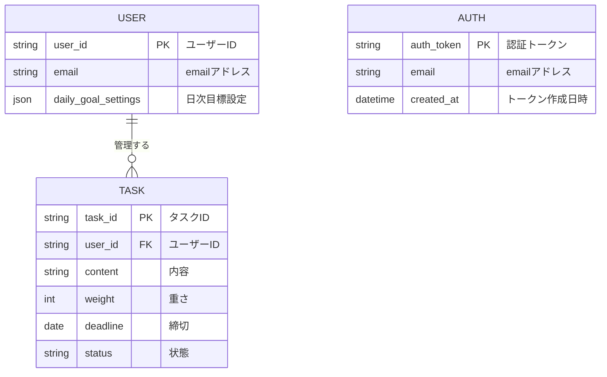

# データ設計書 - VanishToDo

## 1 概念データモデル

### エンティティ一覧

| エンティティ名 | 説明 | 主要な属性 |
|--------------|------|------------|
| ユーザー | システムの利用者（現在は1名想定） | ユーザーID、日次目標設定 |
| タスク | ユーザーが管理する作業項目 | タスクID、内容、重さ、締切、状態 |

### ER図

### カーディナリティ
- ユーザー : タスク = 1 : N （1人のユーザーが複数のタスクを持つ）

### ビジネスルール

#### タスク管理
- タスクは「重さ」と「締切」を同時に持つことはできない（どちらか一方のみ）
- 完了状態は`completedAt`の有無で判断（`completedAt`が`null`でない場合は完了）
- 削除操作は論理削除（`isDeleted`フラグ）として実装
- 楽観的ロックによる同時更新制御を実装

#### 表示制御
- 古いタスク（14日以上前に作成された未完了タスク）は自動的に非表示となるが、データは保持される
- 締切があるタスクは必ず表示される（表示制限の対象外）

#### 自動クリーンアップ
- 完了タスク（`completedAt != null`）は完了から30日経過後に物理削除
- 削除タスク（`isDeleted = true`）は論理削除から7日経過後に物理削除
- 実行タイミング：日次バッチ処理（Cloudflare Cron Trigger使用）
- 通知なしでサイレントに削除

#### その他
- 日次達成記録は日付が変わったあとの初回アクセス時に自動リセット

## 2 論理データモデル

複数DB対応の予定がないため省略する。

## 3 物理データモデル（データベース設計）

### テーブル定義

#### users テーブル
**説明:** システムユーザー情報を管理

| カラム名 | 論理名 | データ型 | NULL | デフォルト | 説明 |
|---------|--------|----------|------|-----------|------|
| user_id | ユーザーID | VARCHAR(36) | NO | - | UUID形式の一意ID |
| email | emailアドレス | VARCHAR(256) | NO | - | 認証に用いたemailアドレス |
| timezone | タイムゾーン | INT | 0 | タイムゾーンの+-n:00の+-n部分 |
| daily_goal_heavy | 日次目標_重 | INT | NO | 1 | 1日の重タスク目標数 |
| daily_goal_medium | 日次目標_中 | INT | NO | 2 | 1日の中タスク目標数 |
| daily_goal_light | 日次目標_軽 | INT | NO | 3 | 1日の軽タスク目標数 |
| created_at | 作成日時 | TIMESTAMP | NO | CURRENT_TIMESTAMP | レコード作成日時(UTC) |
| updated_at | 更新日時 | TIMESTAMP | NO | CURRENT_TIMESTAMP | 最終更新日時(UTC) |

**制約:**
- PRIMARY KEY: user_id
- CHECK: daily_goal_heavy >= 0 AND daily_goal_heavy <= 10
- CHECK: daily_goal_medium >= 0 AND daily_goal_medium <= 10
- CHECK: daily_goal_light >= 0 AND daily_goal_light <= 10

**インデックス:**
- なし（暫定）

#### tasks テーブル
**説明:** タスク情報を管理

| カラム名 | 論理名 | データ型 | NULL | デフォルト | 説明 |
|---------|--------|----------|------|-----------|------|
| task_id | タスクID | VARCHAR(36) | NO | - | UUID形式の一意ID |
| user_id | ユーザーID | VARCHAR(36) | NO | - | UUID形式の一意ID |
| title | タイトル | VARCHAR(500) | NO | - | タスクの内容 |
| weight | 重さ | VARCHAR(10) | YES | NULL | HEAVY/MEDIUM/LIGHT/NULL |
| due_date | 締切日 | DATE | YES | NULL | 締切がある場合の日付 |
| completed_at | 完了日時 | TIMESTAMP | YES | NULL | 完了した日時（非NULLの場合完了状態）(UTC) |
| is_deleted | 削除フラグ | BOOLEAN | NO | FALSE | 論理削除フラグ |
| version | バージョン | INT | NO | 1 | 楽観的ロック用 |
| created_at | 作成日時 | TIMESTAMP | NO | CURRENT_TIMESTAMP | レコード作成日時(UTC) |
| updated_at | 更新日時 | TIMESTAMP | NO | CURRENT_TIMESTAMP | 最終更新日時(UTC) |

**制約:**
- PRIMARY KEY: task_id
- CHECK: (weight IS NOT NULL AND due_date IS NULL) OR (weight IS NULL AND due_date IS NOT NULL) OR (weight IS NULL AND due_date IS NULL)
- CHECK: version >= 1

**インデックス:**
- なし（暫定）

#### auth_tokens テーブル
**説明:** 認証トークンを保持

| カラム名 | 論理名 | データ型 | NULL | デフォルト | 説明 |
|---------|--------|----------|------|-----------|------|
| auth_token | 認証トークン | VARCHAR(64) | NO | - | 暗号論的に安全な256bitの整数を16進文字列にしたもの |
| email | email | VARCHAR(256) | NO | - | ログインに用いたemailアドレス |
| created_at | 作成日時 | TIMESTAMP | NO | CURRENT_TIMESTAMP | レコード作成日時(UTC) |

**制約:**
- PRIMARY KEY: auth_token

**インデックス:**
- なし（暫定）

## 4 アプリケーションデータ型仕様

### TypeScript型定義（types.ts）

本セクションでの型定義は`types.ts`ファイルを参照すること。

### UI用の追加型（フロントエンド専用）

本セクションでの型定義は`types.ts`ファイルを参照すること。

## 5 データ制約とバリデーション

### 値の範囲
- **日次目標数**: 0〜20（各重さカテゴリ）
- **ログ保持期間**: 最大一日（日が変わって最初のアクセスで自動削除）
- **バージョン番号**: 1以上の整数

### 文字列の制約
- **タスクタイトル**: 1〜500文字
- **UUID**: RFC 4122準拠の形式（36文字）
- **分割対象テキスト**: 1〜500文字

### 日付の制約
- **締切日**: 本日以降の日付のみ設定可能
- **完了日時**: タスク作成日時以降

### ビジネスルール
- タスクは「重さ」と「締切」を同時に持つことはできない（どちらか一方のみ、または両方null）
- 締切があるタスクは必ず表示される（表示制限の対象外）
- 完了状態は`completedAt`が`null`でないことで判断
- 削除タスクは論理削除として扱い、復帰可能（`isDeleted`フラグ）
- 古いタスク（14日以上前に作成された未完了タスク）は自動的に表示対象外となる
- 日次達成記録は日付が変わったら自動リセット
- 日付変更はローカル時間で0時とする。
- 楽観的ロックにより、バージョン不一致の更新は拒否される

### 自動クリーンアップルール
- 完了タスク: 完了から30日経過後に物理削除
- 削除タスク: 論理削除から7日経過後に物理削除
- 実行頻度: 日次（Cloudflare Cron Trigger）
- 削除基準:
  - 完了タスク: `completed_at < (現在日時 - 30日) AND completed_at IS NOT NULL`
  - 削除タスク: `updated_at < (現在日時 - 7日) AND is_deleted = true`

### 相互依存
- 日次目標達成の判定: `completed_heavy >= daily_goal_heavy AND completed_medium >= daily_goal_medium AND completed_light >= daily_goal_light`
- 締切タスクの重さ: `due_date IS NOT NULL` の場合、`weight` は必ず `NULL`
- 完了タスクの完了日時: `completed_at IS NOT NULL` の場合、タスクは完了状態
- 楽観的ロック: 更新・削除時にバージョン番号が一致しない場合はエラー

## 6 データマイグレーション

### マイグレーション方針

#### マイグレーションツール
- **選定ツール**: drizzle-kit

#### マイグレーションファイルの命名規則
- drizzle-kitが自動生成

#### バージョン管理の方法
- マイグレーションファイルはGitで管理
- 適用済みマイグレーションはデータベース内の`d1_migrations`テーブルで管理
- 環境別（開発/本番）のマイグレーション状態を記録

### ロールバック方針
- 現状なし
  - 技術力不足のため
  - 継続して検討する

## 7 API/DB間のデータ変換

### Date型とstring型の使い分け

#### アプリケーション内（TypeScript）
- **使用型**: `Date`型
- **理由**: TypeScriptのネイティブな日付操作が可能

#### API通信（JSON）
- **使用型**: ISO 8601形式の`string`型
- **例**: `"2025-11-15T10:00:00Z"`
- **理由**: JSONはDate型をサポートしないため

#### データベース（D1）
- **使用型**: `TIMESTAMP`型、`DATE`型
- **変換**: drizzle ORMが自動的に変換

---

*本文書は、VanishToDoシステムのデータ構造と制約を定義し、実装の基盤となるものである。*

*バージョン: 2.0*  
*最終更新: 2025年11月17日*