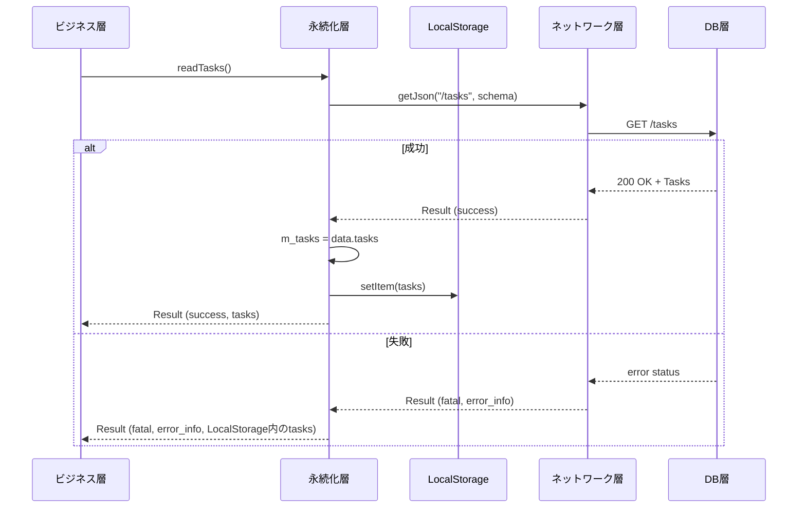
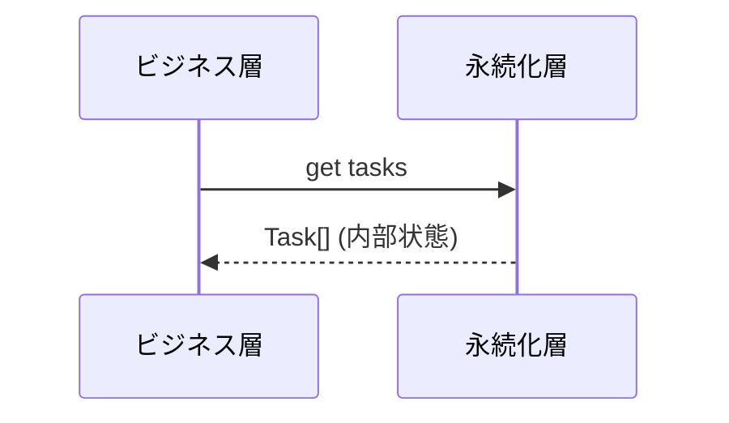
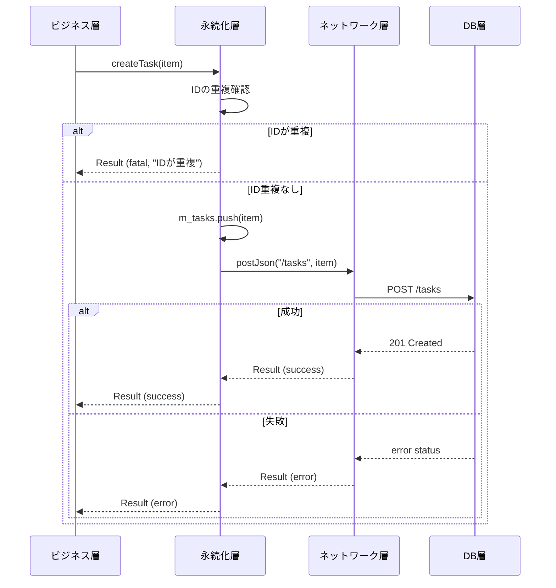
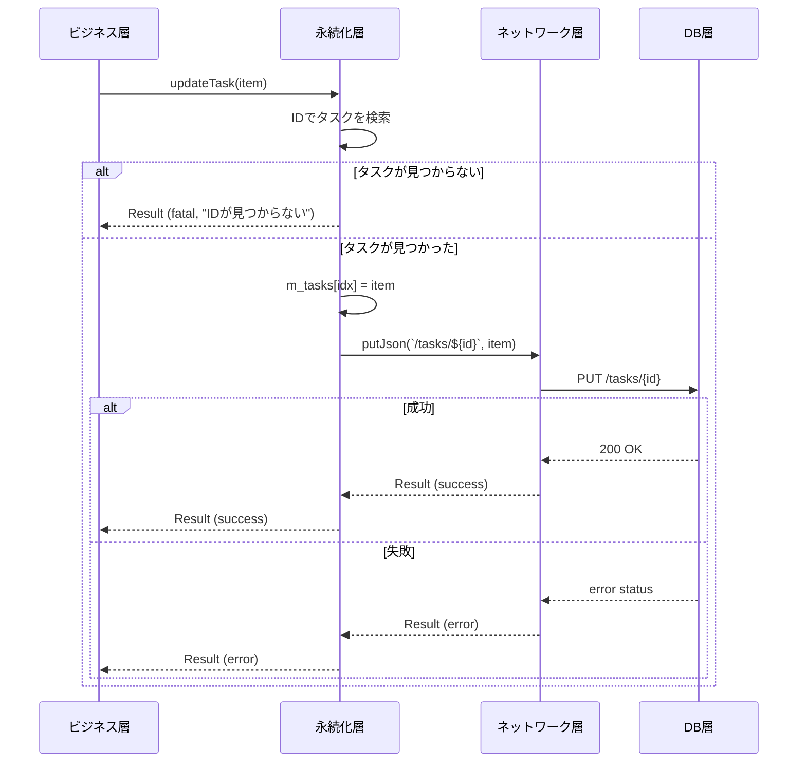

# 永続化層機能仕様

## 概要

永続化層は、タスクリストとセッティングを保持し、ビジネス層からのリクエストに応じてこれらの読み書きを行います。

### 設計意図と理由

#### LocalStorageの利用理由

タスクリストとセッティングはDB層に保存されていますが、永続化層ではLocalStorageをキャッシュとして利用します。これには以下の理由があります:

1. **オフライン耐性**: ネットワークエラーやDB層へのアクセス失敗時でも、LocalStorageに残った値のみを使ってビジネス層からのアクセスに答えることができます。
2. **起動時のフォールバック**: アプリ起動時にDB層からの読み込みが失敗した場合でも、LocalStorageに保存された前回のデータを利用してアプリケーションを動作させることができます。

#### ライトスルーキャッシュ方式

書き込みアクセスでは、まずLocalStorageに書き込みを行い、その後ネットワーク層を通じてDB層へのアクセスも行います。これにより、LocalStorageとDB層のコヒーレンシを保ちます。LocalStorageへの書き込みは同期的に行われ必ず成功するため、ビジネス層は即座に処理を続行できます。

#### 楽観的ロックによる競合検知

複数の端末から同じタスクへの書き込みアクセスが競合する可能性があります。これを検知するために、各タスクにversionフィールドを用意しています。書き込みごとにversionフィールドをインクリメントし、DB層ではDB上の値+1と一致するか比較することで、書き込みアクセスが競合していないことを確認できます。

- **versionフィールドのインクリメント**: 永続化層の責務です（`touchItem()`メソッド）。
- **競合の検出**: DB層の責務です。
- **競合エラーの伝播**: 永続化層はDB層からのアクセス競合エラーを検知してビジネス層に返します。

#### DI可能な設計

永続化層ではネットワーク層の実体をコンストラクタ引数で注入します。これにより、テスト時にモックやスタブへの差し替えを容易にし、テスト容易性を向上させます。

### キュー機能（計画中）

**注意**: 以下のキュー機能は設計段階であり、現在の実装には含まれていません。

DBへの書き込みアクセスは1本のQueueにより直列化され、最初のリクエスト順を守ってDBへの書き込みを行う予定です。DBへの書き込みAPIのリードバックを待ってから次の書き込みを行うことで、順番の追い越しを防ぎます。また、このQueueは非同期で動作し、フロントエンドの動作を極力邪魔しません。

QueueはLocalStorage上に構成される予定です。これは、ブラウザの再起動やリロードを超えてDBとの同期を確保するためです。ネットワークエラーの場合はQueueに値が残り続け、ページロード/リロード時の永続化層初期化の時に、Queueに値が残っている場合は、永続化層の初期読み込みの前にQueueに残ったDB層への書き込みアクセスを処理します。


## 提供インターフェース

永続化層は以下のメソッドを提供します:

### データアクセス

- `get tasks(): Task[]` - LocalStorageに保存されているタスク一覧を取得
- `readTasks(): Promise<Result<ApiTasks>>` - DB層からタスク一覧を取得しLocalStorageに保存
- `createTask(item: Task): Promise<Result<ApiVoid>>` - タスクを新規作成
- `updateTask(item: Task): Promise<Result<ApiVoid>>` - タスクを更新

### メタ情報管理

- `generateItem<T>(data: T): DBContainer<T>` - 新規アイテムのメタ情報を生成
- `touchItem<T>(item: DBContainer<T>): DBContainer<T>` - アイテムのメタ情報を更新（versionインクリメント、updatedAt更新）

## 動作フロー

### 初期化フロー

1. コンストラクタでネットワーク層の実装を注入します。
2. LocalStorageから保存されたタスクデータを読み込みます。
3. データが存在し、かつ正しいスキーマでパース可能な場合は、そのデータを内部状態として保持します。
4. データが存在しない、またはパースに失敗した場合は、空の配列を初期値とします。

### DB層からの読み込みフロー（readTasks）



**フロー説明:**

1. ネットワーク層を通じてDB層にGETリクエストを送信します。
2. 成功した場合:
   - 取得したタスクデータを内部状態として保持します。
   - LocalStorageに保存します。
   - 成功ステータスとデータを返します。
3. 失敗した場合:
   - 内部状態（LocalStorageから読み込んだデータ）をフォールバックとして返します。
   - エラー情報と共に、致命的エラーステータスを返します。

### LocalStorageからの読み込みフロー（tasksプロパティ）



**フロー説明:**

内部状態として保持しているタスクデータをそのまま返します。DB層へのアクセスは行いません。

### タスク作成フロー（createTask）



**フロー説明:**

1. 内部状態から、同じIDを持つタスクが既に存在しないか確認します。
2. IDが重複している場合は致命的エラーを返します。
3. 内部状態にタスクを追加します（LocalStorageへの書き込みは現在未実装）。
4. ネットワーク層を通じてDB層にPOSTリクエストを送信し、結果を返します。

### タスク更新フロー（updateTask）



**フロー説明:**

1. 内部状態から、更新対象のIDを持つタスクを検索します。
2. タスクが見つからない場合は致命的エラーを返します。
3. 内部状態のタスクを更新します（LocalStorageへの書き込みは現在未実装）。
4. ネットワーク層を通じてDB層にPUTリクエストを送信し、結果を返します。

## 機能詳細仕様

### F-PE-001 LocalStorage初期化

**概要:**

永続化層の初期化時に、LocalStorageからタスクデータを読み込みます。データが存在しない、またはパースに失敗した場合は、空の配列を初期値とします。

**実装場所:**

`constructor(network: Network)`

**処理内容:**

1. LocalStorageからキー`"vanish-todo-storage"`でタスクデータを取得します。
2. データが存在する場合、Valibotスキーマでパースを試みます。
3. パース成功時は、そのデータを内部状態として保持します。
4. データが存在しない、またはパース失敗時は、空の配列`[]`を内部状態として保持します。

**なぜ空配列で初期化するか:**

パース失敗時にエラーで停止させず、アプリケーションを継続動作させるためです。空配列であってもビジネス層は正常に動作し、その後DB層からデータを読み込むことで正しい状態に復旧できます。

**エラー:**

エラーは返しません。パース失敗時はコンソールにログを出力し、空の配列で動作を継続します。

---
### F-PE-002 DB読み出し

**概要:**

DB層からデータを読み出し、LocalStorageに格納します。DB読み出しを完全に終えて以降は、LocalStorageが最も正しい状態を表します。

**未同期Queueとの連携:**

DB読み出しがビジネス層から起動された時点で、未同期Queueにアイテムが存在する場合があります。これは、DB読み出しの前に実行された書き込み命令が終わっていない、またはネットワーク断などでDB同期（書き込み）が終わっていないことを示します。

本アプリでは、DB層へのアクセスは必ず順番を守って実行し、コヒーレンシを保つ方針です。そのため、DB読み出し命令は未同期Queueの最後尾に追加することで読み書きの順番を守ります。

**読み出し手順:**

1. 未同期Queueに以下の2個の命令を追加します:
   - DBから`Setting`を読み出し、LocalStorageに格納する命令
   - DBから`Task[]`を読み出し、LocalStorageに格納する命令
2. F-PE-004 DB同期により、未同期QueueのアイテムのDB同期を行います。
3. 未同期Queueで既に同期処理が実行中の場合はそのまま処理を終了します。

**楽観的ロック競合の解決:**

DB同期の際、楽観的ロック競合が生じることがあります。原因として2つが考えられます:

1. **ネットワークエラーによるキュー残留**: ある端末の未同期Queueに値が格納されたままアプリを終了し、その後、他の端末で同じタスクに対し編集などの操作を行った場合
2. **同時書き込み**: 同時に2か所以上で本アプリを使い、同じタスクに対し編集などの操作を行った場合

本来ならばユーザーにどちらが正かを問い合わせるところですが、VanishToDoでは簡略化のため、状況に応じて決め打ちでどちらが正かを決めます:

- **アプリ起動直後のDB読み出し**:
  - 前述の1.の可能性が高いため、DBの状態を正として取り扱います。
  - 具体的には、未同期QueueのTOPにある当該アクセスを破棄し、後続アクセスの処理を続けます。

- **ユーザーが明示的にreloadを指定した場合**:
  - 前述の2.の可能性が高いため、LocalStorageの状態を正として扱います。
  - 具体的には、未同期QueueのTOPにある当該アクセスをDBに強制書き込み（DB層の機能で、version Conflictを無視して書き込み）し、後続アクセスの処理を続けます。

どちらの状況かは、DB読み出し機能を実装する関数の引数`policy`によって指定されます。

**インターフェース:**

`loadDB(policy: UpdatePolicy): Promise<DBStatus>`

**エラー:**

- **ネットワークエラー**: ネットワークエラーのために初期化に失敗しました。
  - エラー発生時点で未同期Queueはdequeueされずにエラーを返します。
  - ネットワークエラーの前に競合エラーが発生していた場合でも、ネットワークエラーを返し、競合エラーは通知されません。

- **サーバー内部エラー**: DB層の内部ロジックにバグがあります。
  - エラー発生時点で未同期Queueはdequeueされずにエラーを返します。
  - サーバー内部エラーの前に競合エラーが発生していた場合でも、サーバー内部エラーを返し、競合エラーは通知されません。

- **競合エラー**: 1個以上のアイテムに関して、バージョンの競合が発生しました。
  - 競合は`policy`で指定される解消方法により解消済みです。そのため、そのままアプリの動作を継続可能です。

エラーが発生した場合も、エラーに随伴する`Model`型データを用いてアプリの動作は継続可能です。

---
### F-PE-003 アイテム書き込み

**概要:**

`Task`または`Setting`をLocalStorageに同期的に書き込みます。その際、`item.version`フィールドと`item.updatedAt`フィールドを更新します。versionはインクリメントし、updatedAtは現在時刻をISO 8601形式で格納します。その後、未同期Queueに書き込み命令を追加します。

**ライトスルーキャッシュ方式:**

LocalStorageはライトスルーキャッシュとして動作します。書き込み時には、まずLocalStorageに同期的に書き込み、その後非同期でDB層にも書き込みます。これにより、ビジネス層は即座に処理を続行でき、フロントエンドの動作を極力邪魔しません。

**書き込み先の指定:**

`Task`および`Setting`の書き込み先は、引数の`item.meta.id`フィールドによって識別されます。

**処理フロー:**

1. `touchItem()`を用いて、versionをインクリメントし、updatedAtを更新します。
2. LocalStorageに同期的に書き込みます（必ず成功します）。
3. 未同期Queueに書き込み命令を追加します。
4. LocalStorageへの書き込みが終わった時点で、更新された`Model`を返します。
5. 非同期でDB層への書き込みを行います。

**DB書き込み結果の通知:**

- DB書き込みが成功した場合: レスポンスはありません（非同期処理のため、ビジネス層は既に次の処理を実行しています）。
- DB書き込みが失敗した場合: `onError()`ハンドラが起動されます。このハンドラは、プレゼンテーション層でユーザーにエラーメッセージを表示させるトリガとして扱うことを想定しています。

**インターフェース:**

```typescript
writeTask(item: Task, onError: (e: DBStatus) => void): Model
writeUserSettings(item: UserSettings, onError: (e: DBStatus) => void): Model
```

**エラー:**

書き込みリクエスト自体はエラーを返しません。引数で渡される`onError()`ハンドラに、F-PE-004 DB同期で発生する下記エラーが報告されることがあります。ただし、どれも動作は継続可能です:

- **ネットワークエラー**: ネットワークエラーのために書き込みに失敗しました。
- **サーバー内部エラー**: DB層の内部ロジックにバグがあります。
- **競合エラー**: バージョンの競合が発生しました。
- **バリデーションエラー**: DB層でのバリデーションに失敗しました。

---
### F-PE-004 DB同期

**概要:**

未同期Queueに積まれた命令をDB層と同期します。命令は1度に1個ずつ処理され、DB層からのレスポンスが完全に返ってきてから次の命令を処理します。

**なぜ直列化が必要か:**

命令の並列実行や追い越しを防ぐためです。例えば、同じタスクに対して「作成」→「更新」→「削除」の順で命令が発行された場合、この順序が守られなければデータの整合性が失われます。直列化により、DBとLocalStorageのコヒーレンシを保証します。

**命令の種類:**

未同期Queueに与えられる命令は4種類存在します:

1. DBから`Task[]`の読み出しとLocalStorageへの格納
2. DBから`UserSettings`の読み出しとLocalStorageへの格納
3. DBへ`Task`の書き込み
4. DBへ`UserSettings`の書き込み

**バリデーションエラーの処理:**

DB層からバリデーションエラーが返ってきた場合、本アプリ自体のロジックに問題があります。回復不能エラーとして、該当する書き込み命令を破棄（dequeue）します。その際、`console.error()`でエラーを報告します。ただし、後続の処理は続けます。

**インターフェース:**

`syncQueue(policy: UpdatePolicy, queue: Queue): DBStatus`

**エラー:**

- **ネットワークエラー**: ネットワークエラーのために命令実行に失敗しました。
  - エラー発生時点で未同期Queueはdequeueされずにエラーを返します。
  - ネットワークエラーの前に競合エラーが発生していた場合でも、ネットワークエラーを返し、競合エラーは通知されません（ネットワークエラーが優先されます）。

- **サーバー内部エラー**: DB層の内部ロジックにバグがあります。
  - エラー発生時点で未同期Queueはdequeueされずにエラーを返します。
  - サーバー内部エラーの前に競合エラーが発生していた場合でも、サーバー内部エラーを返し、競合エラーは通知されません（サーバー内部エラーが優先されます）。

- **競合エラー**: 1個以上のアイテムに関して、バージョンの競合が発生しました。
  - 競合は`policy`で指定される解消方法により解消済みです。そのため、そのままアプリの動作を継続可能です。

---
### F-PE-005 リトライ

**概要:**

未同期Queueの先頭命令を参照して行われるDB層への読み書きアクセスが、ネットワークエラーなどのリトライ可能要因で失敗した場合、一定秒数を待って読み書きのリトライを行います。

**処理フロー:**

1. リトライ可能なエラーが発生した場合、一定秒数待機します。
2. 一定回数までリトライを試行します。
3. リトライ中にアクセスが成功した場合、当該命令をDeQueueして次の命令の処理に進みます。
4. すべてのリトライが失敗した場合、ネットワークエラーを報告します。DeQueueは行いません。

**なぜDeQueueしないのか:**

ネットワークエラーは一時的な障害である可能性が高いため、命令を破棄せずQueueに残しておきます。これにより、ネットワークが復旧した際、またはユーザーが明示的にリロードした際に、残った命令を再度実行し、DBとの同期を完了できます。

**エラー:**

- **ネットワークエラー**: n回のリトライにおいて、すべてネットワークエラーのために書き込みに失敗しました。
  - 未同期Queueは空にならない状態でリターンします（命令はQueueに残ります）。

---

### F-PE-006 アイテム生成

**概要:**

新たにid, createdAt, updatedAt, versionフィールドを初期化したアイテムを生成します。

**実装場所:**

`generateItem<T>(data: T): DBContainer<T>`

**処理内容:**

1. `crypto.randomUUID()`で一意なIDを生成します。
2. `version`を1で初期化します。
3. `createdAt`と`updatedAt`を現在日時（ISO 8601形式）で初期化します。
4. 引数で渡されたデータと共に`DBContainer`型のオブジェクトを返します。

**使用方法:**

アイテムを新しく生成する場合は、この関数を呼び出してメタ情報を付加し、その後F-PE-003 アイテム書き込みを行います。

**インターフェース:**

`generateItem<T>(data: T): DBContainer<T>`

**エラー:**

なし。

---

### F-PE-007 アイテム更新

**概要:**

既存アイテムのメタ情報を更新します。versionをインクリメントし、updatedAtを現在日時に更新します。

**実装場所:**

`touchItem<T>(item: DBContainer<T>): DBContainer<T>`

**処理内容:**

1. `version`を1インクリメントします。
2. `updatedAt`を現在日時（ISO 8601形式）に更新します。
3. `id`と`createdAt`は変更せず、そのまま保持します。
4. 引数で渡されたデータと共に、更新された`DBContainer`型のオブジェクトを返します。

**なぜversionをインクリメントするか:**

楽観的ロックによる競合検知のためです。タスクを更新するたびにversionをインクリメントすることで、DB層では書き込み時にversionフィールドが期待値（DB上の値+1）と一致するか確認します。一致しない場合は、他の端末からの同時書き込みがあったと判断し、競合エラーを返します。

**インターフェース:**

`touchItem<T>(item: DBContainer<T>): DBContainer<T>`

**エラー:**

なし。

---

## データ型

詳細は[type/types.ts](../type/types.ts)を参照してください。

- DBコンテナ: `DBContainer<T>`型
- タスクリスト: `Task[]`型
- セッティング: `UserSettings`型
