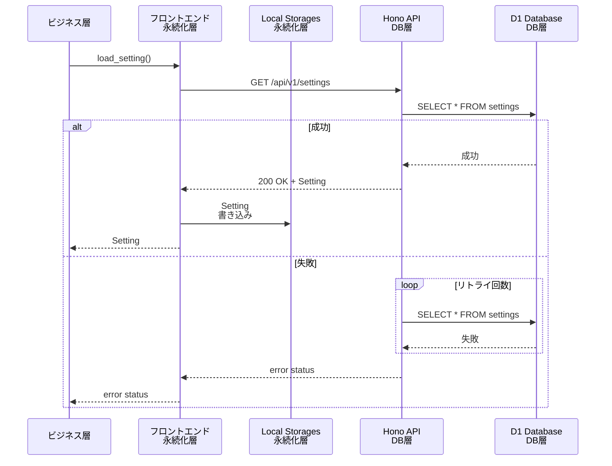
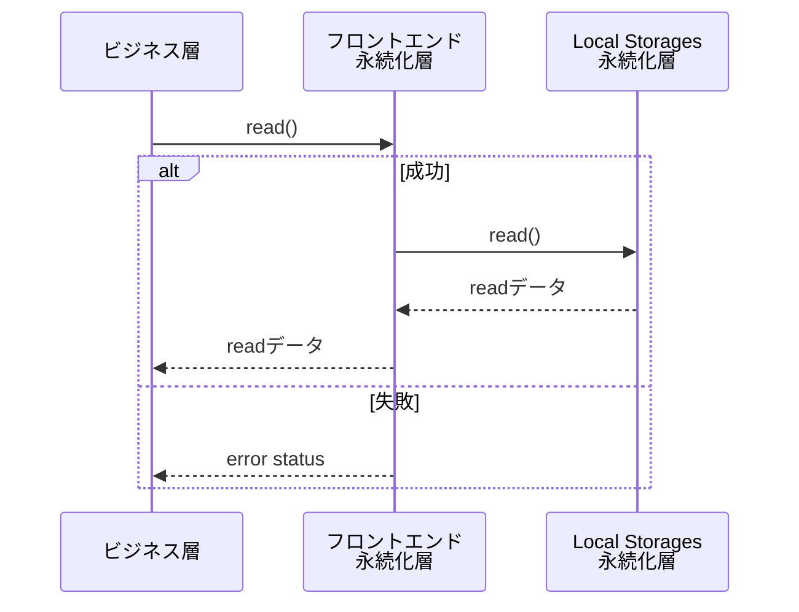
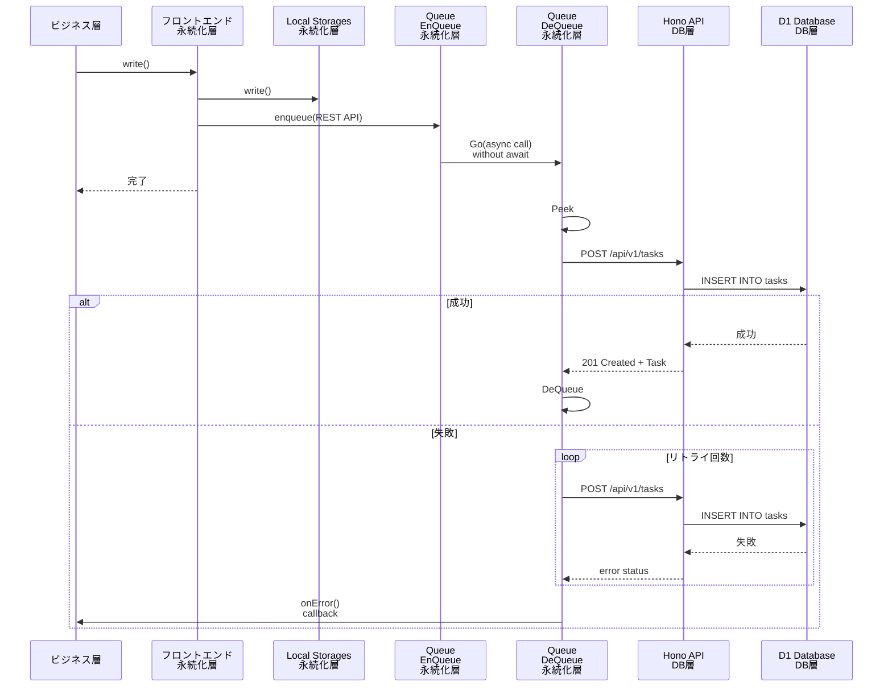

# 永続化層機能仕様

## 1 機能概要

永続化層は、タスクリストとセッティングを保持し、ビジネス層からのリクエストに応えてこれらの値を読み書きします。
タスクリストとセッティングはDB層に保存されているため、アプリの起動直後にDB層からこれらのデータを取得しLocalStorageに保存します。
ビジネス層からの読み書きリクエストはまずLocalStorageに対して行われます。書き込みアクセスはLocalStorageに加えDB層へのアクセスも行い、DB層のDBとLocalStorageのコヒーレントを保ちます。

DB層への書き込みアクセスは1本のQueueにより直列化され、最初のリクエスト順を守ってDBへの書き込みを行います。
DB層への書き込みAPIのリードバックを待ってから次の書き込みを行うことで、順番の追い越しを防ぎます。
また、このQueueは非同期で動作し、フロントエンドの動作を極力邪魔しません。

VanishToDoには、複数の端末からの書き込みアクセスの競合を検知するために、各タスクにversionフィールドを用意してあります。書き込みごとにversionフィールドをインクリメントし、DB上の値+1と一致するか比較することで、書き込みアクセスが競合していないことを確認できます。versionフィールドのインクリメントは永続化層の責務です。また、競合を検出するのはDB層の責務です。永続化層はDB層からのアクセス競合エラーを検知してビジネス層に返す責務も持ちます。

DB層へのアクセスでエラーが返ってきた場合、一部のネットワークエラーではリトライを何回か行います。それでもエラーの場合はDeQueueはリトライを一時停止します。Queueに次のEnQueueアクセスがあった際、またはユーザーから明示的なリロード指定があった際に、あらためてQueueの先頭からDB層へのリトライアクセスをはじめます。

ネットワークエラー以外の、リトライしても改善しないエラーに関しては、基本的に致命的です。ビジネス層にエラーを伝え、エラー原因になったアクセスをQueueから取り除き、次のアクセスをQueueから取り出して続きの処理を行います。

QueueはLocalStorage上に構成されます。ブラウザの再起動やリロードを超えてDBとの同期を確保するためです。ネットワークエラーの場合はQueueに値が残り続けます。ページロード/リロード時の永続化層初期化の時に、Queueに値が残っている場合は、永続化層の初期読み込みの前にQueueに残ったDB層への書き込みアクセスを処理します。

アプリ起動ごとに、DB層からの読み込みを行い、LocalStorageを上書きします。これは、他のクライアントからのアクセスを同期する目的です。DB層からの読み込みは、Queueの値の処理の後に行われます。

エラーがあり、DB層へのアクセスができない場合は、LocalStorageに残った値のみを使ってビジネス層からのアクセスに答えます。

## 2 機能リスト

| 機能ID | 機能名 | 優先度 | 対応要件ID |
|--------|--------|--------|-----------|
| F-PE-001 | LocalStorage初期化 | 高 | FR-5.2 |
| F-PE-002 | DB読み出し | 高 | FR-5.2 |
| F-PE-003 | 書き込み | 必須 | FR-3.1~3.7, 5.1 |
| F-PE-004 | DB同期 | 高 | FR-5.2 |
| F-PE-005 | リトライ | 高 | FR-5.2 |

## 3 シーケンス図

### 初期化・リロード動作


### Read動作(タスク読み込み等)



### Write動作(タスク作成等)


## 4 状態遷移図

なし。

## 5 機能詳細仕様

### F-PE-001 LocalStorage初期化

**概要:**

LocalStorageに値が格納されていない場合、初期値でLocalStorageを初期化します。
値が格納されている場合は何もしません。
初期化以降は、`loadDB()`によるDB読み出し前であってもLocalStorageに残っているデータだけで読み書き動作ができます。

初期値は、`UserSettings`は軽: 3, 中:3, 重: 1で、`Task[]`は`[]`です。

**インターフェース:**
```typescript
// 詳細はtypes.tsを参照
declare function initLocalStorage(): Model;
```

**エラー:**

なし。

---
### F-PE-002 DB読み出し

**概要:**

LocalStorageにDBの値を格納します。DB読み出しを完全に終えて以降は、LocalStorageが最も正しい状態を表します。

DB読み出しがビジネス層から起動された時点で、未同期Queueにアイテムが存在する場合があります。
それは、DB読み出しの前に実行された書き込み命令が終わっていないか、もしくは、ネットワーク断などでDB同期（書き込み）が終わっていないことを示します。
本アプリは、DB層へのアクセスは必ず順番を守って実行してコヒーレンシを保つ方針で作られています。
そのため、DB読み出し命令は、未同期Queueの最後尾に追加することで読み書きの順番を守ります。

この状況をふまえて、読み出し手順を以下に示します。

未同期Queueに命令を2個追加します。ひとつは、DBから`Setting`を読み出し、LocalStorageに格納する命令で、もうひとつは、DBから`Task[]`を読み出し、LocalStorageに格納する命令です。

次に、F-PE-004 DB同期により、未同期QueueのアイテムのDB同期を行います。未同期Queueで既に同期処理が実行中の場合はそのまま処理を終了します。

DB同期の際、楽観的ロック競合が生じることがあります。原因は、2つ考えられます

1. ネットワークエラーなどによりある端末の未同期Queueに値が格納されたままアプリを終了し、その後、他の端末で同じタスクに対し編集などの操作を行った場合
2. 同時に2か所以上で本アプリを使って、同じタスクに対し編集などの操作を行った場合

本来ならば、どちらが正かをユーザーに問い合わせるところですが、VanishToDoでは簡略化のため、状況に応じて決め打ちでどちらが正かを決めます。

- アプリ起動直後のDB読み出しの場合
  - 前述の1. の可能性が高いため、DBの状態を正として取り扱う
    - 具体的には、未同期QueueのTOPにある当該アクセスを破棄し、後続アクセスの処理を続ける
- ユーザーが明示的にreloadを指定した場合
  - 前述の2. の可能性が高いため、LocalStorageの状態を正として扱う
    - 具体的には、未同期QueueのTOPにある当該アクセスをDBに強制書き込み(DB層の機能で、version Conflictを無視して書き込みをする)し、後続アクセスの処理を続ける

どちらの状況かは、DB読み出し機能を実装する関数の引数によって指定されます。

**インターフェース:**
```typescript
// 詳細はtypes.tsを参照
declare function loadDB(policy: UpdatePolicy): Promise<DBStatus>;
```

**エラー:**

- ネットワークエラー: ネットワークエラーのために初期化に失敗した
  - エラー発生時点で未同期Queueはdequeueされずにエラーを返す
  - ネットワークエラーの前に競合エラーが発生していた場合でも、ネットワークエラーを返し、競合エラーは通知されない
- サーバー内部エラー: DB層の内部ロジックにバグがある
  - エラー発生時点で未同期Queueはdequeueされずにエラーを返す
  - サーバー内部エラーの前に競合エラーが発生していた場合でも、サーバー内部エラーを返し、競合エラーは通知されない
- 競合エラー: 1個以上のアイテムに関して、バージョンの競合が発生した
  - 競合は`policy`で指定される解消方法により解消済み。そのため、そのままアプリの動作を継続可能。

エラーが発生した場合も、エラーに随伴する`Model`型データを用いてアプリの動作は継続可能です。

---
### F-PE-003 アイテム書き込み

**概要:**

`Task`もしくは`Setting`をLocalStorageに同期的に書き込みます。
その際、`item.version`フィールドと`item.updateAt`フィールドを更新します。前者はインクリメントし、後者は現在時刻をUTCで格納します。
その後、未同期Queueに`Task`もしくは`Setting`書き込み命令を追加します。
LocalStorageはライトスルーキャッシュのように動作します。

`Task`および`Setting`の書き込み先の指定は、引数の`item.id`フィールドによって指定されます。

LocalStorageへの書き込みは同期的に行われ、必ず成功します。LocalStorageへの書き込みが終わった時点で書き込みが完了した`Model`を伴ってreturnします。

DB書き込みが成功した場合はレスポンスはありません。DB書き込みが失敗した場合は、onError()ハンドラが起動されます。
onError()ハンドラでは、プレゼンテーション層でユーザーにエラーメッセージを表示させるトリガとして扱うことを想定しています。


**インターフェース:**
```typescript
// 詳細はtypes.tsを参照
declare function writeTask(item: Task, onError: (e: DBStatus) => void): Model;
declare function writeUserSettings(item: UserSettings, onError: (e: DBStatus) => void): Model;
```

**エラー:**
書き込みリクエスト自体はエラーを返しません。
引数で渡されるonError()ハンドラに、F-PE-004 DB同期で発生する下記エラーが報告されることがあります。ただし、どれも動作は継続可能です。

- ネットワークエラー: ネットワークエラーのために書き込みに失敗した
- サーバー内部エラー: DB層の内部ロジックにバグがある
- 競合エラー: バージョンの競合が発生した
- バリデーションエラー: DB層でのバリデーションに失敗した

---
### F-PE-004 DB同期

**概要:**

未同期Queueに積まれた命令をDBと同期します。命令は1度に1個ずつ処理され、命令に対するDB層からのレスポンスが完全に返ってきてから次の命令を処理します。
これにより、命令の並列実行や追い越しを防ぎ、DBとLocalStorageのコヒーレンシを保ちます。

未同期Queueに与えられる命令は4種類存在します。

1. DBから`Task[]`の読み出しとLocalStorageへの格納
2. DBから`UserSettings`の読み出しとLocalStorageへの格納
3. DBへ`Task`の書き込み
4. DBから`Task[]`の書き込み

DB層からバリデーションエラーが返ってきた場合、それは本アプリ自体のロジックが間違っています。
回復不能エラーとして書き込みは捨てます（dequする）。
その際。`console.err()`でエラーを報告します。
後続の処理は続けます。

**インターフェース:**
```typescript
// 詳細はtypes.tsを参照
declare function syncQueue(policy: UpdatePolicy, queue: Queue): DBStatus;
```

**機能:**

**エラー:**
- ネットワークエラー: ネットワークエラーのために命令実行に失敗した
  - エラー発生時点で未同期Queueはdequeueされずにエラーを返す
  - ネットワークエラーの前に競合エラーが発生していた場合でも、ネットワークエラーを返し、競合エラーは通知されない
- サーバー内部エラー: DB層の内部ロジックにバグがある
  - エラー発生時点で未同期Queueはdequeueされずにエラーを返す
  - サーバー内部エラーの前に競合エラーが発生していた場合でも、サーバー内部エラーを返し、競合エラーは通知されない
- 競合エラー: 1個以上のアイテムに関して、バージョンの競合が発生した
  - 競合は`policy`で指定される解消方法により解消済み。そのため、そのままアプリの動作を継続可能。

---
### F-PE-005 リトライ

**概要:**

未同期Queueの先頭命令を参照して行われる、DB層への読み書き込みアクセスがネットワークエラーなどのリトライ可能要因で失敗した場合、
一定秒数を待って読み書きのリトライを行います。
一定回数リトライし、その間にアクセスが成功した場合は当該命令をDeQueueをして次の命令の処理に戻ります。
すべてのリトライが失敗した場合、ネットワークエラーを報告します。DeQueueはしません。

**詳細:**

**エラー:**
- ネットワークエラー: n回のリトライにおいて、全てネットワークエラーのために書き込みに失敗した
  - 未同期Queueは空にならない状態でリターン
---

### F-PE-006 アイテム生成

**概要:**

新たにid, createdAt, updatedAt, versionフィールドを初期化したアイテムを生成します。
アイテムを新しく生成する場合は、この関数を呼び、次にアイテム書き込みを行います。

**インターフェース:**
```typescript
// 詳細はtypes.tsを参照
declare function generateItem<T>(data: T): DBContainer<T>;
```

**エラー:**
なし。

---

## 6 データ型

詳細はtypes.tsを参照。

- DBコンテナ: `DBContainer<T>`型
- タスクリスト: `Task[]`型
- Setting: `UserSettings`型
