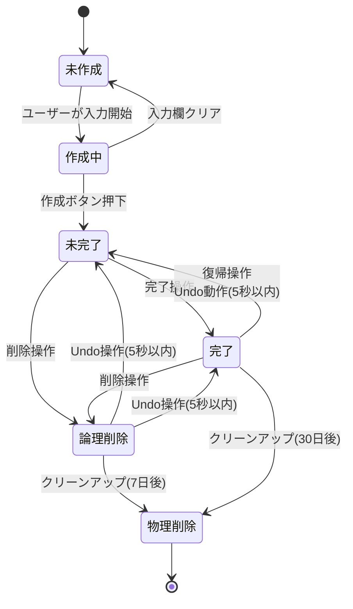
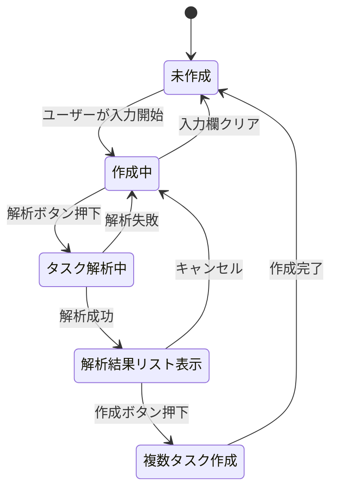
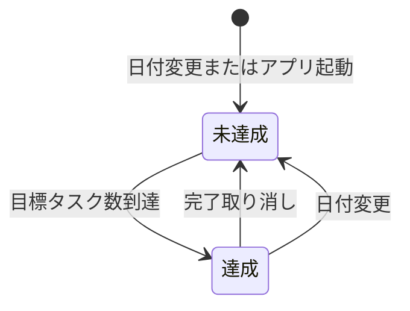
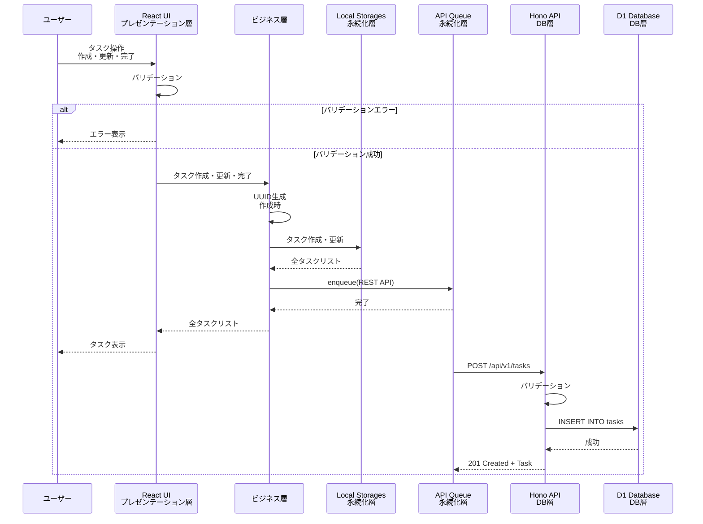
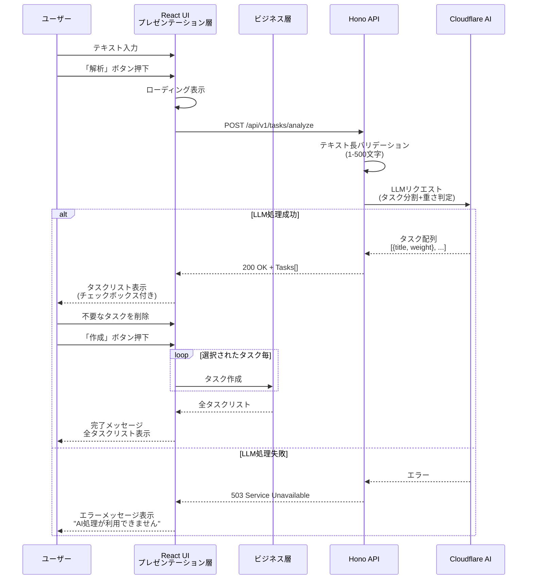
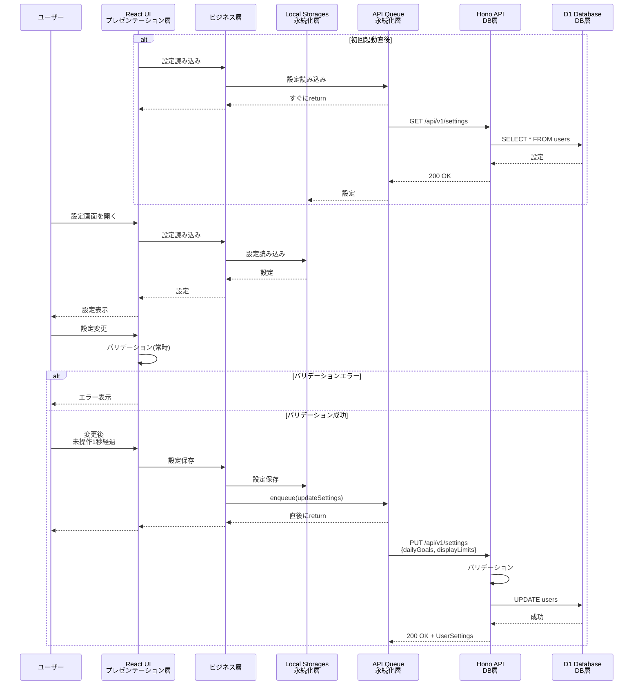
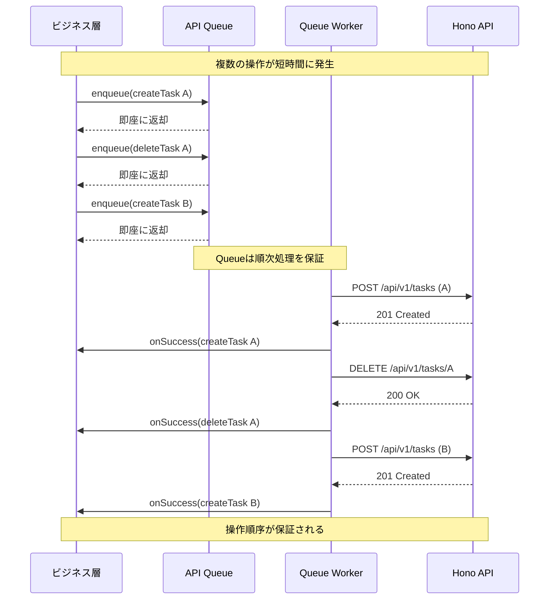

# ビジネス層仕様書 - VanishToDo

## 1 機能一覧

### タスク入力機能
| 機能ID | 機能名 | 優先度 | 対応要件ID |
|--------|--------|--------|-----------|
| F-001 | 基本タスク入力 | 必須 | FR-1.1 |
| F-003 | タスク解析 | 中 | FR-1.2,1.3,1.4 |

### タスク表示機能
| 機能ID | 機能名 | 優先度 | 対応要件ID |
|--------|--------|--------|-----------|
| F-005 | 制限付き表示 | 必須 | FR-2.1 |
| F-006 | 重さ別フィルタリング | 必須 | FR-2.2 |
| F-007 | 自動非表示（Vanish） | 必須 | FR-2.3 |
| F-008 | 全タスク表示 | 中 | FR-2.4 |
| F-009 | 完了タスク表示 | 中 | FR-2.5 |

### タスク管理機能
| 機能ID | 機能名 | 優先度 | 対応要件ID |
|--------|--------|--------|-----------|
| F-010 | タスク編集 | 必須 | FR-3.1 |
| F-011 | タスク削除 | 必須 | FR-3.2 |
| F-012 | タスク完了 | 必須 | FR-3.3 |
| F-013 | 締切設定 | 高 | FR-3.4 |
| F-014 | タスク一括削除 | 中 | FR-3.5 |
| F-015 | タスク一括復帰 | 中 | FR-3.6 |
| F-016 | タスク自動クリーンアップ | 必須 | FR-3.7 |

### 特殊機能
| 機能ID | 機能名 | 優先度 | 対応要件ID |
|--------|--------|--------|-----------|
| F-017 | 日次達成モード | 中 | FR-4.1 |

### システム機能
| 機能ID | 機能名 | 優先度 | 対応要件ID |
|--------|--------|--------|-----------|
| F-018 | ユーザー設定取得 | 必須 | - |
| F-019 | ユーザー設定更新 | 必須 | - |
| F-020 | 認証・認可 | 必須 | NFR-7 |
| F-021 | データ永続化 | 必須 | NFR-3 |
| F-022 | API Queue処理 | 必須 | ADR-008 |

---

## 2 状態遷移図

### タスク状態遷移図



### タスク解析状態遷移図



### 日次達成状態遷移図



---

## 3 シーケンス図

### S-001: 基本タスク処理（LLMなし）




### S-002: タスク解析



### S-003: ユーザー設定更新



### S-004: API Queue処理



## 4 機能詳細仕様 - タスク入力機能

### F-001: 基本タスク入力

#### 対応する要件ID
FR-1.1

#### 対応するユーザーストーリーID
US-1.1

#### 概要
ユーザーがタスクを素早く入力できる基本機能。最小限の入力でタスクを作成し、データベースに保存する。

#### 詳細説明

**入力:**
- `title: string` - タスクのタイトル（1-500文字）
- `weight?: TaskWeight | null` - タスクの重さ（省略可、省略時はnull）
- `dueDate?: Date | null` - 締切日（省略可、省略時はnull）
- `id: string` - タスクID (UUIDv4)を生成
- `version: number` - 楽観的ロックバージョン = 0
- `createdAt`と`updatedAt` = 現在日時
- `isDeleted` = false
- `completedAt` = null

**トリガー:**
- 入力欄でenter押下
- 登録ボタン押下

**バリデーション:**
- タイトルが1-500文字であることを確認
- weightとdueDateが同時に設定されていないことを確認

**APIエンドポイント**
- `POST /api/v1/tasks`

**作用:**
- LocalStorage
  - `Task`型データを`Task[]`の末尾に追加
- DB
  - `Task`型データを`tasks`テーブルにinsert
- Log
  - `TaskOperationLog`をDurableObjectに追加

**最終UI状態:**
- メイン画面
- 入力欄にフォーカス
- 入力欄クリア
- 更新された`Task[]`を表示

#### ビジネスルール
- weightとdueDateは同時に設定できない

#### エラー種別

- タイトル未入力
- タイトル文字数超過
- weight/dueDate同時設定
- ネットワークエラー
- APIバリデーションエラー
- サーバーエラー
- タイムアウト
- DBエラー

| エラー種別 | 検出方法 | エラー時の処理 | ユーザーへの表示 |
|----------|---------|---------------|---------------|
| **タイトル未入力** | フロントエンドバリデーション | API呼び出しを行わず、即座にエラー表示 | "タスクのタイトルを入力してください" |
| **タイトル文字数超過** | フロントエンドバリデーション | API呼び出しを行わず、即座にエラー表示 | "タスクのタイトルは500文字以内で入力してください" |
| **weight/dueDate同時設定** | フロントエンドバリデーション | API呼び出しを行わず、即座にエラー表示 | "重さと締切は同時に設定できません" |
| **ネットワークエラー** | fetch時のcatch | Optimistic UIをロールバック、3回リトライ | "ネットワークエラーが発生しました。再試行します..." |
| **APIバリデーションエラー** | HTTP 400レスポンス | Optimistic UIをロールバック | APIから返却されたエラーメッセージを表示 |
| **サーバーエラー** | HTTP 500レスポンス | Optimistic UIをロールバック、3回リトライ | "サーバーエラーが発生しました。しばらく待ってから再試行してください" |
| **タイムアウト** | AbortSignal.timeout(10秒) | Optimistic UIをロールバック、リトライ | "タイムアウトしました。再試行します..." |
| **DBエラー** | バックエンドでの例外 | エラーレスポンス返却（500） | "データベースエラーが発生しました" |

#### パフォーマンス要件
- 入力からUI反映まで: 0.1秒以内（Optimistic Update）
- API呼び出し完了まで: 1秒以内（通常時）
- 最大タイムアウト: 10秒

#### セキュリティ考慮事項
- XSS対策: タイトルのHTMLエスケープ
- SQLインジェクション対策: Drizzle ORMによるパラメータ化クエリ
- 認証確認: Cloudflare Accessによる事前認証

#### 参照
- シーケンス図: S-001
- API仕様: API-003
- データ仕様: Task型、TaskCreateInput型

---

### F-002: LLM自動補完

#### 機能ID
F-002

#### 機能名
LLM自動補完

#### 対応する要件ID
FR-1.2

#### 対応するユーザーストーリーID
US-1.2

#### 概要
曖昧な入力テキストをLLMが解釈し、適切なタスクタイトルと重さを自動生成する機能。

#### 詳細説明

**入力:**
- `title: string` - ユーザーが入力した曖昧なテキスト（例: "メール", "買い物"）

**処理:**
1. ユーザーが簡潔なテキストを入力
2. Enterキー押下
3. フロントエンドで「LLM処理中」ローディング表示
4. API Queueにタスク解析リクエストをenqueue
5. バックエンドAPIに`POST /api/v1/tasks/analyze`リクエスト送信
6. バックエンドで以下を実施:
   - テキスト長バリデーション（1-2000文字）
   - Cloudflare AI（Llama 3.2 1B Instruct）にリクエスト送信
   - LLMプロンプト:
     ```
     あなたはタスク管理アシスタントです。
     ユーザーが入力した曖昧なテキストから、適切なタスクのタイトルと重さを推定してください。
     
     入力テキスト: "{title}"
     
     以下の形式でJSON形式で出力してください:
     {
       "title": "完全なタスクのタイトル（動詞を含む、例: メール → メールを確認する）",
       "weight": "light" | "medium" | "heavy"
     }
     
     重さの基準:
     - light: 15分以内で完了するタスク
     - medium: 15分～1時間で完了するタスク
     - heavy: 1時間以上かかるタスク
     
     応答はJSON形式のみで、他のテキストは含めないでください。
     ```
   - LLMレスポンスをパース
   - タイムアウト: 10秒
7. 成功時、補完結果をフロントエンドに返却
8. フロントエンドで補完結果をプレビュー表示
9. ユーザーが承認したら、F-001（基本タスク入力）の処理へ
10. 失敗時、フォールバック処理（入力値をそのまま使用、weightはnull）

**出力:**
- `TaskInput` - 補完されたタスク情報
  - `title: string` - 補完されたタスクタイトル
  - `weight: TaskWeight` - 推定された重さ

**副作用:**
- Cloudflare AI APIへのリクエスト（約10ニューロン消費）
- Durable Objectのログに LLM処理記録を保存

#### 前提条件
- ユーザーが認証済み
- Cloudflare Workers AI APIが利用可能
- 1日のニューロン使用量が上限（10,000）未満

#### 事後条件
- 補完されたタスク情報がユーザーに提示される
- または、フォールバック処理が実行される

#### 不変条件
- 入力テキストの内容は変更されない（ログに保存）
- LLM失敗時も基本入力機能は継続可能

#### ビジネスルール
- LLM処理は必須ではなく、失敗時はフォールバック
- タイムアウト時間は10秒固定
- 補完結果はユーザーが承認するまで保存されない
- LLMレスポンスが不正な形式の場合はフォールバック

#### エラーハンドリング

| エラー種別 | 検出方法 | エラー時の処理 | ユーザーへの表示 |
|----------|---------|---------------|---------------|
| **テキスト長超過** | バリデーション | エラーレスポンス返却 | "テキストは2000文字以内で入力してください" |
| **LLM APIエラー** | AI APIからのエラーレスポンス | フォールバック処理（入力値そのまま使用） | "AI処理に失敗しました。入力した内容で作成します" |
| **LLM APIタイムアウト** | 10秒経過 | フォールバック処理 | "AI処理がタイムアウトしました。入力した内容で作成します" |
| **LLMレスポンスパースエラー** | JSON.parse失敗 | フォールバック処理 | "AI処理に失敗しました。入力した内容で作成します" |
| **不正なweight値** | レスポンス検証 | weightをnullに設定 | 警告なし（自動補正） |
| **ニューロン上限超過** | AI APIから429エラー | フォールバック処理 | "本日のAI処理上限に達しました。入力した内容で作成します" |
| **ネットワークエラー** | fetch失敗 | フォールバック処理、リトライなし | "ネットワークエラーが発生しました。入力した内容で作成します" |

#### パフォーマンス要件
- LLM処理時間: 平均3秒、最大10秒
- タイムアウト: 10秒
- フォールバック処理: 即座（0.1秒以内）

#### セキュリティ考慮事項
- LLMへの入力テキストサイズ制限（2000文字）
- LLMレスポンスの検証（期待される形式か確認）
- プロンプトインジェクション対策（システムプロンプトは固定）

#### 参照
- シーケンス図: S-002
- API仕様: API-006
- アーキテクチャ: ADR-001（Cloudflare AI使用）

---

### F-003: タスク自動分割

#### 機能ID
F-003

#### 機能名
タスク自動分割

#### 対応する要件ID
FR-1.3

#### 対応するユーザーストーリーID
US-1.3

#### 概要
複数行の長文メモをLLMが解析し、複数のアクショナブルなタスクに自動分割する機能。

#### 詳細説明

**入力:**
- `title: string` - 複数行のテキスト（1-2000文字）
  - 例: "明日のプレゼン準備\n資料を作成する\nリハーサルをする\n質疑応答の準備"

**処理:**
1. ユーザーが複数行テキストエリアにメモを入力
2. 「分割」ボタンを押下
3. フロントエンドでローディング表示
4. API Queueにタスク分割リクエストをenqueue
5. バックエンドAPIに`POST /api/v1/tasks/analyze`リクエスト送信
6. バックエンドで以下を実施:
   - テキスト長バリデーション（1-2000文字）
   - Cloudflare AI（Llama 3.2 1B Instruct）にリクエスト送信
   - LLMプロンプト:
     ```
     あなたはタスク管理アシスタントです。
     ユーザーが入力した長文メモを、複数の実行可能なタスクに分割してください。
     
     入力テキスト:
     """
     {title}
     """
     
     以下のルールに従って分割してください:
     1. 各タスクは動詞を含む具体的なアクション（例: 資料を作成する）
     2. 抽象的な表現は避け、実行可能な単位に分割
     3. 各タスクの推定所要時間から重さを判定
     
     以下の形式でJSON配列として出力してください:
     [
       {
         "title": "タスク1のタイトル",
         "weight": "light" | "medium" | "heavy"
       },
       {
         "title": "タスク2のタイトル",
         "weight": "light" | "medium" | "heavy"
       }
     ]
     
     重さの基準:
     - light: 15分以内で完了するタスク
     - medium: 15分～1時間で完了するタスク
     - heavy: 1時間以上かかるタスク
     
     応答はJSON配列のみで、他のテキストは含めないでください。
     最低1個、最大10個のタスクに分割してください。
     ```
   - LLMレスポンスをパース（配列）
   - タイムアウト: 15秒
7. 成功時、分割されたタスクリストをフロントエンドに返却
8. フロントエンドでタスクリストをプレビュー表示（チェックボックス付き）
9. ユーザーが不要なタスクのチェックを外す
10. ユーザーが「作成」ボタンを押下
11. 選択されたタスクに対して、F-001（基本タスク入力）を繰り返し実行
12. 全タスクの作成が完了したら完了メッセージ表示

**出力:**
- `TaskInput[]` - 分割されたタスクの配列（1-10個）
  - 各要素: `{title: string, weight: TaskWeight}`

**副作用:**
- Cloudflare AI APIへのリクエスト（約30ニューロン消費）
- Durable Objectのログに LLM処理記録を保存
- 作成されたタスクがD1データベースに挿入

#### 前提条件
- ユーザーが認証済み
- Cloudflare Workers AI APIが利用可能
- 1日のニューロン使用量が上限未満

#### 事後条件
- 分割されたタスクがプレビュー表示される
- ユーザーが選択したタスクがデータベースに保存される

#### 不変条件
- 元のテキストは変更されない
- 最低1個のタスクが生成される
- 各タスクは独立して編集・削除可能

#### ビジネスルール
- 分割は最大10個まで
- 最低1個は必ず生成
- 空のタイトルのタスクは無効
- ユーザーが承認するまでDBに保存されない
- プレビュー段階でタスクの編集が可能

#### エラーハンドリング

| エラー種別 | 検出方法 | エラー時の処理 | ユーザーへの表示 |
|----------|---------|---------------|---------------|
| **テキスト長不足** | バリデーション | エラーレスポンス返却 | "テキストを入力してください" |
| **テキスト長超過** | バリデーション | エラーレスポンス返却 | "テキストは2000文字以内で入力してください" |
| **LLM APIエラー** | AI APIからのエラー | エラー表示、リトライ提案 | "AI処理に失敗しました。もう一度試しますか？" |
| **LLM APIタイムアウト** | 15秒経過 | エラー表示、リトライ提案 | "AI処理がタイムアウトしました。もう一度試しますか？" |
| **LLMレスポンスパースエラー** | JSON.parse失敗 | エラー表示 | "AI処理に失敗しました。テキストを見直してください" |
| **空配列返却** | レスポンス検証 | エラー表示 | "タスクを分割できませんでした。テキストを見直してください" |
| **タスク数超過（>10）** | レスポンス検証 | 最初の10個のみ使用 | 警告表示: "タスクが多すぎるため、最初の10個のみ表示します" |
| **不正なweight値** | レスポンス検証 | weightをnullに自動補正 | 警告なし（自動補正） |
| **個別タスク作成失敗** | API呼び出し失敗 | 失敗したタスクをスキップ、他は続行 | "一部のタスクの作成に失敗しました: {失敗数}個" |
| **ニューロン上限超過** | AI APIから429エラー | エラー表示 | "本日のAI処理上限に達しました。明日以降に再試行してください" |
| **ネットワークエラー** | fetch失敗 | エラー表示、リトライ提案 | "ネットワークエラーが発生しました。接続を確認してください" |

#### パフォーマンス要件
- LLM処理時間: 平均5秒、最大15秒
- タイムアウト: 15秒
- 個別タスク作成: 各1秒以内
- 10個のタスク一括作成: 10秒以内

#### セキュリティ考慮事項
- 入力テキストサイズ制限（2000文字）
- LLMレスポンスの検証（配列形式、要素数制限）
- タスク数上限（10個）の強制
- プロンプトインジェクション対策

#### 参照
- シーケンス図: S-003
- API仕様: API-006
- データ仕様: TaskInput型

---

### F-004: 重さ自動判定

#### 機能ID
F-004

#### 機能名
重さ自動判定

#### 対応する要件ID
FR-1.4

#### 対応するユーザーストーリーID
US-1.4

#### 概要
タスクの内容から推定所要時間を判定し、適切な重さカテゴリ（重・中・軽）を自動設定する機能。

#### 詳細説明

**入力:**
- `title: string` - タスクのタイトル

**処理:**
1. F-002（LLM自動補完）またはF-003（タスク自動分割）の一部として実行
2. LLMに重さ判定を依頼
3. LLMプロンプト（F-002, F-003内で使用）:
   ```
   タスク: "{title}"
   
   このタスクの推定所要時間を判断し、以下の基準で重さを判定してください:
   - light: 15分以内で完了するタスク
     例: メールチェック、簡単な確認作業、短いメッセージ送信
   - medium: 15分～1時間で完了するタスク
     例: 資料作成、会議準備、レポート執筆
   - heavy: 1時間以上かかるタスク
     例: プロジェクト計画、大規模な資料作成、複雑な問題解決
   
   weight: "light" | "medium" | "heavy"
   ```
4. LLMからのレスポンスをパース
5. 結果をタスク作成時に適用
6. ユーザーは作成後に手動で変更可能

**出力:**
- `weight: TaskWeight` - 判定された重さ（"light" | "medium" | "heavy"）

**副作用:**
- なし（F-002, F-003の一部として実行されるため）

#### 前提条件
- タスクタイトルが存在する
- LLM APIが利用可能

#### 事後条件
- タスクにweightが設定される
- 設定されたweightは後から変更可能

#### 不変条件
- 判定結果は必ず"light", "medium", "heavy"のいずれか
- 判定に失敗した場合はnullが設定される

#### ビジネスルール
- 重さ判定はベストエフォート（失敗してもタスク作成は継続）
- ユーザーは作成後に重さを変更可能
- 判定基準:
  - light: 15分以内（例: メール確認、簡単な返信）
  - medium: 15分～1時間（例: 資料作成、会議準備）
  - heavy: 1時間以上（例: プロジェクト計画、大規模作業）

#### エラーハンドリング

| エラー種別 | 検出方法 | エラー時の処理 | ユーザーへの表示 |
|----------|---------|---------------|---------------|
| **LLM判定失敗** | AI APIエラー | weightをnullに設定 | 警告なし（後から設定可能） |
| **不正な重さ値** | レスポンス検証 | weightをnullに設定 | 警告なし（後から設定可能） |
| **タイムアウト** | LLM処理タイムアウト | weightをnullに設定 | 警告なし（後から設定可能） |

**注:** この機能は独立したエラーハンドリングを持たず、F-002またはF-003のエラーハンドリングに従う。

#### パフォーマンス要件
- F-002, F-003の一部として実行されるため、独立した要件なし
- 判定時間: LLM全体の処理時間に含まれる

#### セキュリティ考慮事項
- F-002, F-003と同じ

#### 参照
- 機能: F-002（LLM自動補完）
- 機能: F-003（タスク自動分割）
- API仕様: API-006

### F-005: 制限付き表示

#### 機能ID
F-005

#### 機能名
制限付き表示

#### 対応する要件ID
FR-2.1

#### 対応するユーザーストーリーID
US-2.1

#### 概要
各重さカテゴリで直近のN個のタスクのみを表示し、ユーザーが圧倒されないようにする機能。

#### 詳細説明

**入力:**
- `tasks: Task[]` - 全タスクリスト（DBから取得）
- `displayLimits: {heavy: number, medium: number, light: number}` - 各重さの表示上限
- `currentFilter: FilterType` - 現在のフィルタ状態

**処理:**
1. ページ読み込み時またはタスク更新時に実行
2. 全タスクをDBから取得（削除済みを除く）
3. フィルタリング処理:
   a. 削除済みタスク（`isDeleted = true`）を除外
   b. 完了タスク（`completedAt != null`）を除外
   c. Vanish条件チェック（F-007参照）
   d. 現在のフィルタ適用
4. 重さ別にグループ化:
   - 重タスク: `weight = "heavy"`
   - 中タスク: `weight = "medium"`
   - 軽タスク: `weight = "light"`
   - 締切タスク: `dueDate != null`（重さなし）
5. 各グループ内でソート:
   - 作成日時の降順（新しい順）
6. 表示制限適用:
   - 重タスク: 最新N個（デフォルト3個）
   - 中タスク: 最新N個（デフォルト5個）
   - 軽タスク: 最新N個（デフォルト5個）
   - 締切タスク: 全て表示（制限なし）
7. 締切タスクは常に最優先で表示（締切日の昇順）
8. フィルタに応じた表示:
   - 「すべて」: 全カテゴリを表示
   - 特定の重さ: その重さのみ表示
   - 「締切」: 締切タスクのみ表示

**出力:**
- `displayedTasks: Task[]` - 表示対象のタスクリスト

**副作用:**
- なし（純粋な表示ロジック）

#### 前提条件
- 全タスクがReact Stateに読み込まれている
- ユーザー設定（表示上限）が読み込まれている

#### 事後条件
- 制限された数のタスクがUI上に表示される
- 非表示のタスクもDBには保持される

#### 不変条件
- 締切タスクは常に全て表示される
- 表示制限は各重さカテゴリごとに独立して適用される
- ソート順は常に作成日時降順

#### ビジネスルール
- デフォルト表示上限:
  - 重タスク: 3個
  - 中タスク: 5個
  - 軽タスク: 5個
  - 締切タスク: 無制限
- 締切タスクは表示制限の対象外
- 古いタスクはVanish機能で自動非表示（F-007）
- ユーザーは全タスク表示画面で全てを確認可能

#### エラーハンドリング

| エラー種別 | 検出方法 | エラー時の処理 | ユーザーへの表示 |
|----------|---------|---------------|---------------|
| **タスク取得失敗** | API呼び出し失敗 | 空配列を表示 | "タスクの読み込みに失敗しました。再読み込みしてください" |
| **設定取得失敗** | API呼び出し失敗 | デフォルト値を使用 | 警告なし（デフォルト値で継続） |
| **不正なdisplayLimits値** | バリデーション | デフォルト値を使用 | 警告なし（デフォルト値で継続） |
| **State更新エラー** | React内部エラー | エラー境界でキャッチ | "エラーが発生しました。ページを再読み込みしてください" |

#### パフォーマンス要件
- フィルタリング処理: 0.1秒以内
- 表示更新: 0.3秒以内
- 1000タスクまで快適に動作

#### セキュリティ考慮事項
- なし（表示ロジックのみ）

#### 参照
- シーケンス図: S-004
- 機能: F-007（自動非表示）
- データ仕様: DisplayConfig型

---

### F-006: 重さ別フィルタリング

#### 機能ID
F-006

#### 機能名
重さ別フィルタリング

#### 対応する要件ID
FR-2.2

#### 対応するユーザーストーリーID
US-2.2

#### 概要
タスクを重さまたは締切の有無でフィルタリングし、ユーザーが今やりたいタスクを選びやすくする機能。

#### 詳細説明

**入力:**
- `filterType: FilterType` - 選択されたフィルタ種別
  - "ALL": すべてのタスク
  - "HEAVY": 重タスクのみ
  - "MEDIUM": 中タスクのみ
  - "LIGHT": 軽タスクのみ
  - "DEADLINE": 締切ありタスクのみ

**処理:**
1. ユーザーが画面下部のフィルタボタンをクリック
2. フィルタ状態を更新（React State）
3. F-005（制限付き表示）を再実行
4. フィルタに応じてタスクを絞り込み:
   - "ALL": 全カテゴリを表示（表示制限あり）
   - "HEAVY": `weight = "heavy"`のみ表示
   - "MEDIUM": `weight = "medium"`のみ表示
   - "LIGHT": `weight = "light"`のみ表示
   - "DEADLINE": `dueDate != null`のみ表示
5. フィルタボタンの視覚的状態を更新（選択中のボタンを強調表示）
6. フィルタ状態をlocalStorageに保存（セッション間で保持）

**出力:**
- フィルタリングされたタスクリストがUI上に表示される

**副作用:**
- フィルタ状態がlocalStorageに保存される
- タスクの表示/非表示が切り替わる

#### 前提条件
- タスク一覧が読み込まれている
- フィルタボタンがUI上に表示されている

#### 事後条件
- 選択されたフィルタに応じたタスクのみが表示される
- フィルタ状態が保存され、次回起動時に復元される

#### 不変条件
- 元のタスクデータは変更されない
- フィルタはローカルで即座に適用される（APIアクセス不要）

#### ビジネスルール
- フィルタは排他的（1つのフィルタのみ有効）
- デフォルトフィルタは"ALL"
- フィルタ状態はセッション間で保持される
- 締切タスクはフィルタに関わらず優先表示される場合がある

#### エラーハンドリング

| エラー種別 | 検出方法 | エラー時の処理 | ユーザーへの表示 |
|----------|---------|---------------|---------------|
| **不正なフィルタ種別** | バリデーション | "ALL"にフォールバック | 警告なし（デフォルトで継続） |
| **localStorage保存失敗** | try-catch | エラーを無視、機能継続 | 警告なし（次回は保存されない） |
| **localStorage読み込み失敗** | try-catch | デフォルト値("ALL")を使用 | 警告なし（デフォルトで継続） |
| **State更新エラー** | React内部エラー | エラー境界でキャッチ | "エラーが発生しました。ページを再読み込みしてください" |

#### パフォーマンス要件
- フィルタ切り替え: 0.1秒以内
- UI更新: 0.3秒以内
- localStorage操作: 0.01秒以内

#### セキュリティ考慮事項
- なし（localStorageに保存する情報は機密情報ではない）

#### 参照
- シーケンス図: S-004
- 状態遷移図: フィルタ状態遷移図
- 機能: F-005（制限付き表示）
- データ仕様: FilterType型

---

### F-007: 自動非表示（Vanish）

#### 機能ID
F-007

#### 機能名
自動非表示（Vanish）

#### 対応する要件ID
FR-2.3

#### 対応するユーザーストーリーID
US-2.1

#### 概要
作成から14日以上経過した未完了タスクを自動的に表示対象から除外する機能。タスクはDBに残るが、通常表示では見えなくなる。

#### 詳細説明

**入力:**
- `task: Task` - 判定対象のタスク

**処理:**
1. F-005（制限付き表示）の一部として実行
2. 各タスクに対してVanish条件をチェック:
   ```typescript
   function shouldVanish(task: Task): boolean {
     const now = new Date();
     const createdAt = new Date(task.createdAt);
     const daysSinceCreated = (now.getTime() - createdAt.getTime()) / (1000 * 60 * 60 * 24);
     
     // Vanish条件
     return (
       daysSinceCreated >= 14 &&  // 14日以上経過
       task.dueDate === null &&    // 締切なし
       task.completedAt === null   // 未完了
     );
   }
   ```
3. Vanish条件を満たすタスクを表示対象から除外
4. ただし、以下の場合は例外:
   - 全タスク表示画面では表示される
   - 締切ありタスクは対象外

**出力:**
- `boolean` - タスクを非表示にするかどうか

**副作用:**
- なし（表示ロジックのみ、DBは変更しない）

#### 前提条件
- タスクが存在する
- 現在日時が取得可能

#### 事後条件
- 古いタスクが通常表示から消える
- 全タスク表示画面では引き続き確認可能

#### 不変条件
- タスクのデータは変更されない（非表示になるだけ）
- 復元可能（全タスク表示画面から確認・編集可能）

#### ビジネスルール
- 非表示条件:
  - 作成から14日以上経過
  - 締切が設定されていない
  - 未完了状態
- 例外:
  - 締切ありタスクは絶対に非表示にならない
  - 全タスク表示画面では全て表示
- 物理削除はされない（F-016で別途処理）

#### エラーハンドリング

| エラー種別 | 検出方法 | エラー時の処理 | ユーザーへの表示 |
|----------|---------|---------------|---------------|
| **日付計算エラー** | try-catch | そのタスクは表示対象とする | 警告なし（安全側に倒す） |
| **不正なcreatedAt** | Date妥当性チェック | そのタスクは表示対象とする | 警告なし（安全側に倒す） |
| **タイムゾーンエラー** | なし（常にUTC） | - | - |

#### パフォーマンス要件
- 1タスクあたりの判定: 0.001秒以内
- 1000タスクの判定: 1秒以内

#### セキュリティ考慮事項
- なし（表示ロジックのみ）

#### 参照
- 機能: F-005（制限付き表示）
- 機能: F-016（自動クリーンアップ）
- データ仕様: Task型

---

### F-008: 全タスク表示

#### 機能ID
F-008

#### 機能名
全タスク表示

#### 対応する要件ID
FR-2.4

#### 対応するユーザーストーリーID
US-3.4

#### 概要
表示制限を解除し、削除済みを除く全タスクを一覧表示する画面。検索・ソート機能も提供。

#### 詳細説明

**入力:**
- なし（メニューからの画面遷移）

**処理:**
1. ユーザーがメニューから「全タスク表示」を選択
2. React Routerで`/all-tasks`へ遷移
3. 全タスクを取得（削除済みを除く）:
   ```typescript
   const allTasks = tasks.filter(t => !t.isDeleted);
   ```
4. デフォルトソート: 作成日時降順
5. UI要素:
   - 検索ボックス（タイトルで絞り込み）
   - ソート選択（作成日時、締切日、重さ）
   - タスク一覧（表示制限なし）
   - 戻るボタン
6. 検索機能:
   - リアルタイムでタイトルを部分一致検索
   - 大文字小文字を区別しない
7. ソート機能:
   - 作成日時（昇順/降順）
   - 締切日（昇順/降順、nullは最後）
   - 重さ（重→中→軽、nullは最後）
8. 各タスクは編集・削除可能

**出力:**
- 全タスク一覧の表示

**副作用:**
- URLが`/all-tasks`に変更される
- ブラウザ履歴に追加される

#### 前提条件
- タスクが読み込まれている
- ユーザーが認証済み

#### 事後条件
- 全タスクが表示される
- 検索・ソート状態がコンポーネント内で保持される

#### 不変条件
- 元のタスクデータは変更されない
- メイン画面の状態は保持される

#### ビジネスルール
- 削除済みタスク（`isDeleted = true`）は表示されない
- Vanishタスクも表示される
- 表示制限は適用されない
- 完了タスクは表示されない（完了タスク画面で確認）

#### エラーハンドリング

| エラー種別 | 検出方法 | エラー時の処理 | ユーザーへの表示 |
|----------|---------|---------------|---------------|
| **タスク取得失敗** | API呼び出し失敗 | 空配列を表示 | "タスクの読み込みに失敗しました" |
| **検索処理エラー** | try-catch | 検索をスキップ、全件表示 | "検索処理でエラーが発生しました" |
| **ソート処理エラー** | try-catch | デフォルトソートを使用 | "ソート処理でエラーが発生しました" |
| **ルーティングエラー** | React Router | エラー境界でキャッチ | "ページの表示に失敗しました" |

#### パフォーマンス要件
- 画面遷移: 0.5秒以内
- 検索処理: 0.1秒以内（リアルタイム）
- ソート処理: 0.2秒以内
- 1000タスクまで快適に動作

#### セキュリティ考慮事項
- 検索文字列のサニタイズ（XSS対策）
- URLパラメータのバリデーション

#### 参照
- シーケンス図: S-007
- アーキテクチャ: ADR-007（React Router）
- UI仕様: 全タスク画面

---

### F-009: 完了タスク表示

#### 機能ID
F-009

#### 機能名
完了タスク表示

#### 対応する要件ID
FR-2.5

#### 対応するユーザーストーリーID
US-3.5

#### 概要
完了済みタスクを一覧表示し、検索・ソート・一括復帰機能を提供する画面。

#### 詳細説明

**入力:**
- なし（メニューからの画面遷移）

**処理:**
1. ユーザーがメニューから「完了タスク表示」を選択
2. React Routerで`/completed-tasks`へ遷移
3. 完了タスクを取得:
   ```typescript
   const completedTasks = tasks.filter(t => t.completedAt !== null && !t.isDeleted);
   ```
4. デフォルトソート: 完了日時降順
5. UI要素:
   - 検索ボックス（タイトルで絞り込み）
   - ソート選択（完了日時、作成日時、重さ）
   - チェックボックス付きタスク一覧
   - 全選択/選択解除ボタン
   - 一括復帰ボタン
   - 一括削除ボタン
   - 戻るボタン
6. 検索機能: F-008と同様
7. ソート機能: F-008と同様（完了日時が追加）
8. 一括操作機能: F-014, F-015参照

**出力:**
- 完了タスク一覧の表示

**副作用:**
- URLが`/completed-tasks`に変更される
- ブラウザ履歴に追加される

#### 前提条件
- タスクが読み込まれている
- ユーザーが認証済み

#### 事後条件
- 完了タスクが表示される
- 選択状態がコンポーネント内で保持される

#### 不変条件
- 元のタスクデータは変更されない（操作時を除く）
- メイン画面の状態は保持される

#### ビジネスルール
- 完了タスク（`completedAt != null`）のみ表示
- 削除済みタスク（`isDeleted = true`）は表示されない
- 表示制限は適用されない
- 個別タスクの復帰も可能

#### エラーハンドリング

| エラー種別 | 検出方法 | エラー時の処理 | ユーザーへの表示 |
|----------|---------|---------------|---------------|
| **タスク取得失敗** | API呼び出し失敗 | 空配列を表示 | "完了タスクの読み込みに失敗しました" |
| **検索処理エラー** | try-catch | 検索をスキップ、全件表示 | "検索処理でエラーが発生しました" |
| **ソート処理エラー** | try-catch | デフォルトソートを使用 | "ソート処理でエラーが発生しました" |
| **チェックボックス操作エラー** | try-catch | 操作を無視 | "選択に失敗しました" |
| **ルーティングエラー** | React Router | エラー境界でキャッチ | "ページの表示に失敗しました" |

#### パフォーマンス要件
- 画面遷移: 0.5秒以内
- 検索処理: 0.1秒以内
- ソート処理: 0.2秒以内
- 1000タスクまで快適に動作

#### セキュリティ考慮事項
- 検索文字列のサニタイズ
- URLパラメータのバリデーション

#### 参照
- 機能: F-008（全タスク表示）
- 機能: F-014（一括削除）
- 機能: F-015（一括復帰）
- アーキテクチャ: ADR-007（React Router）
- UI仕様: 完了タスク画面

### F-010: タスク編集

#### 機能ID
F-010

#### 機能名
タスク編集

#### 対応する要件ID
FR-3.1

#### 対応するユーザーストーリーID
US-3.1

#### 概要
既存タスクの内容（タイトル、重さ、締切）を変更する機能。インライン編集で即座に反映。

#### 詳細説明

**入力:**
- `taskId: string` - 編集対象のタスクID
- `updates: Partial<TaskUpdateInput>` - 更新内容

**処理:**
1. ユーザーがタスクをクリックして編集モードに入る
2. 編集可能フィールド:
   - タイトル（テキスト入力）
   - 重さ（ドロップダウン: 重/中/軽/なし）
   - 締切日（日付ピッカー）
3. インライン編集（モーダルではない）
4. フォーカスアウトまたはEnterキーで保存
5. バリデーション:
   - タイトル: 1-500文字
   - weightとdueDateの同時設定禁止
6. Optimistic Update（即座にUI反映）
7. API Queueにenqueue
8. バックエンドに`PUT /api/v1/tasks/:id`リクエスト送信
9. 楽観的ロック適用（versionチェック）
10. 成功時、UI状態を確定
11. 失敗時、ロールバックして元の値に戻す

**出力:**
- 更新されたタスク

**副作用:**
- D1データベースのtasksテーブルが更新される
- versionが1増加
- updatedAtが現在日時に更新
- Durable Objectのログに更新記録

#### 前提条件
- タスクが存在する
- ユーザーが編集権限を持つ

#### 事後条件
- タスクがDBに更新される
- UI上の表示が更新される
- 編集モードが解除される

#### 不変条件
- タスクIDは変更されない
- createdAtは変更されない
- versionは単調増加

#### ビジネスルール
- タイトルは必須（空にできない）
- weightとdueDateは同時に設定できない
- 編集中も他のタスクは操作可能（非モーダル）
- 自動保存（フォーカスアウト時）
- 楽観的ロックにより同時編集を防止

#### エラーハンドリング

| エラー種別 | 検出方法 | エラー時の処理 | ユーザーへの表示 |
|----------|---------|---------------|---------------|
| **タイトル未入力** | フロントエンドバリデーション | 保存を拒否 | "タイトルを入力してください" |
| **タイトル文字数超過** | フロントエンドバリデーション | 保存を拒否 | "タイトルは500文字以内で入力してください" |
| **weight/dueDate同時設定** | フロントエンドバリデーション | 保存を拒否 | "重さと締切は同時に設定できません" |
| **楽観的ロック競合** | HTTP 409レスポンス | Rollback、競合ダイアログ表示 | "他の場所で更新されています。リロードまたは上書きしますか？" |
| **タスクが存在しない** | HTTP 404レスポンス | Rollback、エラー表示 | "タスクが見つかりません。削除された可能性があります" |
| **ネットワークエラー** | fetch失敗 | Rollback、3回リトライ | "ネットワークエラーが発生しました" |
| **サーバーエラー** | HTTP 500レスポンス | Rollback、リトライ | "サーバーエラーが発生しました" |
| **タイムアウト** | 10秒経過 | Rollback、リトライ | "タイムアウトしました" |

#### パフォーマンス要件
- UI反映: 0.1秒以内（Optimistic Update）
- API完了: 1秒以内
- タイムアウト: 10秒

#### セキュリティ考慮事項
- XSS対策: タイトルのエスケープ
- SQLインジェクション対策: ORMのパラメータ化
- 楽観的ロックによる競合制御

#### 参照
- API仕様: API-004
- データ仕様: TaskUpdateInput型
- アーキテクチャ: 楽観的ロック

---

### F-011: タスク削除

#### 機能ID
F-011

#### 機能名
タスク削除

#### 対応する要件ID
FR-3.2

#### 対応するユーザーストーリーID
US-3.2

#### 概要
不要なタスクを削除する機能。論理削除（5秒間Undo可能）→物理削除の2段階処理。

#### 詳細説明

**入力:**
- `taskId: string` - 削除対象のタスクID
- `version: number` - 楽観的ロック用バージョン

**処理:**
1. ユーザーが削除ボタンを押下
2. 確認ダイアログ表示（オプション、設定で無効化可能）
3. ユーザーが確認したら処理開始
4. **第1段階: 論理削除**
   a. Optimistic Update（即座にUIから消す）
   b. Undoボタンを5秒間表示
   c. API Queueにenqueue
   d. `PUT /api/v1/tasks/:id`で`isDeleted = true`に更新
   e. 楽観的ロックでバージョンチェック
5. **Undoの場合:**
   a. ユーザーが5秒以内にUndoボタン押下
   b. `PUT /api/v1/tasks/:id`で`isDeleted = false`に更新
   c. タスクを復元表示
6. **第2段階: 物理削除（5秒経過後）**
   a. 5秒経過したら自動的に物理削除
   b. `DELETE /api/v1/tasks/:id`リクエスト送信
   c. DBから完全に削除

**出力:**
- なし（タスクが削除される）

**副作用:**
- D1データベースから削除
- Durable Objectのログに削除記録

#### 前提条件
- タスクが存在する
- 論理削除の場合: タスクが未削除状態
- 物理削除の場合: タスクが論理削除済み

#### 事後条件
- 論理削除: `isDeleted = true`に更新
- 物理削除: DBから完全削除
- UI上からタスクが消える

#### 不変条件
- 削除されたタスクIDは再利用されない
- 削除ログは保持される（Durable Object）

#### ビジネスルール
- 論理削除から物理削除まで5秒の猶予
- Undo可能期間は5秒間のみ
- 確認ダイアログは設定で無効化可能
- 削除済みタスクは通常表示されない
- 自動クリーンアップ（F-016）でも物理削除される

#### エラーハンドリング

| エラー種別 | 検出方法 | エラー時の処理 | ユーザーへの表示 |
|----------|---------|---------------|---------------|
| **楽観的ロック競合** | HTTP 409レスポンス | Rollback（タスクを表示） | "他の場所で更新されています。リロードしてください" |
| **タスクが存在しない** | HTTP 404レスポンス | 無視（既に削除済み） | 警告なし（意図した結果） |
| **ネットワークエラー（論理削除）** | fetch失敗 | Rollback、3回リトライ | "ネットワークエラーが発生しました" |
| **ネットワークエラー（物理削除）** | fetch失敗 | リトライ（ユーザーには通知しない） | 警告なし（バックグラウンド処理） |
| **サーバーエラー** | HTTP 500レスポンス | Rollback、リトライ | "サーバーエラーが発生しました" |
| **Undo時の競合** | HTTP 409レスポンス | エラー表示 | "復元に失敗しました。既に削除された可能性があります" |
| **物理削除失敗** | HTTP 500レスポンス | リトライ（3回まで） | 警告なし（バックグラウンド処理） |

#### パフォーマンス要件
- UI反映: 0.1秒以内（Optimistic Update）
- 論理削除API: 1秒以内
- 物理削除API: 1秒以内（バックグラウンド）
- Undoボタン表示時間: 正確に5秒

#### セキュリティ考慮事項
- 楽観的ロックによる競合制御
- 削除確認による誤操作防止
- ログへの記録（監査証跡）

#### 参照
- シーケンス図: S-006
- API仕様: API-004（論理削除）、API-005（物理削除）
- 機能: F-016（自動クリーンアップ）

---

### F-012: タスク完了

#### 機能ID
F-012

#### 機能名
タスク完了

#### 対応する要件ID
FR-3.3

#### 対応するユーザーストーリーID
US-2.4

#### 概要
タスクを完了状態にし、完了アニメーションを表示した後、タスクリストから除外する機能。

#### 詳細説明

**入力:**
- `taskId: string` - 完了対象のタスクID
- `version: number` - 楽観的ロック用バージョン

**処理:**
1. ユーザーがチェックボックスをクリック
2. Optimistic Update（即座にUI上で完了状態に変更）
3. 完了アニメーション表示（チェックマーク、拍手など）
4. API Queueにenqueue
5. `PUT /api/v1/tasks/:id`リクエスト送信
   - `completedAt = new Date()`に設定
   - 楽観的ロックでバージョンチェック
6. 成功時:
   a. Durable Objectの日次達成記録を更新
   b. 達成判定を実施（F-017参照）
   c. 1秒後にタスクをフェードアウト
   d. タスクリストから除外
7. 失敗時:
   a. Rollback（未完了状態に戻す）
   b. エラー表示

**出力:**
- 完了したタスク
- 日次達成状態の更新

**副作用:**
- D1データベースで`completedAt`が設定される
- versionが1増加
- Durable Objectの日次達成記録が更新
- Durable Objectのログに完了記録

#### 前提条件
- タスクが存在する
- タスクが未完了状態（`completedAt = null`）
- タスクが未削除状態（`isDeleted = false`）

#### 事後条件
- タスクが完了状態になる（`completedAt != null`）
- タスクがUI上から消える
- 日次達成記録が更新される

#### 不変条件
- タスクIDは変更されない
- createdAtは変更されない
- 完了日時は現在日時

#### ビジネスルール
- 完了日時は自動設定（ユーザー指定不可）
- 完了タスクは通常表示から除外
- 完了タスクは完了タスク画面で確認可能
- 完了タスクは復帰可能（F-015）
- 完了から30日後に自動削除（F-016）

#### エラーハンドリング

| エラー種別 | 検出方法 | エラー時の処理 | ユーザーへの表示 |
|----------|---------|---------------|---------------|
| **楽観的ロック競合** | HTTP 409レスポンス | Rollback、競合ダイアログ | "他の場所で更新されています。リロードまたは上書きしますか？" |
| **タスクが存在しない** | HTTP 404レスポンス | Rollback | "タスクが見つかりません。削除された可能性があります" |
| **既に完了済み** | レスポンス検証 | 無視（意図した結果） | 警告なし |
| **ネットワークエラー** | fetch失敗 | Rollback、3回リトライ | "ネットワークエラーが発生しました" |
| **サーバーエラー** | HTTP 500レスポンス | Rollback、リトライ | "サーバーエラーが発生しました" |
| **日次達成更新失敗** | Durable Object エラー | ログ記録、処理継続 | 警告なし（タスク完了は成功） |
| **タイムアウト** | 10秒経過 | Rollback、リトライ | "タイムアウトしました" |

#### パフォーマンス要件
- UI反映: 0.1秒以内（Optimistic Update）
- アニメーション表示: 0.5秒
- フェードアウト: 1秒
- API完了: 1秒以内

#### セキュリティ考慮事項
- 楽観的ロックによる競合制御
- 完了日時の改ざん防止（サーバー側で設定）

#### 参照
- シーケンス図: S-005
- API仕様: API-004
- 機能: F-017（日次達成モード）
- 機能: F-016（自動クリーンアップ）

---

### F-013: 締切設定

#### 機能ID
F-013

#### 機能名
締切設定

#### 対応する要件ID
FR-3.4

#### 対応するユーザーストーリーID
US-3.3

#### 概要
タスクに期限を設定し、締切が近いタスクを視覚的に強調表示する機能。

#### 詳細説明

**入力:**
- `taskId: string` - 対象のタスクID
- `dueDate: Date | null` - 締切日（nullで解除）

**処理:**
1. ユーザーがタスクの締切設定ボタンをクリック
2. 日付ピッカーまたはクイック選択UI表示:
   - カレンダーUI（任意の日付選択）
   - クイック選択ボタン:
     - 今日
     - 明日
     - 来週（7日後）
     - 解除（null）
3. 日付を選択
4. バリデーション:
   - 本日以降の日付のみ許可
   - weightが設定されている場合は解除（weight/dueDate同時設定禁止）
5. Optimistic Update
6. API Queueにenqueue
7. `PUT /api/v1/tasks/:id`リクエスト送信
   - `dueDate`を設定
   - `weight = null`に設定（自動調整）
   - 楽観的ロック
8. 成功時、UI状態を確定
9. 締切タスクの表示:
   - 締切フィルタで一覧表示可能
   - 締切までの日数を表示
   - 期限切れタスクは赤字で強調
   - 24時間以内のタスクは警告表示

**出力:**
- 締切が設定されたタスク

**副作用:**
- D1データベースのdueDateフィールドが更新
- weightが自動的にnullに設定
- versionが1増加

#### 前提条件
- タスクが存在する
- タスクが未完了状態

#### 事後条件
- タスクに締切が設定される
- weightがnullになる
- 締切フィルタで表示可能になる

#### 不変条件
- タスクIDは変更されない
- 締切日は本日以降

#### ビジネスルール
- 締切とweightは同時に設定できない
- 締切設定時、weightは自動的にnullになる
- 締切タスクは表示制限の対象外（常に全て表示）
- 期限切れタスクは最優先で表示
- 締切24時間前に視覚的警告

#### エラーハンドリング

| エラー種別 | 検出方法 | エラー時の処理 | ユーザーへの表示 |
|----------|---------|---------------|---------------|
| **過去の日付指定** | フロントエンドバリデーション | 保存を拒否 | "本日以降の日付を選択してください" |
| **不正な日付形式** | バリデーション | 保存を拒否 | "正しい日付を入力してください" |
| **楽観的ロック競合** | HTTP 409レスポンス | Rollback、競合ダイアログ | "他の場所で更新されています。リロードまたは上書きしますか？" |
| **タスクが存在しない** | HTTP 404レスポンス | Rollback | "タスクが見つかりません" |
| **ネットワークエラー** | fetch失敗 | Rollback、3回リトライ | "ネットワークエラーが発生しました" |
| **サーバーエラー** | HTTP 500レスポンス | Rollback、リトライ | "サーバーエラーが発生しました" |
| **タイムアウト** | 10秒経過 | Rollback、リトライ | "タイムアウトしました" |

#### パフォーマンス要件
- UI反映: 0.1秒以内（Optimistic Update）
- API完了: 1秒以内
- 日付ピッカー表示: 0.2秒以内

#### セキュリティ考慮事項
- 日付バリデーション（過去日付の拒否）
- 楽観的ロックによる競合制御

#### 参照
- API仕様: API-004
- データ仕様: Task型
- 機能: F-010（タスク編集）

---

### F-014: タスク一括削除

#### 機能ID
F-014

#### 機能名
タスク一括削除

#### 対応する要件ID
FR-3.5

#### 対応するユーザーストーリーID
US-3.4, US-3.5

#### 概要
複数のタスクを一度に削除する機能。全タスク表示画面および完了タスク画面で利用可能。

#### 詳細説明

**入力:**
- `taskIds: string[]` - 削除対象のタスクIDリスト
- `versions: Record<string, number>` - 各タスクのバージョン番号

**処理:**
1. 全タスク表示画面または完了タスク画面で実行
2. UI要素:
   - 各タスクにチェックボックス
   - 全選択/選択解除ボタン
   - 削除実行ボタン
3. ユーザーが削除したいタスクをチェック
4. 「全選択」ボタンで全タスクを選択可能
5. 「削除」ボタンを押下
6. 削除確認ダイアログ表示:
   - "選択した{n}個のタスクを削除しますか？"
7. ユーザーが確認したら処理開始
8. **第1段階: 一括論理削除**
   a. Optimistic Update（選択タスクをUIから消す）
   b. Undoボタンを5秒間表示
   c. 選択タスクごとに論理削除APIを並列実行
   d. 各タスク: `PUT /api/v1/tasks/:id`で`isDeleted = true`
   e. 楽観的ロックでバージョンチェック
9. **Undoの場合:**
   a. ユーザーが5秒以内にUndoボタン押下
   b. 全タスクを復元（並列実行）
10. **第2段階: 一括物理削除（5秒経過後）**
    a. 選択タスクごとに物理削除APIを並列実行
    b. `DELETE /api/v1/tasks/:id`
11. 結果表示:
    - 成功: "{n}個のタスクを削除しました"
    - 一部失敗: "{n}個中{m}個のタスクを削除しました"

**出力:**
- 削除結果の統計情報

**副作用:**
- D1データベースから複数タスクが削除
- Durable Objectのログに削除記録

#### 前提条件
- 全タスク表示画面または完了タスク画面が表示されている
- 削除対象タスクが選択されている
- 少なくとも1個のタスクが選択されている

#### 事後条件
- 選択タスクが論理削除または物理削除される
- UI上から選択タスクが消える
- 選択状態がクリアされる

#### 不変条件
- 選択されていないタスクは影響を受けない
- 削除順序は保証されない（並列実行）

#### ビジネスルール
- 最大100個まで一括削除可能
- 論理削除から物理削除まで5秒の猶予
- Undo可能期間は5秒間のみ
- 一部が失敗しても他は続行
- 失敗したタスクは選択状態を保持

#### エラーハンドリング

| エラー種別 | 検出方法 | エラー時の処理 | ユーザーへの表示 |
|----------|---------|---------------|---------------|
| **タスク未選択** | 選択数チェック | 削除を拒否 | "削除するタスクを選択してください" |
| **選択数超過（>100）** | 選択数チェック | 削除を拒否 | "一度に削除できるのは100個までです" |
| **個別タスク削除失敗** | API呼び出し失敗 | そのタスクをスキップ、他は続行 | "一部のタスクの削除に失敗しました" |
| **楽観的ロック競合** | HTTP 409レスポンス | そのタスクをスキップ | "一部のタスクが他で更新されています" |
| **全タスク削除失敗** | 全APIが失敗 | Rollback、エラー表示 | "タスクの削除に失敗しました。再試行してください" |
| **ネットワークエラー** | fetch失敗 | リトライ（各タスク3回まで） | "ネットワークエラーが発生しました" |
| **サーバーエラー** | HTTP 500レスポンス | リトライ | "サーバーエラーが発生しました" |
| **Undo時の一部失敗** | 個別API失敗 | 失敗タスクのみエラー表示 | "一部のタスクの復元に失敗しました" |
| **タイムアウト** | 個別APIタイムアウト | そのタスクをスキップ | "一部のタスクがタイムアウトしました" |

#### パフォーマンス要件
- UI反映: 0.1秒以内（Optimistic Update）
- 並列削除: 10個/秒
- 100個の一括削除: 10秒以内
- Undoボタン表示時間: 正確に5秒

#### セキュリティ考慮事項
- 選択数上限（100個）の強制
- 楽観的ロックによる競合制御
- 削除確認による誤操作防止
- ログへの記録（監査証跡）

#### 参照
- 機能: F-011（タスク削除）
- API仕様: API-004（論理削除）、API-005（物理削除）
- UI仕様: 全タスク画面、完了タスク画面

---

### F-015: タスク一括復帰

#### 機能ID
F-015

#### 機能名
タスク一括復帰

#### 対応する要件ID
FR-3.6

#### 対応するユーザーストーリーID
US-3.5

#### 概要
完了タスク画面で、複数の完了タスクを一度に未完了状態に戻す機能。

#### 詳細説明

**入力:**
- `taskIds: string[]` - 復帰対象のタスクIDリスト
- `versions: Record<string, number>` - 各タスクのバージョン番号

**処理:**
1. 完了タスク画面で実行
2. UI要素:
   - 各タスクにチェックボックス
   - 全選択/選択解除ボタン
   - 復帰実行ボタン
3. ユーザーが復帰したいタスクをチェック
4. 「全選択」ボタンで全タスクを選択可能
5. 「復帰」ボタンを押下
6. 復帰確認ダイアログ表示（オプション）:
   - "選択した{n}個のタスクを未完了に戻しますか？"
7. ユーザーが確認したら処理開始
8. Optimistic Update（選択タスクをUIから消す）
9. API Queueに各タスクの復帰リクエストをenqueue
10. 選択タスクごとに並列実行:
    a. `PUT /api/v1/tasks/:id`リクエスト送信
    b. `completedAt = null`に設定
    c. 楽観的ロックでバージョンチェック
11. 成功したタスクはメイン画面のタスクリストに追加
12. Durable Objectの日次達成記録を更新（完了数を減算）
13. 結果表示:
    - 成功: "{n}個のタスクを復帰しました"
    - 一部失敗: "{n}個中{m}個のタスクを復帰しました"

**出力:**
- 復帰結果の統計情報

**副作用:**
- D1データベースで`completedAt = null`に更新
- versionが1増加
- Durable Objectの日次達成記録が更新
- Durable Objectのログに復帰記録

#### 前提条件
- 完了タスク画面が表示されている
- 復帰対象タスクが選択されている
- 少なくとも1個のタスクが選択されている
- 選択タスクが完了状態（`completedAt != null`）

#### 事後条件
- 選択タスクが未完了状態になる
- タスクがメイン画面に表示される
- 完了タスク画面から選択タスクが消える
- 日次達成記録が更新される

#### 不変条件
- タスクIDは変更されない
- createdAtは変更されない
- 選択されていないタスクは影響を受けない

#### ビジネスルール
- 最大100個まで一括復帰可能
- 完了タスクのみ復帰可能
- 一部が失敗しても他は続行
- 復帰後はメイン画面の未完了タスクリストに追加
- 日次達成記録の完了数を減算

#### エラーハンドリング

| エラー種別 | 検出方法 | エラー時の処理 | ユーザーへの表示 |
|----------|---------|---------------|---------------|
| **タスク未選択** | 選択数チェック | 復帰を拒否 | "復帰するタスクを選択してください" |
| **選択数超過（>100）** | 選択数チェック | 復帰を拒否 | "一度に復帰できるのは100個までです" |
| **個別タスク復帰失敗** | API呼び出し失敗 | そのタスクをスキップ、他は続行 | "一部のタスクの復帰に失敗しました" |
| **楽観的ロック競合** | HTTP 409レスポンス | そのタスクをスキップ | "一部のタスクが他で更新されています" |
| **既に未完了** | レスポンス検証 | 無視（意図した結果） | 警告なし |
| **全タスク復帰失敗** | 全APIが失敗 | Rollback、エラー表示 | "タスクの復帰に失敗しました。再試行してください" |
| **ネットワークエラー** | fetch失敗 | リトライ（各タスク3回まで） | "ネットワークエラーが発生しました" |
| **サーバーエラー** | HTTP 500レスポンス | リトライ | "サーバーエラーが発生しました" |
| **日次達成更新失敗** | Durable Object エラー | ログ記録、処理継続 | 警告なし（タスク復帰は成功） |
| **タイムアウト** | 個別APIタイムアウト | そのタスクをスキップ | "一部のタスクがタイムアウトしました" |

#### パフォーマンス要件
- UI反映: 0.1秒以内（Optimistic Update）
- 並列復帰: 10個/秒
- 100個の一括復帰: 10秒以内

#### セキュリティ考慮事項
- 選択数上限（100個）の強制
- 楽観的ロックによる競合制御
- ログへの記録（監査証跡）

#### 参照
- 機能: F-012（タスク完了）
- 機能: F-017（日次達成モード）
- API仕様: API-004
- UI仕様: 完了タスク画面

---

### F-016: タスク自動クリーンアップ

#### 機能ID
F-016

#### 機能名
タスク自動クリーンアップ

#### 対応する要件ID
FR-3.7

#### 対応するユーザーストーリーID
-

#### 概要
完了タスクと削除タスクを一定期間後に自動的に物理削除するバッチ処理機能。

#### 詳細説明

**入力:**
- なし（Cron Triggerによる自動実行）

**処理:**
1. Cloudflare Cron Triggerで日次実行（UTC 0:00）
2. **完了タスクのクリーンアップ:**
   a. 完了から30日以上経過したタスクを検索:
      ```sql
      SELECT id, version FROM tasks
      WHERE completedAt IS NOT NULL
        AND completedAt < datetime('now', '-30 days')
      ```
   b. 該当タスクを物理削除:
      ```sql
      DELETE FROM tasks WHERE id IN (...)
      ```
3. **削除タスクのクリーンアップ:**
   a. 論理削除から7日以上経過したタスクを検索:
      ```sql
      SELECT id, version FROM tasks
      WHERE isDeleted = true
        AND updatedAt < datetime('now', '-7 days')
      ```
   b. 該当タスクを物理削除:
      ```sql
      DELETE FROM tasks WHERE id IN (...)
      ```
4. 削除結果をログに記録
5. エラーが発生した場合もログに記録、処理は継続

**出力:**
- クリーンアップ統計:
  - 削除した完了タスク数
  - 削除した削除タスク数
  - エラー数

**副作用:**
- D1データベースから古いタスクが物理削除
- Durable Objectのログにクリーンアップ記録

#### 前提条件
- Cloudflare Cron Triggerが設定されている
- D1データベースが利用可能

#### 事後条件
- 古いタスクがDBから削除される
- データベース容量が節約される

#### 不変条件
- 30日未満の完了タスクは削除されない
- 7日未満の削除タスクは削除されない
- 未完了タスクは削除されない

#### ビジネスルール
- 完了タスク: 完了から30日後に物理削除
- 削除タスク: 論理削除から7日後に物理削除
- 実行タイミング: 日次（UTC 0:00）
- 通知なし（サイレントに削除）
- エラーが発生しても処理継続
- 削除は不可逆（復元不可）

#### エラーハンドリング

| エラー種別 | 検出方法 | エラー時の処理 | ユーザーへの表示 |
|----------|---------|---------------|---------------|
| **DB接続エラー** | データベース例外 | ログ記録、処理スキップ | なし（バックグラウンド処理） |
| **SELECT失敗** | SQL例外 | ログ記録、処理スキップ | なし |
| **DELETE失敗** | SQL例外 | ログ記録、次回リトライ | なし |
| **個別タスク削除失敗** | SQL例外 | そのタスクをスキップ、他は続行 | なし |
| **Cron実行失敗** | Cloudflare エラー | 次回実行時にリトライ | なし |
| **タイムアウト** | Workers CPU制限 | 処理を中断、次回継続 | なし |
| **ログ記録失敗** | Durable Object エラー | エラーを無視、処理継続 | なし |

#### パフォーマンス要件
- 実行時間: 10秒以内（通常時）
- 最大処理タスク数: 1000個/回
- Workers CPU時間: 10ms以内

#### セキュリティ考慮事項
- 削除条件の厳格なチェック（誤削除防止）
- ログへの記録（監査証跡）
- トランザクション使用（部分削除防止）

#### 参照
- 機能: F-011（タスク削除）
- 機能: F-012（タスク完了）
- アーキテクチャ: Cloudflare Cron Triggers

### F-017: 日次達成モード

#### 機能ID
F-017

#### 機能名
日次達成モード

#### 対応する要件ID
FR-4.1

#### 対応するユーザーストーリーID
US-2.3

#### 概要
1日の目標タスク数を設定し、達成後は追加タスクを非表示にする機能。達成感を演出し、過度な作業を防ぐ。

#### 詳細説明

**入力:**
- `dailyGoals: {heavy: number, medium: number, light: number}` - 日次目標数

**処理:**
1. **初期化（ページ読み込み時）:**
   a. Durable Objectから日次達成状態を取得
   b. 保存されている日付が今日と異なる場合:
      - 達成状態をリセット
      - 完了数を0にリセット
      - 日付を今日に更新
   c. ユーザー設定から目標数を取得
2. **タスク完了時の処理:**
   a. F-012（タスク完了）の一部として実行
   b. 完了したタスクの重さを判定
   c. Durable Objectの完了カウントを増加:
      ```typescript
      if (task.weight === 'heavy') {
        dailyAchievement.completed.heavy += 1;
      } else if (task.weight === 'medium') {
        dailyAchievement.completed.medium += 1;
      } else if (task.weight === 'light') {
        dailyAchievement.completed.light += 1;
      }
      ```
   d. 達成判定を実施:
      ```typescript
      const isAchieved = 
        dailyAchievement.completed.heavy >= dailyAchievement.goals.heavy &&
        dailyAchievement.completed.medium >= dailyAchievement.goals.medium &&
        dailyAchievement.completed.light >= dailyAchievement.goals.light;
      ```
   e. 達成した場合:
      - 「今日はお疲れ様！」メッセージを表示
      - 新規タスクを非表示（フィルタで除外）
      - 「もっとやる」ボタンを表示
3. **もっとやるモード:**
   a. ユーザーが「もっとやる」ボタンを押下
   b. 新規タスクを再表示
   c. 超過達成モードに移行
4. **タスク復帰時の処理:**
   a. F-015（タスク一括復帰）の一部として実行
   b. 復帰したタスクの重さを判定
   c. Durable Objectの完了カウントを減算
   d. 達成状態を再判定
5. **日付変更時:**
   a. 次回アクセス時に自動リセット
   b. 新しい日の目標が適用される

**出力:**
- 達成メッセージとUIの表示制御

**副作用:**
- Durable Objectの日次達成状態が更新される
- タスク表示が制御される

#### 前提条件
- ユーザー設定で日次目標が設定されている
- Durable Objectが利用可能

#### 事後条件
- 達成時、新規タスクが非表示になる
- 達成メッセージが表示される
- 翌日に自動リセットされる

#### 不変条件
- 既に表示されているタスクは消えない
- 締切タスクは常に表示される
- 完了タスクは達成判定に影響しない（復帰時のみ）

#### ビジネスルール
- デフォルト目標:
  - 重タスク: 1個
  - 中タスク: 2個
  - 軽タスク: 3個
- 達成条件: すべてのカテゴリで目標数を達成
- 日付変更: ローカル時間0:00にリセット
- 「もっとやる」モードで超過達成可能
- 達成状態はDurable Objectに保存（日次）
- 締切タスクは目標達成に関わらず表示

#### エラーハンドリング

| エラー種別 | 検出方法 | エラー時の処理 | ユーザーへの表示 |
|----------|---------|---------------|---------------|
| **Durable Object読み込み失敗** | API呼び出し失敗 | デフォルト値を使用 | 警告なし（デフォルトで継続） |
| **Durable Object書き込み失敗** | API呼び出し失敗 | ログ記録、処理継続 | 警告なし（カウントは次回更新） |
| **日付計算エラー** | try-catch | リセットしない、エラーログ | 警告なし（次回アクセス時にリトライ） |
| **目標数取得失敗** | 設定API失敗 | デフォルト値を使用 | 警告なし |
| **不正な目標数** | バリデーション | デフォルト値を使用 | 警告なし |
| **タイムゾーンエラー** | 環境依存 | UTC基準でリセット | 警告なし |

#### パフォーマンス要件
- 達成判定: 0.01秒以内
- Durable Object更新: 0.1秒以内
- UI更新: 0.2秒以内

#### セキュリティ考慮事項
- なし（個人の目標管理機能）

#### 参照
- シーケンス図: S-009
- 状態遷移図: 日次達成状態遷移図
- 機能: F-012（タスク完了）
- 機能: F-015（タスク一括復帰）
- データ仕様: DailyAchievementState型

---

### F-018: ユーザー設定取得

#### 機能ID
F-018

#### 機能名
ユーザー設定取得

#### 対応する要件ID
-

#### 対応するユーザーストーリーID
-

#### 概要
ユーザーの設定（日次目標、表示上限）をサーバーから取得する機能。

#### 詳細説明

**入力:**
- なし

**処理:**
1. ページ読み込み時またはユーザーが明示的にリクエスト
2. API Queueにenqueue
3. `GET /api/v1/settings`リクエスト送信
4. バックエンドで以下を実施:
   a. ユーザーIDを取得（Cloudflare Accessから）
   b. D1データベースから設定を取得:
      ```sql
      SELECT * FROM users WHERE id = :userId
      ```
   c. 存在しない場合、デフォルト設定を返却
5. 設定をフロントエンドに返却
6. React Stateに保存
7. 設定を各機能で使用

**出力:**
- `UserSettings` - ユーザー設定

**副作用:**
- なし（読み取り専用）

#### 前提条件
- ユーザーが認証済み
- D1データベースが利用可能

#### 事後条件
- 設定がReact Stateに保存される
- 各機能で設定が適用される

#### 不変条件
- データベースの設定は変更されない

#### ビジネスルール
- デフォルト設定:
  - 日次目標: 重1個、中2個、軽3個
  - 表示上限: 重3個、中5個、軽5個
- ユーザーレコードが存在しない場合、デフォルト設定を返却
- 初回アクセス時に自動的にユーザーレコードを作成

#### エラーハンドリング

| エラー種別 | 検出方法 | エラー時の処理 | ユーザーへの表示 |
|----------|---------|---------------|---------------|
| **DBエラー** | SQL例外 | デフォルト設定を使用 | 警告なし（デフォルトで継続） |
| **ネットワークエラー** | fetch失敗 | デフォルト設定を使用、リトライ | "設定の読み込みに失敗しました" |
| **サーバーエラー** | HTTP 500レスポンス | デフォルト設定を使用、リトライ | "サーバーエラーが発生しました" |
| **タイムアウト** | 10秒経過 | デフォルト設定を使用 | "タイムアウトしました" |
| **不正なレスポンス** | バリデーション失敗 | デフォルト設定を使用 | 警告なし |

#### パフォーマンス要件
- API完了: 0.5秒以内
- タイムアウト: 10秒

#### セキュリティ考慮事項
- ユーザーIDの検証
- 他ユーザーの設定へのアクセス禁止

#### 参照
- API仕様: API-007
- データ仕様: UserSettings型
- 機能: F-019（ユーザー設定更新）

---

### F-019: ユーザー設定更新

#### 機能ID
F-019

#### 機能名
ユーザー設定更新

#### 対応する要件ID
-

#### 対応するユーザーストーリーID
-

#### 概要
ユーザーの設定（日次目標、表示上限）を更新する機能。

#### 詳細説明

**入力:**
- `updates: UserSettingsUpdate` - 更新する設定値

**処理:**
1. ユーザーが設定画面で値を変更
2. 「保存」ボタンを押下
3. フロントエンドでバリデーション:
   - 日次目標: 0-10の範囲
4. Optimistic Update（即座にUI反映）
5. API Queueにenqueue
6. `PUT /api/v1/settings`リクエスト送信
7. バックエンドで以下を実施:
   a. ユーザーIDを取得
   b. バリデーション実施
   c. D1データベースを更新:
      ```sql
      UPDATE users
      SET daily_goal_heavy = :heavy,
          daily_goal_medium = :medium,
          daily_goal_light = :light,
          display_limit_heavy = :heavy_limit,
          display_limit_medium = :medium_limit,
          display_limit_light = :light_limit,
          updated_at = CURRENT_TIMESTAMP
      WHERE id = :userId
      ```
8. 更新された設定を返却
9. フロントエンドのReact Stateを更新
10. 「保存しました」メッセージを表示
11. 新しい設定を即座に適用

**出力:**
- `UserSettings` - 更新された設定

**副作用:**
- D1データベースのusersテーブルが更新される
- Durable Objectのログに更新記録

#### 前提条件
- ユーザーが認証済み
- 設定画面が表示されている

#### 事後条件
- 設定がDBに保存される
- 新しい設定が即座に適用される
- 表示制限や日次目標が変更される

#### 不変条件
- ユーザーIDは変更されない
- createdAtは変更されない

#### ビジネスルール
- 日次目標の範囲: 0-10（各カテゴリ）
- 表示上限の範囲: 1-20（各カテゴリ）
- 部分更新可能（変更したフィールドのみ指定）
- 即座に反映される（次回読み込み不要）
- デフォルト値へのリセット機能あり

#### エラーハンドリング

| エラー種別 | 検出方法 | エラー時の処理 | ユーザーへの表示 |
|----------|---------|---------------|---------------|
| **バリデーションエラー** | フロントエンド | 保存を拒否 | "入力値を確認してください" |
| **範囲外の値** | バリデーション | 保存を拒否 | "日次目標は0-10、表示上限は1-20の範囲で設定してください" |
| **DBエラー** | SQL例外 | Rollback、リトライ | "保存に失敗しました" |
| **ネットワークエラー** | fetch失敗 | Rollback、リトライ | "ネットワークエラーが発生しました" |
| **サーバーエラー** | HTTP 500レスポンス | Rollback、リトライ | "サーバーエラーが発生しました" |
| **タイムアウト** | 10秒経過 | Rollback、リトライ | "タイムアウトしました" |
| **不正なレスポンス** | バリデーション失敗 | Rollback | "保存に失敗しました" |

#### パフォーマンス要件
- UI反映: 0.1秒以内（Optimistic Update）
- API完了: 1秒以内
- タイムアウト: 10秒

#### セキュリティ考慮事項
- 入力値のバリデーション（範囲チェック）
- ユーザーIDの検証
- 他ユーザーの設定への書き込み禁止

#### 参照
- シーケンス図: S-008
- API仕様: API-008
- データ仕様: UserSettings型、UserSettingsUpdate型
- 機能: F-018（ユーザー設定取得）

---

### F-020: 認証・認可

#### 機能ID
F-020

#### 機能名
認証・認可

#### 対応する要件ID
NFR-7

#### 対応するユーザーストーリーID
US-4.2

#### 概要
Cloudflare Accessを使用したEmail OTP認証により、シングルユーザーのアクセスを制御する機能。

#### 詳細説明

**入力:**
- `email: string` - ユーザーのメールアドレス

**処理:**
1. **初回アクセス時:**
   a. ユーザーがアプリのURLにアクセス
   b. Cloudflare Accessがリクエストをインターセプト
   c. 認証済みでない場合、ログイン画面を表示
2. **Email OTP認証フロー:**
   a. ユーザーがメールアドレスを入力
   b. Cloudflare Accessが6桁のOTPをメール送信
   c. ユーザーがOTPを入力
   d. OTP有効期限: 10分
   e. 認証成功時、セッションCookieを発行
   f. セッション有効期限: 30日
3. **認証済みアクセス:**
   a. Cloudflare AccessがセッションCookieを検証
   b. 有効な場合、アプリへのアクセスを許可
   c. 無効な場合、再認証を要求
4. **API呼び出し時の認証:**
   a. Workers内でCloudflare Accessのヘッダーを検証
   b. `Cf-Access-Authenticated-User-Email`ヘッダーからユーザーIDを取得
   c. シングルユーザーのため、追加の認可チェックは不要
5. **セッション管理:**
   a. セッションは30日間有効
   b. 期限切れ時、自動的に再認証画面へリダイレクト
   c. ログアウト機能なし（セッションの自然な期限切れ）

**出力:**
- 認証成功時: アプリへのアクセス許可
- 認証失敗時: ログイン画面表示

**副作用:**
- Cloudflare AccessがセッションCookieを発行
- アクセスログが記録される

#### 前提条件
- Cloudflare Accessが設定されている
- 許可されたメールアドレスがAccess Policyに登録されている

#### 事後条件
- ユーザーが認証され、アプリにアクセス可能
- セッションが確立される

#### 不変条件
- 認証済みユーザーのみがAPIにアクセス可能
- すべてのリクエストでユーザーIDが検証される

#### ビジネスルール
- シングルユーザー専用（1つのメールアドレスのみ許可）
- OTP有効期限: 10分
- セッション有効期限: 30日
- 自動ログアウトなし
- パスワードレス認証

#### エラーハンドリング

| エラー種別 | 検出方法 | エラー時の処理 | ユーザーへの表示 |
|----------|---------|---------------|---------------|
| **メールアドレス未登録** | Access Policy チェック | アクセス拒否 | "アクセスが許可されていません" |
| **OTP不正** | Cloudflare Access検証 | 認証失敗、再入力要求 | "OTPが正しくありません" |
| **OTP期限切れ** | Cloudflare Access検証 | 認証失敗、再送要求 | "OTPの有効期限が切れました。再送信してください" |
| **セッション期限切れ** | Cookie検証 | 再認証画面へリダイレクト | "セッションが期限切れです。再度ログインしてください" |
| **不正なアクセストークン** | Workers内検証 | HTTP 401 Unauthorized | "認証エラーが発生しました" |
| **Access設定エラー** | システムエラー | HTTP 503 | "認証サービスが一時的に利用できません" |

#### パフォーマンス要件
- OTP送信: 5秒以内
- 認証検証: 0.1秒以内
- セッション検証: 0.01秒以内

#### セキュリティ考慮事項
- Email OTPによる本人確認
- セッションCookieの安全な管理（HttpOnly, Secure, SameSite）
- HTTPS通信の強制
- OTP有効期限の設定
- セッション期限の設定
- アクセスログの記録

#### 参照
- アーキテクチャ: ADR-005（認証方式）
- 要求仕様: NFR-7（認証・認可）

---

### F-021: データ永続化

#### 機能ID
F-021

#### 機能名
データ永続化

#### 対応する要件ID
NFR-3

#### 対応するユーザーストーリーID
US-4.1

#### 概要
Cloudflare D1データベースを使用してタスクデータを永続化し、どのデバイスからでも同じデータにアクセスできる機能。

#### 詳細説明

**入力:**
- CRUD操作のリクエスト

**処理:**
1. **データ書き込み:**
   a. APIリクエストを受信
   b. Drizzle ORMを使用してSQL生成
   c. D1データベースへのクエリ実行
   d. トランザクション内で実行（ACID特性保証）
   e. 成功/失敗をレスポンス
2. **データ読み取り:**
   a. APIリクエストを受信
   b. Drizzle ORMを使用してSQL生成
   c. D1データベースからデータ取得
   d. JSON形式でレスポンス
3. **自動同期:**
   a. すべての変更は即座にD1に反映
   b. クライアント間でデータは共有される
   c. ページ読み込み時に最新データを取得
4. **バックアップ:**
   a. Cloudflareが自動的にバックアップ実施
   b. ユーザーによる手動バックアップは不要
5. **データ整合性:**
   a. 楽観的ロックによる並行制御
   b. トランザクションによる一貫性保証
   c. 外部キー制約による参照整合性

**出力:**
- 永続化されたデータ

**副作用:**
- D1データベースにデータが保存される
- 自動バックアップが作成される

#### 前提条件
- Cloudflare D1が設定されている
- データベーススキーマがマイグレーション済み

#### 事後条件
- データがD1に永続化される
- どのデバイスからもアクセス可能

#### 不変条件
- データはACID特性を満たす
- トランザクション内の操作は原子性が保証される

#### ビジネスルール
- すべての変更は即座に永続化
- デバイス間でデータは同期される
- オフライン対応なし（常にオンライン必須）
- バックアップはCloudflare管理
- データ保持期限なし（自動削除はF-016のみ）

#### エラーハンドリング

| エラー種別 | 検出方法 | エラー時の処理 | ユーザーへの表示 |
|----------|---------|---------------|---------------|
| **DB接続エラー** | D1例外 | リトライ（3回まで） | "データベース接続エラーが発生しました" |
| **書き込みエラー** | D1例外 | ロールバック、エラーレスポンス | "データの保存に失敗しました" |
| **読み取りエラー** | D1例外 | リトライ、空データ返却 | "データの読み込みに失敗しました" |
| **トランザクションエラー** | D1例外 | ロールバック | "データベースエラーが発生しました" |
| **外部キー制約違反** | D1例外 | エラーレスポンス | "データの整合性エラーが発生しました" |
| **容量超過** | D1例外 | エラーレスポンス | "データベース容量の上限に達しました" |
| **同期エラー** | ネットワークエラー | リトライ | "同期に失敗しました。再試行してください" |

#### パフォーマンス要件
- 書き込み: 1秒以内
- 読み取り: 0.5秒以内
- バックアップ: 自動（ユーザーには透過的）

#### セキュリティ考慮事項
- Drizzle ORMによるSQLインジェクション対策
- ユーザーIDによるデータ分離
- Cloudflareによるデータ暗号化（保存時）
- HTTPS通信による転送時暗号化

#### 参照
- アーキテクチャ: ADR-001（Cloudflare採用）
- データ仕様: D1スキーマ
- 要求仕様: NFR-3（信頼性要求）

---

### F-022: API Queue処理

#### 機能ID
F-022

#### 機能名
API Queue処理

#### 対応する要件ID
-

#### 対応するユーザーストーリーID
-

#### 概要
フロントエンドのAPI呼び出しをQueue経由で順次実行し、操作の順序を保証する機能。

#### 詳細説明

**入力:**
- `operation: APIOperation` - API操作（create, update, delete等）
- `params: any` - 操作のパラメータ

**処理:**
1. **Queue初期化:**
   a. アプリ起動時にQueue インスタンスを作成
   b. 空のQueue（配列）を初期化
   c. Worker関数を起動
2. **操作のEnqueue:**
   a. ユーザー操作（タスク作成、更新、削除等）が発生
   b. Optimistic Update（即座にUI更新）
   c. 操作をQueue配列の末尾に追加:
      ```typescript
      queue.push({
        id: generateId(),
        operation: operation,
        params: params,
        onSuccess: successCallback,
        onError: errorCallback,
        retryCount: 0
      });
      ```
   d. 即座にユーザーに制御を返す
3. **Worker処理:**
   a. Queueを監視（ポーリングまたはイベント駆動）
   b. Queue先頭の操作を取り出し
   c. API呼び出しを実行
   d. 成功時:
      - onSuccessコールバックを実行
      - 次の操作へ
   e. 失敗時:
      - retryCountを増加
      - 3回未満ならリトライ（Queue先頭に戻す）
      - 3回失敗ならonErrorコールバックを実行
   f. 次の操作へ（再帰的に処理）
4. **順序保証:**
   a. Queue構造により FIFO（先入れ先出し）を保証
   b. 前の操作が完了するまで次の操作は実行されない
   c. 例: タスクA作成 → タスクA削除の順序が保証される

**出力:**
- API呼び出しの結果（コールバック経由）

**副作用:**
- API呼び出しが順次実行される
- UI状態が最終的に確定する

#### 前提条件
- Queue システムが初期化されている
- コールバック関数が定義されている

#### 事後条件
- すべての操作が順序通りに実行される
- 失敗した操作はリトライまたはエラー処理される

#### 不変条件
- 操作の順序は変更されない
- 同じタスクへの操作は順序通りに実行される

#### ビジネスルール
- すべてのAPI呼び出しはQueue経由
- FIFO順序保証
- 最大リトライ回数: 3回
- リトライ間隔: 1秒（指数バックオフ）
- タイムアウト: 各操作10秒
- Queue上限なし（メモリの範囲内）

#### エラーハンドリング

| エラー種別 | 検出方法 | エラー時の処理 | ユーザーへの表示 |
|----------|---------|---------------|---------------|
| **API呼び出し失敗** | fetch失敗 | リトライ（3回まで） | onErrorコールバックで処理 |
| **タイムアウト** | 10秒経過 | リトライ | onErrorコールバックで処理 |
| **ネットワークエラー** | fetch失敗 | リトライ | onErrorコールバックで処理 |
| **Queue処理エラー** | Worker例外 | エラーログ、次の操作へ | "予期しないエラーが発生しました" |
| **コールバック実行エラー** | try-catch | エラーログ、処理継続 | 警告なし |
| **リトライ上限到達** | retryCount >= 3 | onErrorコールバック実行、Queue から削除 | onErrorコールバックで処理 |
| **メモリ不足** | Queue サイズチェック | 古い操作を削除 | "処理が追いついていません" |

#### パフォーマンス要件
- Enqueue処理: 0.01秒以内
- Worker起動: 0.1秒以内
- 各API呼び出し: 1-10秒（操作による）
- Queue処理オーバーヘッド: 0.01秒以内

#### セキュリティ考慮事項
- Queue内の操作は暗号化されない（クライアント側メモリ）
- 機密情報はパラメータに含めない（APIで取得）

#### 参照
- シーケンス図: S-010
- アーキテクチャ: ADR-008（API Queue方式）
- すべてのCRUD操作がこの機能を使用

---

## 5 ビジネスロジック

### BL-001: タスク表示フィルタリングロジック

#### 概要
タスクをフィルタリングして表示対象を決定する複雑なビジネスロジック。

#### 入力
- `tasks: Task[]` - 全タスクリスト
- `filter: FilterType` - 現在のフィルタ
- `displayLimits: {heavy: number, medium: number, light: number}` - 表示上限
- `currentDate: Date` - 現在日時

#### ロジック

```typescript
function filterTasks(
  tasks: Task[],
  filter: FilterType,
  displayLimits: { heavy: number; medium: number; light: number },
  currentDate: Date
): Task[] {
  // ステップ1: 基本フィルタ（削除済み、完了済みを除外）
  let filtered = tasks.filter(
    (task) => !task.isDeleted && task.completedAt === null
  );

  // ステップ2: Vanish条件チェック
  filtered = filtered.filter((task) => {
    const daysSinceCreated =
      (currentDate.getTime() - new Date(task.createdAt).getTime()) /
      (1000 * 60 * 60 * 24);
    const shouldVanish =
      daysSinceCreated >= 14 &&
      task.dueDate === null &&
      task.completedAt === null;
    return !shouldVanish;
  });

  // ステップ3: フィルタタイプによる絞り込み
  if (filter === "HEAVY") {
    filtered = filtered.filter((task) => task.weight === "heavy");
  } else if (filter === "MEDIUM") {
    filtered = filtered.filter((task) => task.weight === "medium");
  } else if (filter === "LIGHT") {
    filtered = filtered.filter((task) => task.weight === "light");
  } else if (filter === "DEADLINE") {
    filtered = filtered.filter((task) => task.dueDate !== null);
  }
  // "ALL"の場合は絞り込みなし

  // ステップ4: 重さ別にグループ化
  const grouped = {
    deadline: filtered.filter((task) => task.dueDate !== null),
    heavy: filtered.filter(
      (task) => task.weight === "heavy" && task.dueDate === null
    ),
    medium: filtered.filter(
      (task) => task.weight === "medium" && task.dueDate === null
    ),
    light: filtered.filter(
      (task) => task.weight === "light" && task.dueDate === null
    ),
  };

  // ステップ5: 各グループ内でソート（作成日時降順）
  Object.keys(grouped).forEach((key) => {
    grouped[key].sort((a, b) => {
      return new Date(b.createdAt).getTime() - new Date(a.createdAt).getTime();
    });
  });

  // ステップ6: 締切タスクは締切日でソート（昇順）
  grouped.deadline.sort((a, b) => {
    return new Date(a.dueDate!).getTime() - new Date(b.dueDate!).getTime();
  });

  // ステップ7: 表示制限適用
  const limited = {
    deadline: grouped.deadline, // 締切タスクは全て表示
    heavy: grouped.heavy.slice(0, displayLimits.heavy),
    medium: grouped.medium.slice(0, displayLimits.medium),
    light: grouped.light.slice(0, displayLimits.light),
  };

  // ステップ8: 結合（締切タスクを最優先）
  const result = [
    ...limited.deadline,
    ...limited.heavy,
    ...limited.medium,
    ...limited.light,
  ];

  return result;
}
```

#### 判定条件

**Vanish条件:**
```
shouldVanish = (daysSinceCreated >= 14) AND (dueDate = null) AND (completedAt = null)
```

**表示優先度:**
1. 締切タスク（期限切れ > 24時間以内 > それ以外）
2. 重タスク
3. 中タスク
4. 軽タスク

#### デシジョンテーブル

| 条件 | isDeleted | completedAt | daysSince | dueDate | filter | 結果 |
|-----|-----------|-------------|-----------|---------|--------|------|
| 1 | true | - | - | - | - | 非表示 |
| 2 | false | != null | - | - | - | 非表示 |
| 3 | false | null | >= 14 | null | - | 非表示（Vanish） |
| 4 | false | null | < 14 | null | HEAVY | weight=heavy なら表示 |
| 5 | false | null | < 14 | null | MEDIUM | weight=medium なら表示 |
| 6 | false | null | < 14 | null | LIGHT | weight=light なら表示 |
| 7 | false | null | - | != null | DEADLINE | 表示（全て） |
| 8 | false | null | - | != null | ALL | 表示（全て） |
| 9 | false | null | < 14 | null | ALL | 表示（制限内） |

---

### BL-002: 日次達成判定ロジック

#### 概要
タスク完了時に日次目標の達成を判定するロジック。

#### 入力
- `dailyGoals: {heavy: number, medium: number, light: number}` - 日次目標
- `completed: {heavy: number, medium: number, light: number}` - 完了数

#### ロジック

```typescript
function checkDailyAchievement(
  dailyGoals: { heavy: number; medium: number; light: number },
  completed: { heavy: number; medium: number; light: number }
): boolean {
  const heavyAchieved = completed.heavy >= dailyGoals.heavy;
  const mediumAchieved = completed.medium >= dailyGoals.medium;
  const lightAchieved = completed.light >= dailyGoals.light;

  return heavyAchieved && mediumAchieved && lightAchieved;
}
```

#### デシジョンテーブル

| ケース | heavy完了 | medium完了 | light完了 | 結果 |
|--------|-----------|------------|-----------|------|
| 1 | >= 目標 | >= 目標 | >= 目標 | 達成 |
| 2 | < 目標 | >= 目標 | >= 目標 | 未達成 |
| 3 | >= 目標 | < 目標 | >= 目標 | 未達成 |
| 4 | >= 目標 | >= 目標 | < 目標 | 未達成 |
| 5 | < 目標 | < 目標 | < 目標 | 未達成 |

**注:** すべてのカテゴリで目標達成が必要（AND条件）

---

### BL-003: 締切タスク警告表示ロジック

#### 概要
締切タスクの緊急度に応じた表示スタイルを決定するロジック。

#### 入力
- `dueDate: Date` - 締切日
- `currentDate: Date` - 現在日時

#### ロジック

```typescript
enum DeadlineUrgency {
  OVERDUE = "overdue", // 期限切れ
  URGENT = "urgent", // 24時間以内
  SOON = "soon", // 3日以内
  NORMAL = "normal", // それ以外
}

function calculateDeadlineUrgency(
  dueDate: Date,
  currentDate: Date
): DeadlineUrgency {
  const hoursUntilDue =
    (dueDate.getTime() - currentDate.getTime()) / (1000 * 60 * 60);

  if (hoursUntilDue < 0) {
    return DeadlineUrgency.OVERDUE;
  } else if (hoursUntilDue <= 24) {
    return DeadlineUrgency.URGENT;
  } else if (hoursUntilDue <= 72) {
    return DeadlineUrgency.SOON;
  } else {
    return DeadlineUrgency.NORMAL;
  }
}
```

#### 表示スタイル

| 緊急度 | 時間 | 背景色 | テキスト色 | アイコン |
|--------|------|--------|-----------|---------|
| OVERDUE | < 0時間 | 赤 | 白 | ⚠️ 警告 |
| URGENT | 0-24時間 | オレンジ | 白 | 🔥 炎 |
| SOON | 24-72時間 | 黄 | 黒 | ⏰ 時計 |
| NORMAL | > 72時間 | なし | 通常 | 📅 カレンダー |

---

### BL-004: LLMプロンプト構築ロジック

#### 概要
タスク分析用のLLMプロンプトを構築するロジック。

#### F-002（自動補完）用プロンプト

```typescript
function buildCompletionPrompt(title: string): string {
  return `あなたはタスク管理アシスタントです。
ユーザーが入力した曖昧なテキストから、適切なタスクのタイトルと重さを推定してください。

入力テキスト: "${title}"

以下の形式でJSON形式で出力してください:
{
  "title": "完全なタスクのタイトル（動詞を含む、例: メール → メールを確認する）",
  "weight": "light" | "medium" | "heavy"
}

重さの基準:
- light: 15分以内で完了するタスク
- medium: 15分～1時間で完了するタスク
- heavy: 1時間以上かかるタスク

応答はJSON形式のみで、他のテキストは含めないでください。`;
}
```

#### F-003（タスク分割）用プロンプト

```typescript
function buildSplitPrompt(text: string): string {
  return `あなたはタスク管理アシスタントです。
ユーザーが入力した長文メモを、複数の実行可能なタスクに分割してください。

入力テキスト:
"""
${text}
"""

以下のルールに従って分割してください:
1. 各タスクは動詞を含む具体的なアクション（例: 資料を作成する）
2. 抽象的な表現は避け、実行可能な単位に分割
3. 各タスクの推定所要時間から重さを判定

以下の形式でJSON配列として出力してください:
[
  {
    "title": "タスク1のタイトル",
    "weight": "light" | "medium" | "heavy"
  },
  {
    "title": "タスク2のタイトル",
    "weight": "light" | "medium" | "heavy"
  }
]

重さの基準:
- light: 15分以内で完了するタスク
- medium: 15分～1時間で完了するタスク
- heavy: 1時間以上かかるタスク

応答はJSON配列のみで、他のテキストは含めないでください。
最低1個、最大10個のタスクに分割してください。`;
}
```

#### プロンプト構築ルール
1. システムロール: 「タスク管理アシスタント」と明記
2. 入力の明確化: 入力テキストを明示的に示す
3. 出力形式の指定: JSON形式を厳密に指定
4. 重さ基準の明記: 判定基準を具体的に記載
5. 制約の明示: 出力形式以外のテキスト禁止

